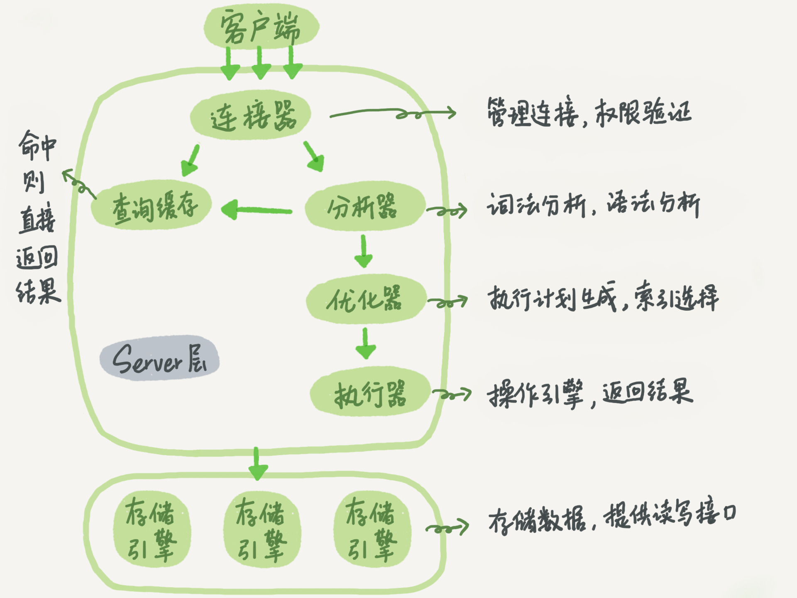
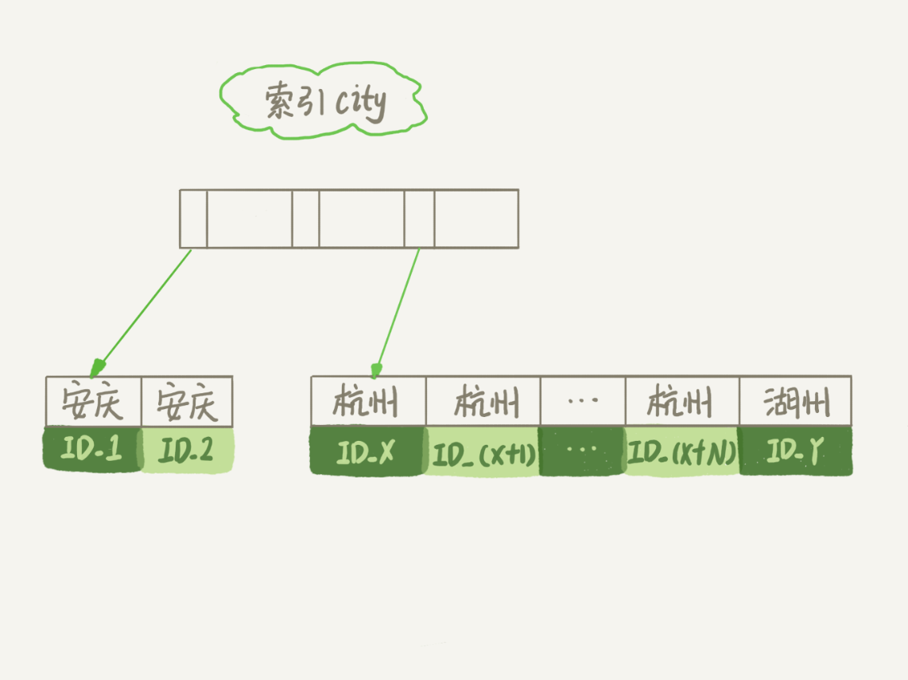

# MySQL实战

## 概览



MySQL 可以分为 Server 层和存储引擎层两部分。

Server 层包括连接器、查询缓存、分析器、优化器、执行器等，涵盖 MySQL 的大多数核心服务功能，以及所有的内置函数（如日期、时间、数学和加密函数等），所有跨存储引擎的功能都在这一层实现，比如存储过程、触发器、视图等。

而存储引擎层负责数据的存储和提取。其架构模式是插件式的，支持 InnoDB、MyISAM、Memory 等多个存储引擎。  不同的存储引擎共用一个 **Server 层**   

###连接器

  连接器负责跟客户端建立连接、获取权限、维持和管理连接。连接命令一般是这么写的：   

```mysql
mysql -h$ip -P$port -u$user -p
```

  客户端如果太长时间没动静，连接器就会自动将它断开。这个时间是由参数 wait_timeout 控制的，默认值是 8 小时。   

  有些时候 MySQL 占用内存涨得特别快，这是因为 MySQL 在执行过程中临时使用的内存是管理在连接对象里面的。这些资源会在连接断开的时候才释放。   

==如果你用的是 MySQL 5.7 或更新版本，可以在每次执行一个比较大的操作后，通过执行 mysql_reset_connection 来重新初始化连接资源。这个过程不需要重连和重新做权限验证，但是会将连接恢复到刚刚创建完时的状态。==


###查询缓存

**大多数情况下我会建议你不要使用查询缓存，为什么呢？因为查询缓存往往弊大于利。**查询缓存的失效非常频繁，只要有对一个表的更新，这个表上所有的查询缓存都会被清空。

好在 MySQL 也提供了这种“按需使用”的方式。你可以将参数 query_cache_type 设置成 DEMAND，这样对于默认的 SQL 语句都不使用查询缓存。而对于你确定要使用查询缓存的语句，可以用 SQL_CACHE 显式指定，像下面这个语句一样：

```mysql
mysql> select SQL_CACHE * from T where ID=10；
```

需要注意的是，**MySQL 8.0 版本直接将查询缓存的整块功能删掉了**，也就是说 8.0 开始彻底没有这个功能了。


###  **分析器**   

分析器先会做“词法分析”。你输入的是由多个字符串和空格组成的一条 SQL 语句，MySQL 需要识别出里面的字符串分别是什么，代表什么。

做完了这些识别以后，就要做“语法分析”。根据词法分析的结果，语法分析器会根据语法规则，判断你输入的这个 SQL 语句是否满足 MySQL 语法。如果你的语句不对，就会收到“You have an error in your SQL syntax”


###  **优化器**   

  优化器是在表里面有多个索引的时候，决定使用哪个索引；或者在一个语句有多表关联（join）的时候，决定各个表的连接顺序。   


### 执行器

  开始执行的时候，要先判断一下你对这个表 T 有没有执行查询的权限     如果没有，就会返回没有权限的错误，如下所示 (在工程实现上，如果命中查询缓存，会在查询缓存返回结果的时候，做权限验证。查询也会在优化器之前调用 precheck 验证权限)。   


## 日志系统

###  redo log（重做日志）   

**InnoDB 引擎特有的日志** 

就像赊账黑板一样，先记录，后批存，也叫  WAL 技术，WAL 的全称是 Write-Ahead Logging，它的关键点就是先写日志，再写磁盘。**注意这里是顺序写喔，因此能提升性能**

  具体来说，当有一条记录需要更新的时候，InnoDB 引擎就会先把记录写到 redo log（粉板）里面，并更新内存，这个时候更新就算完成了。同时，InnoDB 引擎会在适当的时候，将这个操作记录更新到磁盘里面   


  write pos 是当前记录的位置，一边写一边后移，写到第 3 号文件末尾后就回到 0 号文件开头。checkpoint 是当前要擦除的位置，也是往后推移并且循环的，擦除记录前要把记录更新到数据文件。   

  有了 redo log，InnoDB 就可以保证即使数据库发生异常重启，之前提交的记录都不会丢失，这个能力称为**crash-safe**


redo log包括两部分：一是内存中的日志缓冲(redo log buffer)，该部分日志是易失性的；二是磁盘上的重做日志文件(redo log file)，该部分日志是持久的。

在概念上，innodb通过***force log at commit\***机制实现事务的持久性，即在事务提交的时候，必须先将该事务的所有事务日志写入到磁盘上的redo log file和undo log file中进行持久化。

ref:

https://juejin.im/entry/5ba0a254e51d450e735e4a1f

https://zhuanlan.zhihu.com/p/35355751


###  binlog（归档日志）   

**server层特有的日志**

update语句执行流程图


### 区别

1. redo log 是 InnoDB 引擎特有的；binlog 是 MySQL 的 Server 层实现的，所有引擎都可以使用。
2. redo log 是物理日志，记录的是“在某个数据页上做了什么修改”；binlog 是逻辑日志，记录的是这个语句的原始逻辑，比如“给 ID=2 这一行的 c 字段加 1 ”。
3. redo log 是循环写的，空间固定会用完；binlog 是可以追加写入的。“追加写”是指 binlog 文件写到一定大小后会切换到下一个，并不会覆盖以前的日志。

###二阶段提交

1 prepare阶段 2 写binlog 3 commit

当在2之前崩溃时

重启恢复：后发现没有commit，回滚。备份恢复：没有binlog 。一致

当在3之前崩溃

重启恢复：虽没有commit，但满足prepare和binlog完整，所以重启后会自动commit。备份：有binlog. 一致


## 事务隔离

1、事务的特性：ACID（Atomicity、Consistency、Isolation、Durability，即原子性、一致性、隔离性、持久性
2、多事务同时执行的时候，可能会出现的问题：脏读、不可重复读、幻读

>  所谓脏读是指一个事务中访问到了另外一个事务未提交的数据 
>
>  所谓不可重复读是指在一个事务内根据同一个条件对行记录进行多次查询，但是搜出来的结果却不一致。发生不可重复读的原因是在多次搜索期间查询条件覆盖的数据被其他事务修改了 
>
>  所谓幻读是指同一个事务内多次查询返回的结果集不一样（比如增加了或者减少了行记录）。比如同一个事务A内第一次查询时候有n条记录，但是第二次同等条件下查询却有n+1条记录，这就好像产生了幻觉。 
>
> 和不可重复读一样，发生幻读的原因也是另外一个事务新增或者删除或者修改了第一个事务结果集里面的数据。不同在于不可重复读是同一个记录的数据内容被修改了，幻读是数据行记录变多了或者少了

3、事务隔离级别：读未提交、读提交、可重复读、串行化
4、不同事务隔离级别的区别：
读未提交：一个事务还未提交，它所做的变更就可以被别的事务看到
读提交：一个事务提交之后，它所做的变更才可以被别的事务看到
可重复读： 一个事务执行过程中看到的数据，跟这个事务在启动时看到的数据是一致的 。 未提交变更对其他事务也是不可见的 
串行化： 对于同一行记录，“写”会加“写锁”，“读”会加“读锁”。当出现读写锁冲突的时候 ，后访问的事务必须等前一个事务执行完成才能继续执行
5、配置方法：启动参数transaction-isolation
6、事务隔离的实现：每条记录在更新的时候都会同时记录一条回滚操作。同一条记录在系统中可以存在多个版本，这就是数据库的多版本并发控制（MVCC）。
7、回滚日志什么时候删除？系统会判断当没有事务需要用到这些回滚日志的时候，回滚日志会被删除。
8、什么时候不需要了？当系统里没有比这个回滚日志更早的read-view的时候。
9、为什么尽量不要使用长事务。长事务意味着系统里面会存在很老的事务视图，在这个事务提交之前，回滚记录都要保留，这会导致大量占用存储空间。除此之外，长事务还占用锁资源，可能会拖垮库。

> 查询长事务
>
>  select * from information_schema.innodb_trx where TIME_TO_SEC(timediff(now(),trx_started))>60 

10、事务启动方式：

一、显式启动事务语句，begin或者start transaction,提交commit，回滚rollback；

二、set autocommit=0，该命令会把这个线程的自动提交关掉。这样只要执行一个select语句，事务就启动，并不会自动提交，直到主动执行commit或rollback或断开连接。
11、建议使用方法一，如果考虑多一次交互问题，可以使用commit work and chain语法。在autocommit=1的情况下用begin显式启动事务，如果执行commit则提交事务。如果执行commit work and chain则提交事务并自动启动下一个事务。 


##MVCC-Multiversion Currency Control


### 一致性视图（consistent read view）

1.innodb支持RC和RR隔离级别实现是用的一致性视图(consistent read view)

2.一致性视图启动时机

(1)如果是RR级别

>  begin/start transaction 命令启动方式，一致性视图/事务是在执行第一个快照读语句时创建的；
>
> start transaction with consistent snapshot 启动方式，一致性视图/事务马上创建。 
>
> 默认 autocommit=1，sql 语句本身就是一个事务，语句完成的时候会自动提交 

(2) 在RC读提交隔离级别下，每一个语句执行前都会重新算出一个新的视图 


###快照

1.事务在启动时会拍一个**快照**,这个快照是基于整个库的.
基于整个库的意思就是说一个事务内,整个库的修改对于该事务都是不可见的(对于快照读的情况)
如果在事务内select t表,另外的事务执行了DDL t表,根据发生时间,要嘛锁住要嘛报错(参考第六章)

2.事务是如何实现快照的呢?
(0)每个事务都有一个事务ID,叫做transaction id(严格递增)
(1)事务在更新一条语句时,比如id=1改为了id=2.会把id=1和该行之前的row trx_id写到undo log里,
并且在数据页上把id的值改为2,并且把修改这条语句的transaction id记在该行行头


> V1、V2、V3 并不是物理上真实存在的，而是每次需要的时候根据当前版本和 undo log 计算出来的

(2)InnoDB 为每个事务构造了一个数组，用来保存这个事务启动瞬间，启动了但还没提交所有事务 ID。

(3)数组里面事务 ID 的最小值记为低水位；当前系统里面已经创建过的事务 ID 的最大值加 1记为高水位 

 (4)再定一个规矩,一个事务要查看一条数据时,必须先用该事务的up_limit_id与该行的transaction id做比对,
如果up_limit_id>=transaction id,那么可以看.如果up_limit_id<transaction id,则只能去undo log里去取。去undo log查找数据的时候,也需要做比对,必须up_limit_id>transaction id,才返回数据

(4) 这个视图数组和高水位，就组成了当前事务的read-view， 数据版本的可见性规则，就是基于数据的 row trx_id 和这个一致性视图的对比结果得到的。


> 如果落在绿色部分，表示这个版本是已提交的事务或者是当前事务自己生成的，这个数据是可见的；
>
> 如果落在红色部分，表示这个版本是由将来启动的事务生成的，是肯定不可见的；继续去undo log找
>
> 如果落在黄色部分，那就包括两种情况
>
> a. 若 row trx_id 在数组中，表示这个版本是由还没提交的事务生成的，不可见；
>
> b. 若 row trx_id 不在数组中，表示这个版本是已经提交了的事务生成的，可见。 

 翻译一下。一个数据版本，对于一个事务视图来说，除了自己的更新总是可见以外，有三种情况： 

> **版本未提交，不可见；**
>
> **版本已提交，但是是在视图创建后提交的，不可见；**
>
> **版本已提交，而且是在视图创建前提交的，可见。** 

 

###current read

什么是当前读, 更新数据都是先读后写的，而这个读，只能读当前的值 

 除了 update 语句外，select 语句如果加锁，也是当前读。

```mysql
mysql> select k from t where id=1 lock in share mode; 读锁（S 锁，共享锁）
mysql> select k from t where id=1 for update; 写锁（X 锁，排他锁）
```


4.为什么rr能实现可重复读而rc不能,分两种情况
(1)快照读的情况下,rr不能更新事务内的up_limit_id,
  而rc每次会把up_limit_id更新为快照读之前最新已提交事务的transaction id,则rc不能可重复读
(2)当前读的情况下,rr是利用record lock+gap lock来实现的,而rc没有gap,所以rc不能可重复读 


## 索引

###索引基础

0.二叉搜索树：每个节点的左儿子小于父节点，父节点又小于右儿子
1.二叉搜索树：查询时间复杂度O(log(N))，更新时间复杂度O(log(N))
2.数据库存储大多不适用二叉树，因为树高过高，会适用N叉树
3.InnoDB中的索引模型：B+Tree
4.索引类型：主键索引、非主键索引
主键索引的叶子节点存的是整行的数据(聚簇索引)，非主键索引的叶子节点内容是主键的值(二级索引)
5.主键索引和普通索引的区别：主键索引只要搜索ID这个B+Tree即可拿到数据。普通索引先搜索索引拿到主键值，再到主键索引树搜索一次(回表)
6.一个数据页满了，按照B+Tree算法，新增加一个数据页，叫做页分裂，会导致性能下降。空间利用率降低大概50%。当相邻的两个数据页利用率很低的时候会做数据页合并，合并的过程是分裂过程的逆过程。
7.从性能和存储空间方面考量，自增主键往往是更合理的选择。 

8.回表：回到主键索引树搜索的过程，称为回表
9.**覆盖索引**：某索引已经覆盖了查询需求，称为覆盖索引，例如：select ID from T where k between 3 and 5
在引擎内部使用覆盖索引在索引K上其实读了三个记录，R3~R5(对应的索引k上的记录项)，但对于MySQL的Server层来说，它就是找引擎拿到了两条记录，因此MySQL认为扫描行数是2

>  因为覆盖索引的目的就是”不回表“，所以只有索引包含了where条件部分和select返回部分的所有字段，才能实现这个目的。一般用于  高频查询 

10.**最左前缀**原则：B+Tree这种索引结构，可以利用索引的"最左前缀"来定位记录
只要满足最左前缀，就可以利用索引来加速检索。
最左前缀可以是联合索引的最左N个字段，也可以是字符串索引的最左M个字符
11.第一原则是：如果通过调整顺序，可以少维护一个索引，那么这个顺序往往就是需要优先考虑采用的。
12.**索引下推**：在MySQL5.6之前，只能从根据最左前缀查询到ID开始一个个回表。到主键索引上找出数据行，再对比字段值。
MySQL5.6引入的索引下推优化，可以在索引遍历过程中，对索引中包含的字段先做判断，直接过滤掉不满足条件的记录，减少回表次数。 


###普通索引和唯一索引的选择


**对于查询过程来说：**
a、普通索引，查到满足条件的第一个记录后，继续查找下一个记录，直到第一个不满足条件的记录
b、唯一索引，由于索引唯一性，查到第一个满足条件的记录后，停止检索
但是，两者的性能差距微乎其微。因为InnoDB根据数据页来读写的(InnoDB 中，每个数据页的大小默认是 16KB)。


**概念：change buffer**
当需要更新一个数据页，如果数据页在内存中就直接更新，如果不在内存中，在不影响数据一致性的前提下，InnoDB会将这些更新操作缓存在change buffer中。下次查询需要访问这个数据页的时候，将数据页读入内存，然后执行change buffer中的与这个页有关的操作。

change buffer是可以持久化的数据。在内存中有拷贝，也会被写入到磁盘上,在磁盘上占据了系统表空间ibdata，对应的内部系统表名为SYS_IBUF_TABLE

purge: 将change buffer中的操作应用到原数据页上，得到最新结果的过程，称为merge
访问这个数据页会触发merge，系统有后台线程定期merge，在数据库正常关闭的过程中，也会执行merge

唯一索引的更新不能使用change buffer

change buffer用的是buffer pool里的内存，可以通过参数innodb_change_buffer_max_size来动态设置占buffer pool的比例。

**对于插入/更新过程来说：**

- 第一种情况是，要更新的目标页在内存中。这时，InnoDB 的处理流程如下：

对于唯一索引来说，找到 3 和 5 之间的位置，判断到没有冲突，插入/更新这个值，语句执行结束；

对于普通索引来说，找到 3 和 5 之间的位置，插入这个值，语句执行结束。

这样看来，普通索引和唯一索引对更新语句性能影响的差别，只是一个判断，只会耗费微小的 CPU 时间。

- 第二种情况是，这个记录要更新的目标页不在内存中。这时，InnoDB 的处理流程如下：

对于唯一索引来说，需要将数据页读入内存，判断到没有冲突，插入/更新这个值，语句执行结束；

对于普通索引来说，则是将更新记录在 change buffer，语句执行就结束了。


将数据从磁盘读入内存涉及随机IO的访问，是数据库里面成本最高的操作之一。
change buffer 因为减少了随机磁盘访问，所以对更新性能的提升很明显。

**change buffer使用场景**
在一个数据页做merge之前，change buffer记录的变更越多，收益就越大。
对于写多读少的业务来说，页面在写完以后马上被访问到的概率比较小，此时change buffer的使用效果最好。这种业务模型常见的就是账单类、日志类的系统。

反过来，假设一个业务的更新模式是写入之后马上会做查询，那么即使满足了条件，将更新先记录在change buffer,但之后由于马上要访问这个数据页，会立即触发merge过程。
这样随机访问IO的次数不会减少，反而增加了change buffer的维护代价。所以，对于这种业务模式来说，change buffer反而起到了副作用。

索引的选择和实践：
尽可能使用普通索引。
redo log主要节省的是随机写磁盘的IO消耗(转成顺序写)，而change buffer主要节省的则是随机读磁盘的IO消耗。

==Q: 如果某次写入使用了 change buffer 机制，之后主机异常重启，是否会丢失 change buffer 和数据==

A: 虽然是只更新内存，但是在事务提交的时候，我们把 change buffer 的操作也记录到 redo log 里了，所以崩溃恢复的时候，change buffer 也能找回来。

Q: merge 的过程是否会把数据直接写回磁盘

A: merge 的执行流程是这样的：

```
从磁盘读入数据页到内存（老版本的数据页）；
从 change buffer 里找出这个数据页的 change buffer 记录 (可能有多个)，依次应用，得到新版数据页；
写 redo log。这个 redo log 包含了数据的变更和 change buffer 的变更。
```

到这里 merge 过程就结束了。这时候，数据页和内存中 change buffer 对应的磁盘位置都还没有修改，属于脏页，之后各自刷回自己的物理数据，就是另外一个过程了


### 怎么给字符串字段加索引

1. 直接创建完整索引，这样可能比较占用空间；

2. 创建前缀索引，节省空间，但会增加查询扫描次数，并且不能使用覆盖索引；

3. 倒序存储，再创建前缀索引，用于绕过字符串本身前缀的区分度不够的问题；

4. 创建 hash 字段索引，查询性能稳定，有额外的存储和计算消耗，跟第三种方式一样，都不支持范围扫描。

   

### 经典问题

Q: 假如要查 A in () AND B in (), 怎么建索引?

```mysql
where A in (a,b,c) AND B in (x,y,z)
会转成
(A=a and B=x) or (A=a and B=y) or (A=a and B=z) or
(A=b and B=x) or (A=b and B=y) or (A=b and B=z) or
(A=c and B=x) or (A=c and B=y) or (A=c and B=z)

建立AB联合索引即可
```


## 锁

 MySQL里面的锁可以分为：全局锁、表级锁、行级锁 

全局锁、表锁 service层实现

### 全局锁

MySQL提供加全局读锁的方法：**Flush tables with read lock(FTWRL)**
这个命令可以使整个库处于只读状态。使用该命令之后，数据更新语句、数据定义语句和更新类事务的提交语句等操作都会被阻塞。
使用场景：全库逻辑备份。
风险：
1.如果在主库备份，在备份期间不能更新，业务停摆
2.如果在从库备份，备份期间不能执行主库同步的binlog，导致主从延迟


官方自带的逻辑备份工具mysqldump，当**mysqldump使用参数--single-transaction**的时候，会启动一个事务，确保拿到一致性视图。而由于MVCC的支持，这个过程中数据是可以正常更新的。

一致性读是好，但是前提是引擎要支持这个隔离级别。single-transaction 方法只适用于所有的表使用事务引擎的库

如果要全库只读，为什么不使用**set global readonly=true**的方式？
1.在有些系统中，readonly的值会被用来做其他逻辑，比如判断主备库。所以修改global变量的方式影响太大。
2.在异常处理机制上有差异。如果执行FTWRL命令之后由于客户端发生异常断开，那么MySQL会自动释放这个全局锁，整个库回到可以正常更新的状态。而将整个库设置为readonly之后，如果客户端发生异常，则数据库就会一直保持readonly状态，这样会导致整个库长时间处于不可写状态，风险较高。 


### 表级锁

 MySQL里面表级锁有两种，一种是表锁，一种是元数据锁(meta data lock,MDL) 

表锁用来互斥DML

MDL用来互斥DML与DDL？

#### 	表锁

表锁的语法是:lock tables ... read/write

>  如果一个线程获得在一个表上的read锁，那么该线程和所有其他线程只能从表中读数据，不能进行任何写操作。 
>
>  如果一个线程在一个表上得到一个 WRITE  锁，那么只有拥有这个锁的线程可以从表中读取和写表。其它的线程被阻塞。 
>
> 无论哪种锁，当前线程会话对其它表都不能read,write 

可以用unlock tables主动释放锁，也可以在客户端断开的时候自动释放。lock tables语法除了会限制别的线程的读写外，也限定了本线程接下来的操作对象。
对于InnoDB这种支持行锁的引擎，一般不使用lock tables命令来控制并发，毕竟锁住整个表的影响面还是太大。 


#### meta data lock（MDL）

MDL：不需要显式使用，在访问一个表的时候会被自动加上。
作用：保证读写的正确性。
在对一个表做增删改查操作的时候，加MDL读锁；当要对表做结构变更操作的时候，加MDL写锁。
读锁之间不互斥。读写锁之间，写锁之间是互斥的，用来保证变更表结构操作的安全性。
MDL 会直到事务提交才会释放，在做表结构变更的时候，一定要小心不要导致锁住线上查询和更新。 


==Q: 备份一般都会在备库上执行，你在用–single-transaction 方法做逻辑备份的过程中，如果主库上的一个小表做了一个 DDL，比如给一个表上加了一列。这时候，从备库上会看到什么现象呢？==

A: 假设这个 DDL 是针对表 t1 的， 这里我把备份过程中几个关键的语句列出来 

```sql
Q1:SET SESSION TRANSACTION ISOLATION LEVEL REPEATABLE READ;
Q2:START TRANSACTION  WITH CONSISTENT SNAPSHOT；
/* other tables */
Q3:SAVEPOINT sp;
/* 时刻 1 */
Q4:show create table `t1`;
/* 时刻 2 */
Q5:SELECT * FROM `t1`;
/* 时刻 3 */
Q6:ROLLBACK TO SAVEPOINT sp;
/* 时刻 4 */
/* other tables */
```

在备份开始的时候，为了确保 RR（可重复读）隔离级别，再设置一次 RR 隔离级别 (Q1);

启动事务，这里用 WITH CONSISTENT SNAPSHOT 确保这个语句执行完就可以得到一个一致性视图（Q2)；

设置一个保存点，这个很重要（Q3）；

show create 是为了拿到表结构 (Q4)，然后正式导数据 （Q5），回滚到 SAVEPOINT sp，在这里的作用是释放 t1 的 MDL 锁 （Q6）。当然这部分属于“超纲”，上文正文里面都没提到。

DDL 从主库传过来的时间按照效果不同，我打了四个时刻。题目设定为小表，我们假定到达后，如果开始执行，则很快能够执行完成。

参考答案如下：

如果在 Q4 语句执行之前到达，现象：没有影响，备份拿到的是 DDL 后的表结构。

如果在“时刻 2”到达，则表结构被改过，Q5 执行的时候，报 Table definition has changed, please retry transaction，现象：mysqldump 终止；

如果在“时刻 2”和“时刻 3”之间到达，mysqldump 占着 t1 的 MDL 读锁，binlog 被阻塞，现象：主从延迟，直到 Q6 执行完成。

从“时刻 4”开始，mysqldump 释放了 MDL 读锁，现象：没有影响，备份拿到的是 DDL 前的表结构。


### 行锁

**两阶段锁**：在 InnoDB 事务中，行锁是在需要的时候才加上的，但并不是不需要了就立刻释放， 而是要等到事务结束时才释放。
==建议==：如果你的事务中需要锁多个行，要把最可能造成锁冲突、最可能影响并发度的锁尽量往后放。

**死锁**：当并发系统中不同线程出现循环资源依赖，涉及的线程都在等待别的线程释放资源时，就会导致这几个线程都进入无限等待的状态。
解决方案：
1、通过参数 innodb_lock_wait_timeout 根据实际业务场景来设置超时时间，InnoDB引擎默认值是50s。
2、发起死锁检测，发现死锁后，主动回滚死锁链条中的某一个事务，让其他事务得以继续执行。将参数 innodb_deadlock_detect 设置为 on，表示开启这个逻辑（默认是开启状态）。
如何解决热点行更新导致的性能问题？
1、如果你能确保这个业务一定不会出现死锁，可以临时把死锁检测关闭掉。一般不建议采用
2、控制并发度，对应相同行的更新，在进入引擎之前排队。这样在InnoDB内部就不会有大量的死锁检测工作了。(中间件实现或改mysql源码)
3、将热更新的行数据拆分成逻辑上的多行来减少锁冲突，但是业务复杂度可能会大大提高。

innodb行级锁是通过锁索引记录实现的，如果更新的列没建索引是会根据主键索引逐行扫描 逐行加锁 。 


表空间不释放

delete删除表数据，只是打上一个可复用标记，如果是数据页上一部分数据打上标记，如果按照自增主键insert数据，那表空间的数据不会复用，如果是整个数据页的所有数据打上标记，那么可以复用。2个3相临的数据页，如果空洞太多，合并成一个页，另外一个可以标记复用。重建表可以减少空洞，文件大小可以减小，本质上是通过，创建临时文件，将数据在临时文件上，重建一份，重建过程，按照顺序插入，极大减少了黑洞，数据都拷贝到临时文件以后，会有删除原来文件，切换到新文件。文件会减小了。


##MySQL为什么会“抖”一下？

###产生原因

把内存里数据页的数据写入磁盘的过程，术语就是 flush。

**当内存数据页跟磁盘数据页内容不一致的时候，我们称这个内存页为“脏页”。内存数据写入到磁盘后，内存和磁盘上的数据页的内容就一致了，称为“干净页”。**

什么情况会引发数据库的 flush 过程呢？

- 第一种场景是，InnoDB 的 redo log 写满了。这时候系统会停止所有更新操作，把 checkpoint 往前推进，对应的所有脏页都 flush 到磁盘上，redo log 留出空间可以继续写。

- 第二种场景是，系统内存不足。当需要新的内存页，而内存不够用的时候，就要淘汰一些数据页，空出内存给别的数据页使用。如果淘汰的是“脏页”，就要先将脏页写到磁盘。

- 第三种场景是，MySQL 认为系统“空闲”的时候，只要有机会就刷一点“脏页”。

- 第四种场景是，MySQL 正常关闭的情况。会把内存的脏页都 flush 到磁盘上

接下来，可以分析一下上面四种场景对性能的影响。

其中，第三种情况是属于 MySQL 空闲时的操作，这时系统没什么压力，而第四种场景是数据库本来就要关闭了。这两种情况下，你不会太关注“性能”问题。我们主要来分析一下前两种场景下的性能问题。

第一种是“redo log 写满了，要 flush 脏页”，这种情况是 InnoDB 要尽量避免的。因为出现这种情况的时候，整个系统就不能再接受更新了，所有的更新都必须堵住。如果你从监控上看，这时候更新数会跌为 0。

第二种是“内存不够用了，要先将脏页写到磁盘”，这种情况其实是常态。当要读入的数据页没有在内存的时候，就必须到缓冲池中申请一个数据页。这时候只能把最久不使用的数据页从内存中淘汰掉：如果要淘汰的是一个干净页，就直接释放出来复用；但如果是脏页呢，就必须将脏页先刷到磁盘，变成干净页后才能复用。

### InnoDB 刷脏页的控制策略

首先，你要正确地告诉 InnoDB 所在主机的 IO 能力，这样 InnoDB 才能知道需要全力刷脏页的时候，可以刷多快。

这就要用到 innodb_io_capacity 这个参数了，它会告诉 InnoDB 你的磁盘能力。这个值我建议你设置成磁盘的 IOPS。

**如果你来设计策略控制刷脏页的速度，会参考哪些因素呢？**

这个问题可以这么想，如果刷太慢，会出现什么情况？

首先是内存脏页太多，其次是 redo log 写满。所以，InnoDB 的刷盘速度就是要参考这两个因素：一个是脏页比例，一个是 redo log 写盘速度。

InnoDB 会根据这两个因素先单独算出两个数字。参数 innodb_max_dirty_pages_pct 是脏页比例上限，默认值是 75%。


（图中的 F1、F2 就是上面我们通过脏页比例和 redo log 写入速度算出来的两个值。）

脏页比例计算：

> mysql> select VARIABLE_VALUE into @a from global_status where VARIABLE_NAME = 'Innodb_buffer_pool_pages_dirty';
> select VARIABLE_VALUE into @b from global_status where VARIABLE_NAME = 'Innodb_buffer_pool_pages_total';
> select @a/@b;


###好问题

Q: ==当内存不够用了，要将脏页写到磁盘，会有一个数据页淘汰机制（最久不使用），假设淘汰的是脏页，则此时脏页所对应的redo log的位置是随机的，当有多个不同的脏页需要刷，则对应的redo log可能在不同的位置，这样就需要把redo log的多个不同位置刷掉，这样对于redo log的处理不是就会很麻烦吗？（合并间隙，移动位置？）==
==另外，redo log的优势在于将磁盘随机写转换成了顺序写，如果需要将redo log的不同部分刷掉（刷脏页），不是就在redo log里随机读写了么？==

A: 其实由于淘汰的时候，刷脏页过程不用动redo log文件的。

这个有个额外的保证，是redo log在“重放”的时候，如果一个数据页已经是刷过的，会识别出来并跳过。

buffer pool里维护着一个脏页列表，假设现在redo log 的 checkpoint 记录的 LSN 为 10，现在内存中的一干净页有修改，修改后该页的LSN为12，大于 checkpoint 的LSN，则在写redo log的同时该页也会被标记为脏页记录到脏页列表中，现在内存不足，该页需要被淘汰掉，该页会被刷到磁盘，磁盘中该页的LSN为12，该页也从脏页列表中移除，现在redo log 需要往前推进checkpoint，到LSN为12的这条log时，发现内存中的脏页列表里没有该页，且磁盘上该页的LSN也已经为12，则该页已刷脏，已为干净页，跳过。


##为什么删数据表文件大小不变

### 数据删除流程


delete删除表数据，只是打上一个可复用标记。如果是数据页上一部分数据打上标记，如果按照自增主键insert数据，那表空间的数据不会复用(记录的复用，只限于符合范围条件的数据)；如果是整个数据页的所有数据打上标记，那么可以复用。

相邻的两个数据页利用率很小，系统就会把这两个页上的数据合到其中一个页上，另外一个数据页就被标记为可复用。

**不止是删除数据会造成空洞，插入数据也会。**


###重建表

重建表可以减少空洞，文件大小可以减小，本质上是通过，创建临时文件，将数据在临时文件上，重建一份，重建过程，按照顺序插入，极大减少了空洞，数据都拷贝到临时文件以后，会有删除原来文件，切换到新文件。文件会减小了。


MySQL 5.6 版本开始引入的 Online DDL，重建表的流程：

1. 建立一个临时文件，扫描表 A 主键的所有数据页；
2. 用数据页中表 A 的记录生成 B+ 树，存储到临时文件中；
3. 生成临时文件的过程中，将所有对 A 的操作记录在一个日志文件（row log）中，对应的是图中 state2 的状态；
4. 临时文件生成后，将日志文件中的操作应用到临时文件，得到一个逻辑数据上与表 A 相同的数据文件，对应的就是图中 state3 的状态；
5. 用临时文件替换表 A 的数据文件。


我们重建表的这个语句 alter table t engine=InnoDB，其实隐含的意思是：

`alter table t engine=innodb,ALGORITHM=inplace;`

跟 inplace 对应的就是拷贝表的方式了，用法是：

`alter table t engine=innodb,ALGORITHM=copy;`


## count(*) 语句是怎样实现的

### count(*) 的实现方式

在不同的 MySQL 引擎中，count(*) 有不同的实现方式。*

- MyISAM 引擎把一个表的总行数存在了磁盘上，因此执行 count(*) 的时候会直接返回这个数，效率很高；

- 而 InnoDB 引擎就麻烦了，它执行 count(*) 的时候，需要把数据一行一行地从引擎里面读出来，然后累积计数。*

需要注意的是，我们讨论的是没有过滤条件的 count(*)，如果加了 where 条件的话，MyISAM 表也是不能返回得这么快的。

**那为什么 InnoDB 不跟 MyISAM 一样，也把数字存起来呢？**

> 这是因为即使是在同一个时刻的多个查询，由于多版本并发控制（MVCC）的原因，InnoDB 表“应该返回多少行”也是不确定的。每一行记录都要判断自己是否对这个会话可见，因此InnoDB 只好把数据一行一行地读出依次判断

**优化**

InnoDB 是索引组织表，普通索引树比主键索引树小很多。对于 count(*) 这样的操作，遍历哪个索引树得到的结果逻辑上都是一样的。因此，MySQL 优化器会找到最小的那棵树来遍历。**在保证逻辑正确的前提下，尽量减少扫描的数据量，是数据库系统设计的通用法则之一。**


到这里我们小结一下：

- MyISAM 表虽然 count(*) 很快，但是不支持事务；*

- show table status 命令虽然返回很快，但是不准确；
- InnoDB 表直接 count(*) 会遍历全表，虽然结果准确，但会导致性能问题。


### 在数据库保存计数

首先，这解决了崩溃丢失的问题，InnoDB 是支持崩溃恢复不丢数据的。

然后，我们再看看能不能解决计数不精确的问题。


虽然会话 B 的读操作仍然是在 T3 执行的，但是因为这时候更新事务还没有提交，所以计数值加 1 这个操作对会话 B 还不可见。因此，会话 B 看到的结果里， 查计数值和“最近 100 条记录”看到的结果，逻辑上就是一致的。


### 不同的 count 用法

count(*)、count(主键 id)、count(字段) 和 count(1) 等不同用法的性能，有哪些差别

count(*)、count(主键 id) 和 count(1) 都表示返回满足条件的结果集的总行数；而 count(字段），则表示返回满足条件的数据行里面，参数“字段”不为 NULL 的总个数。

结论是：按照效率排序的话，count(字段)<count(主键 id)<count(1)≈count(*)，所以尽量使用 count(*)。


## order by 工作原理

```mysql
CREATE TABLE `t` (
  `id` int(11) NOT NULL,
  `city` varchar(16) NOT NULL,
  `name` varchar(16) NOT NULL,
  `age` int(11) NOT NULL,
  `addr` varchar(128) DEFAULT NULL,
  PRIMARY KEY (`id`),
  KEY `city` (`city`)
) ENGINE=InnoDB;

#假设你要查询城市是“杭州”的所有人名字，并且按照姓名排序返回前 1000 个人的姓名、年龄

select city,name,age from t where city='杭州' order by name limit 1000  ;

```


###全字段排序

我们先来看一下 city 这个索引的示意图



通常情况下，这个语句执行流程如下所示 ：

1.初始化 sort_buffer，确定放入 name、city、age 这三个字段；

2.从索引 city 找到第一个满足 city='杭州’条件的主键 id，也就是图中的 ID_X；

3.到主键 id 索引取出整行，取 name、city、age 三个字段的值，存入 sort_buffer 中；

4.从索引 city 取下一个记录的主键 id；

5.重复步骤 3、4 直到 city 的值不满足查询条件为止，对应的主键 id 也就是图中的 ID_Y；

6.对 sort_buffer 中的数据按照字段 name 做快速排序；

7.按照排序结果取前 1000 行返回给客户端。

我们暂且把这个排序过程，称为全字段排序，执行流程的示意图如下所示


图中“按 name 排序”这个动作，可能在内存中完成，也可能需要使用外部排序，这取决于排序所需的内存和参数 sort_buffer_size。

sort_buffer_size，就是 MySQL 为排序开辟的内存（sort_buffer）的大小。如果要排序的数据量小于 sort_buffer_size，排序就在内存中完成。但如果排序数据量太大，内存放不下，则不得不利用磁盘临时文件辅助排序。


### rowid 排序

如果 MySQL 认为排序的单行长度太大会怎么做呢？ 我来修改一个参数，让 MySQL 采用另外一种算法。

> SET max_length_for_sort_data = 16;

max_length_for_sort_data，是 MySQL 中专门控制用于排序的行数据的长度的一个参数。它的意思是，如果单行的长度超过这个值，MySQL 就认为单行太大，要换一个算法。新的算法放入 sort_buffer 的字段，只有要排序的列（即 name 字段）和主键 id。


分页查询，可以用延迟关联来优化：
select * from t join
(select id from t where city in('杭州','苏州') order by name limit 10000,100) t_id
on t.id=t_id.id;


## 如何正确地显示随机消息？

假设要从一个单词表中随机选出三个单词。这个表的建表语句和初始数据的命令如下：

```mysql

mysql> CREATE TABLE `words` (
  `id` int(11) NOT NULL AUTO_INCREMENT,
  `word` varchar(64) DEFAULT NULL,
  PRIMARY KEY (`id`)
) ENGINE=InnoDB;

delimiter ;;
create procedure idata()
begin
  declare i int;
  set i=0;
  while i<10000 do
    insert into words(word) values(concat(char(97+(i div 1000)), char(97+(i % 1000 div 100)), char(97+(i % 100 div 10)), char(97+(i % 10))));
    set i=i+1;
  end while;
end;;
delimiter ;

call idata();
```


### 内存临时表

首先你会想到

> mysql> select word from words order by rand() limit 3;

用 explain 命令来看看这个语句的执行情况。Extra 字段显示 Using temporary，表示的是需要使用临时表；Using filesort，表示的是需要执行排序操作。

对于 InnoDB 表来说，执行全字段排序会减少磁盘访问，因此会被优先选择。

我强调了“InnoDB 表”，你肯定想到了，**对于内存表，回表过程只是简单地根据数据行的位置，直接访问内存得到数据，根本不会导致多访问磁盘。**优化器没有了这一层顾虑，那么它会优先考虑的，就是用于排序的行越小越好了，所以，MySQL 这时就会选择 rowid 排序。

这条语句的执行流程是这样的：

```
1.创建一个临时表。这个临时表使用的是 memory 引擎，表里有两个字段，第一个字段是 double 类型，为了后面描述方便，记为字段 R，第二个字段是 varchar(64) 类型，记为字段 W。并且，这个表没有建索引。

2.从 words 表中，按主键顺序取出所有的 word 值。对于每一个 word 值，调用 rand() 函数生成一个大于 0 小于 1 的随机小数，并把这个随机小数和 word 分别存入临时表的 R 和 W 字段中，到此，扫描行数是 10000。

3.现在临时表有 10000 行数据了，接下来你要在这个没有索引的内存临时表上，按照字段 R 排序。

4.初始化 sort_buffer。sort_buffer 中有两个字段，一个是 double 类型，另一个是整型。

5.从内存临时表中一行一行地取出 R 值和引擎生成的row_id，分别存入 sort_buffer 中的两个字段里。这个过程要对内存临时表做全表扫描，此时扫描行数增加 10000，变成了 20000。6.在 sort_buffer 中根据 R 的值进行排序。注意，这个过程没有涉及到表操作，所以不会增加扫描行数。

7.排序完成后，取出前三个结果的位置信息，依次到内存临时表中取出 word 值，返回给客户端。这个过程中，访问了表的三行数据，总扫描行数变成了 20003。
```


小结一下：**order by rand() 使用了内存临时表，内存临时表排序的时候使用了 rowid 排序方法。**


### 磁盘临时表

tmp_table_size 这个配置限制了内存临时表的大小，默认值是 16M。如果临时表大小超过了 tmp_table_size，那么内存临时表就会转成磁盘临时表。

磁盘临时表使用的引擎默认是 InnoDB，是由参数 internal_tmp_disk_storage_engine 控制的。

当使用磁盘临时表的时候，对应的就是一个没有显式索引的 InnoDB 表的排序过程。

为了复现这个过程，如下操作

```mysql
set tmp_table_size=1024;
set sort_buffer_size=32768;
set max_length_for_sort_data=16;
/* 打开 optimizer_trace，只对本线程有效 */
SET optimizer_trace='enabled=on'; 

/* 执行语句 */
select word from words order by rand() limit 3;

/* 查看 OPTIMIZER_TRACE 输出 */
SELECT * FROM `information_schema`.`OPTIMIZER_TRACE`\G
```


这里number_of_tmp_files 的值是 0，原因是limit 3 数量比较少，采用了 优先队列排序算法

### 随机排序方法

1.取得整个表的行数，并记为 C。

2.取得 Y = floor(C * rand())。 floor 函数在这里的作用，就是取整数部分。

3.再用 limit Y,1 取得一行。

```mysql
mysql> select count(*) into @C from t;
set @Y = floor(@C * rand());
set @sql = concat("select * from t limit ", @Y, ",1");
prepare stmt from @sql;
execute stmt;
DEALLOCATE prepare stmt;
```

由于 limit 后面的参数不能直接跟变量，所以我在上面的代码中使用了 prepare+execute 的方法。你也可以把拼接 SQL 语句的方法写在应用程序中，会更简单些。


## 幻读是什么 & GAP锁

**1：什么是幻读？**
幻读是指在同一个事务中，存在前后两次查询同一个范围的数据，但是第二次查询却看到了第一次查询没看到的行。
注意，幻读出现的场景
第一：事务的隔离级别为可重复读，且是"当前读"（current read)
第二：幻读仅专指新插入的行
**2：幻读带来的问题？**
一是，对行锁语义的破坏。(并没锁住想锁的所有行)
二是，破坏了数据一致性。(binlog重跑会与原始不一致)

**3：为啥会出现幻读？**
行锁只能锁定存在的行，针对新插入的操作没有限定

**4：如何解决幻读？**
存储引擎采用加间隙锁(Gap Lock)的方式来避免出现幻读

**5：间隙锁是啥？它怎么避免出现幻读的？它引入了什么新的问题？**
间隙锁和行锁合称 next-key lock，专门用于解决幻读这种问题。它锁的了行与行之间的间隙，能够阻塞新插入的操作。
间隙锁的引入也带来了一些新的问题，可能会导致同样的语句锁住更大的范围，这其实是影响了并发度的，可能导致死锁。
注意，读读不互斥，读写/写读/写写是互斥的，但是**间隙锁之间都不存在冲突关系的，跟间隙锁存在冲突关系的，是“往这个间隙中插入一个记录”这个操作。**间隙锁在可重复读级别下才是有效的


### gap 锁加锁规则

MySQL 后面的版本可能会改变加锁策略，所以这个规则只限于截止到现在的最新版本，即 5.x 系列 <=5.7.24，8.0 系列 <=8.0.13


我总结的加锁规则里面，包含了两个“原则”、两个“优化”和一个“bug”。

> 原则 1：加锁的基本单位是 next-key lock。希望你还记得，next-key lock 是前开后闭区间。
>
> 原则 2：查找过程中访问到的对象才会加锁。
>
> 优化 1：索引上的等值查询，给唯一索引加锁的时候，next-key lock 退化为行锁。
>
> 优化 2：索引上的等值查询，向右遍历时且最后一个值不满足等值条件的时候，next-key lock 退化为间隙锁。
>
> 一个 bug：唯一索引上的范围查询会访问到不满足条件的第一个值为止。