# MySQL实战

## 概览


MySQL 可以分为 Server 层和存储引擎层两部分。

Server 层包括连接器、查询缓存、分析器、优化器、执行器等，涵盖 MySQL 的大多数核心服务功能，以及所有的内置函数（如日期、时间、数学和加密函数等），所有跨存储引擎的功能都在这一层实现，比如存储过程、触发器、视图等。

而存储引擎层负责数据的存储和提取。其架构模式是插件式的，支持 InnoDB、MyISAM、Memory 等多个存储引擎。  不同的存储引擎共用一个 **Server 层**   

###连接器

  连接器负责跟客户端建立连接、获取权限、维持和管理连接。连接命令一般是这么写的：   

```mysql
mysql -h$ip -P$port -u$user -p
```

  客户端如果太长时间没动静，连接器就会自动将它断开。这个时间是由参数 wait_timeout 控制的，默认值是 8 小时。   

  有些时候 MySQL 占用内存涨得特别快，这是因为 MySQL 在执行过程中临时使用的内存是管理在连接对象里面的。这些资源会在连接断开的时候才释放。   

==如果你用的是 MySQL 5.7 或更新版本，可以在每次执行一个比较大的操作后，通过执行 mysql_reset_connection 来重新初始化连接资源。这个过程不需要重连和重新做权限验证，但是会将连接恢复到刚刚创建完时的状态。==


###查询缓存

**大多数情况下我会建议你不要使用查询缓存，为什么呢？因为查询缓存往往弊大于利。**查询缓存的失效非常频繁，只要有对一个表的更新，这个表上所有的查询缓存都会被清空。

好在 MySQL 也提供了这种“按需使用”的方式。你可以将参数 query_cache_type 设置成 DEMAND，这样对于默认的 SQL 语句都不使用查询缓存。而对于你确定要使用查询缓存的语句，可以用 SQL_CACHE 显式指定，像下面这个语句一样：

```mysql
mysql> select SQL_CACHE * from T where ID=10；
```

需要注意的是，**MySQL 8.0 版本直接将查询缓存的整块功能删掉了**，也就是说 8.0 开始彻底没有这个功能了。


###  **分析器**   

分析器先会做“词法分析”。你输入的是由多个字符串和空格组成的一条 SQL 语句，MySQL 需要识别出里面的字符串分别是什么，代表什么。

做完了这些识别以后，就要做“语法分析”。根据词法分析的结果，语法分析器会根据语法规则，判断你输入的这个 SQL 语句是否满足 MySQL 语法。如果你的语句不对，就会收到“You have an error in your SQL syntax”


###  **优化器**   

  优化器是在表里面有多个索引的时候，决定使用哪个索引；或者在一个语句有多表关联（join）的时候，决定各个表的连接顺序。   


### 执行器

  开始执行的时候，要先判断一下你对这个表 T 有没有执行查询的权限     如果没有，就会返回没有权限的错误，如下所示 (在工程实现上，如果命中查询缓存，会在查询缓存返回结果的时候，做权限验证。查询也会在优化器之前调用 precheck 验证权限)。   


## 日志系统

###  redo log（重做日志）   

**InnoDB 引擎特有的日志** 

就像赊账黑板一样，先记录，后批存，也叫  WAL 技术，WAL 的全称是 Write-Ahead Logging，它的关键点就是先写日志，再写磁盘。**注意这里是顺序写喔，因此能提升性能**

  具体来说，当有一条记录需要更新的时候，InnoDB 引擎就会先把记录写到 redo log（粉板）里面，并更新内存，这个时候更新就算完成了。同时，InnoDB 引擎会在适当的时候，将这个操作记录更新到磁盘里面   


  write pos 是当前记录的位置，一边写一边后移，写到第 3 号文件末尾后就回到 0 号文件开头。checkpoint 是当前要擦除的位置，也是往后推移并且循环的，擦除记录前要把记录更新到数据文件。   

  有了 redo log，InnoDB 就可以保证即使数据库发生异常重启，之前提交的记录都不会丢失，这个能力称为**crash-safe**


redo log包括两部分：一是内存中的日志缓冲(redo log buffer)，该部分日志是易失性的；二是磁盘上的重做日志文件(redo log file)，该部分日志是持久的。

在概念上，innodb通过***force log at commit\***机制实现事务的持久性，即在事务提交的时候，必须先将该事务的所有事务日志写入到磁盘上的redo log file和undo log file中进行持久化。

ref:

https://juejin.im/entry/5ba0a254e51d450e735e4a1f

https://zhuanlan.zhihu.com/p/35355751


###  binlog（归档日志）   

**server层特有的日志**

update语句执行流程图

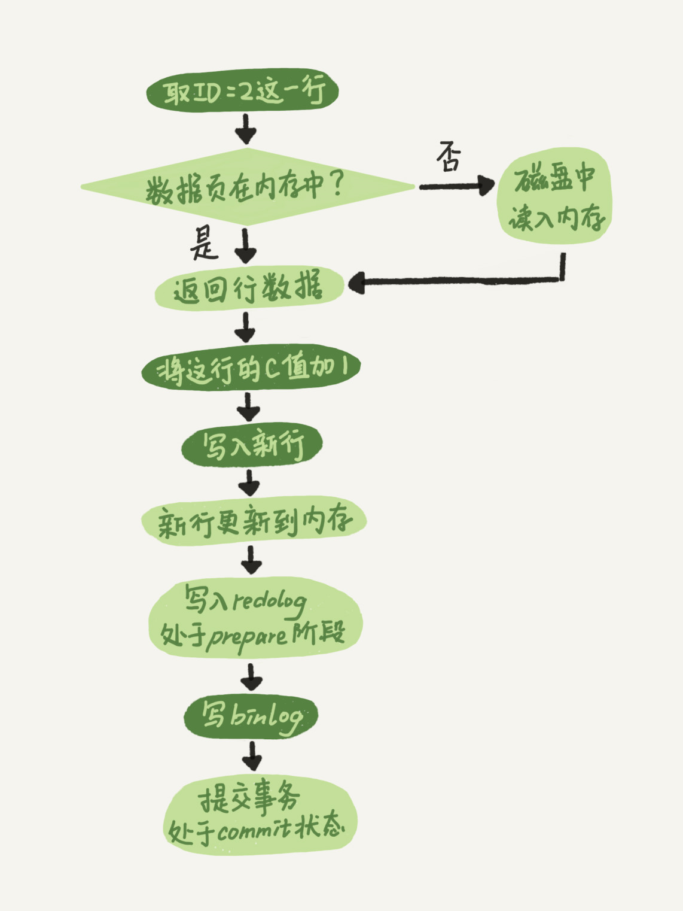


### 区别

1. redo log 是 InnoDB 引擎特有的；binlog 是 MySQL 的 Server 层实现的，所有引擎都可以使用。
2. redo log 是物理日志，记录的是“在某个数据页上做了什么修改”；binlog 是逻辑日志，记录的是这个语句的原始逻辑，比如“给 ID=2 这一行的 c 字段加 1 ”。
3. redo log 是循环写的，空间固定会用完；binlog 是可以追加写入的。“追加写”是指 binlog 文件写到一定大小后会切换到下一个，并不会覆盖以前的日志。

###二阶段提交

1 redolog prepare阶段 2 写binlog 3 commit

当在2之前崩溃时

重启恢复：后发现没有commit，回滚。备份恢复：没有binlog 。一致

当在3之前崩溃

重启恢复：虽没有commit，但满足prepare和binlog完整，所以重启后会自动commit。备份：有binlog. 一致


## 事务隔离

1、事务的特性：ACID（Atomicity、Consistency、Isolation、Durability，即原子性、一致性、隔离性、持久性
2、多事务同时执行的时候，可能会出现的问题：脏读、不可重复读、幻读

>  所谓脏读是指一个事务中访问到了另外一个事务未提交的数据 
>
>  所谓不可重复读是指在一个事务内根据同一个条件对行记录进行多次查询，但是搜出来的结果却不一致。发生不可重复读的原因是在多次搜索期间查询条件覆盖的数据被其他事务修改了 
>
>  所谓幻读是指同一个事务内多次查询返回的结果集不一样（比如增加了或者减少了行记录）。比如同一个事务A内第一次查询时候有n条记录，但是第二次同等条件下查询却有n+1条记录，这就好像产生了幻觉。 
>
> 和不可重复读一样，发生幻读的原因也是另外一个事务新增或者删除或者修改了第一个事务结果集里面的数据。不同在于不可重复读是同一个记录的数据内容被修改了，幻读是数据行记录变多了或者少了

3、事务隔离级别：读未提交、读提交、可重复读、串行化
4、不同事务隔离级别的区别：
读未提交：一个事务还未提交，它所做的变更就可以被别的事务看到
读提交：一个事务提交之后，它所做的变更才可以被别的事务看到
可重复读： 一个事务执行过程中看到的数据，跟这个事务在启动时看到的数据是一致的 。 未提交变更对其他事务也是不可见的 
串行化： 对于同一行记录，“写”会加“写锁”，“读”会加“读锁”。当出现读写锁冲突的时候 ，后访问的事务必须等前一个事务执行完成才能继续执行
5、配置方法：启动参数transaction-isolation
6、事务隔离的实现：每条记录在更新的时候都会同时记录一条回滚操作。同一条记录在系统中可以存在多个版本，这就是数据库的多版本并发控制（MVCC）。
7、回滚日志什么时候删除？系统会判断当没有事务需要用到这些回滚日志的时候，回滚日志会被删除。
8、什么时候不需要了？当系统里没有比这个回滚日志更早的read-view的时候。
9、为什么尽量不要使用长事务。长事务意味着系统里面会存在很老的事务视图，在这个事务提交之前，回滚记录都要保留，这会导致大量占用存储空间。除此之外，长事务还占用锁资源，可能会拖垮库。

> 查询长事务
>
>  select * from information_schema.innodb_trx where TIME_TO_SEC(timediff(now(),trx_started))>60 

10、事务启动方式：

一、显式启动事务语句，begin或者start transaction,提交commit，回滚rollback；

二、set autocommit=0，该命令会把这个线程的自动提交关掉。这样只要执行一个select语句，事务就启动，并不会自动提交，直到主动执行commit或rollback或断开连接。
11、建议使用方法一，如果考虑多一次交互问题，可以使用commit work and chain语法。在autocommit=1的情况下用begin显式启动事务，如果执行commit则提交事务。如果执行commit work and chain则提交事务并自动启动下一个事务。 


##MVCC-Multiversion Currency Control


### 一致性视图（consistent read view）

1.innodb支持RC和RR隔离级别实现是用的一致性视图(consistent read view)

2.一致性视图启动时机

(1)如果是RR级别

>  begin/start transaction 命令启动方式，一致性视图/事务是在执行第一个快照读语句时创建的；
>
> start transaction with consistent snapshot 启动方式，一致性视图/事务马上创建。 
>
> 默认 autocommit=1，sql 语句本身就是一个事务，语句完成的时候会自动提交 

(2) 在RC读提交隔离级别下，每一个语句执行前都会重新算出一个新的视图 


###快照

1.事务在启动时会拍一个**快照**,这个快照是基于整个库的.
基于整个库的意思就是说一个事务内,整个库的修改对于该事务都是不可见的(对于快照读的情况)
如果在事务内select t表,另外的事务执行了DDL t表,根据发生时间,要嘛锁住要嘛报错(参考第六章)

2.事务是如何实现快照的呢?
(0)每个事务都有一个事务ID,叫做transaction id(严格递增)
(1)事务在更新一条语句时,比如id=1改为了id=2.会把id=1和该行之前的row trx_id写到undo log里,
并且在数据页上把id的值改为2,并且把修改这条语句的transaction id记在该行行头


> V1、V2、V3 并不是物理上真实存在的，而是每次需要的时候根据当前版本和 undo log 计算出来的

(2)InnoDB 为每个事务构造了一个数组，用来保存这个事务启动瞬间，启动了但还没提交所有事务 ID。

(3)数组里面事务 ID 的最小值记为低水位；当前系统里面已经创建过的事务 ID 的最大值加 1记为高水位 

 (4)再定一个规矩,一个事务要查看一条数据时,必须先用该事务的up_limit_id与该行的transaction id做比对,
如果up_limit_id>=transaction id,那么可以看.如果up_limit_id<transaction id,则只能去undo log里去取。去undo log查找数据的时候,也需要做比对,必须up_limit_id>transaction id,才返回数据

(4) 这个视图数组和高水位，就组成了当前事务的read-view， 数据版本的可见性规则，就是基于数据的 row trx_id 和这个一致性视图的对比结果得到的。


> 如果落在绿色部分，表示这个版本是已提交的事务或者是当前事务自己生成的，这个数据是可见的；
>
> 如果落在红色部分，表示这个版本是由将来启动的事务生成的，是肯定不可见的；继续去undo log找
>
> 如果落在黄色部分，那就包括两种情况
>
> a. 若 row trx_id 在数组中，表示这个版本是由还没提交的事务生成的，不可见；
>
> b. 若 row trx_id 不在数组中，表示这个版本是已经提交了的事务生成的，可见。 

 翻译一下。一个数据版本，对于一个事务视图来说，除了自己的更新总是可见以外，有三种情况： 

> **版本未提交，不可见；**
>
> **版本已提交，但是是在视图创建后提交的，不可见；**
>
> **版本已提交，而且是在视图创建前提交的，可见。** 

 

###current read

什么是当前读, 更新数据都是先读后写的，而这个读，只能读当前的值 

 除了 update 语句外，select 语句如果加锁，也是当前读。

```mysql
mysql> select k from t where id=1 lock in share mode; 读锁（S 锁，共享锁）
mysql> select k from t where id=1 for update; 写锁（X 锁，排他锁）
```


4.为什么rr能实现可重复读而rc不能,分两种情况
(1)快照读的情况下,rr不能更新事务内的up_limit_id,
  而rc每次会把up_limit_id更新为快照读之前最新已提交事务的transaction id,则rc不能可重复读
(2)当前读的情况下,rr是利用record lock+gap lock来实现的,而rc没有gap,所以rc不能可重复读 


## 索引

###索引基础

0.二叉搜索树：每个节点的左儿子小于父节点，父节点又小于右儿子
1.二叉搜索树：查询时间复杂度O(log(N))，更新时间复杂度O(log(N))
2.数据库存储大多不适用二叉树，因为树高过高，会适用N叉树
3.InnoDB中的索引模型：B+Tree
4.索引类型：主键索引、非主键索引
主键索引的叶子节点存的是整行的数据(聚簇索引)，非主键索引的叶子节点内容是主键的值(二级索引)
5.主键索引和普通索引的区别：主键索引只要搜索ID这个B+Tree即可拿到数据。普通索引先搜索索引拿到主键值，再到主键索引树搜索一次(回表)
6.一个数据页满了，按照B+Tree算法，新增加一个数据页，叫做页分裂，会导致性能下降。空间利用率降低大概50%。当相邻的两个数据页利用率很低的时候会做数据页合并，合并的过程是分裂过程的逆过程。
7.从性能和存储空间方面考量，自增主键往往是更合理的选择。 

8.回表：回到主键索引树搜索的过程，称为回表
9.**覆盖索引**：某索引已经覆盖了查询需求，称为覆盖索引，例如：select ID from T where k between 3 and 5
在引擎内部使用覆盖索引在索引K上其实读了三个记录，R3~R5(对应的索引k上的记录项)，但对于MySQL的Server层来说，它就是找引擎拿到了两条记录，因此MySQL认为扫描行数是2

>  因为覆盖索引的目的就是”不回表“，所以只有索引包含了where条件部分和select返回部分的所有字段，才能实现这个目的。一般用于  高频查询 

10.**最左前缀**原则：B+Tree这种索引结构，可以利用索引的"最左前缀"来定位记录
只要满足最左前缀，就可以利用索引来加速检索。
最左前缀可以是联合索引的最左N个字段，也可以是字符串索引的最左M个字符
11.第一原则是：如果通过调整顺序，可以少维护一个索引，那么这个顺序往往就是需要优先考虑采用的。
12.**索引下推**：在MySQL5.6之前，只能从根据最左前缀查询到ID开始一个个回表。到主键索引上找出数据行，再对比字段值。
MySQL5.6引入的索引下推优化，可以在索引遍历过程中，对索引中包含的字段先做判断，直接过滤掉不满足条件的记录，减少回表次数。 


###普通索引和唯一索引的选择


**对于查询过程来说：**
a、普通索引，查到满足条件的第一个记录后，继续查找下一个记录，直到第一个不满足条件的记录
b、唯一索引，由于索引唯一性，查到第一个满足条件的记录后，停止检索
但是，两者的性能差距微乎其微。因为InnoDB根据数据页来读写的(InnoDB 中，每个数据页的大小默认是 16KB)。


**概念：change buffer**
当需要更新一个数据页，如果数据页在内存中就直接更新，如果不在内存中，在不影响数据一致性的前提下，InnoDB会将这些更新操作缓存在change buffer中。下次查询需要访问这个数据页的时候，将数据页读入内存，然后执行change buffer中的与这个页有关的操作。

change buffer是可以持久化的数据。在内存中有拷贝，也会被写入到磁盘上,在磁盘上占据了系统表空间ibdata，对应的内部系统表名为SYS_IBUF_TABLE

purge: 将change buffer中的操作应用到原数据页上，得到最新结果的过程，称为merge
访问这个数据页会触发merge，系统有后台线程定期merge，在数据库正常关闭的过程中，也会执行merge

唯一索引的更新不能使用change buffer

change buffer用的是buffer pool里的内存，可以通过参数innodb_change_buffer_max_size来动态设置占buffer pool的比例。

**对于插入/更新过程来说：**

- 第一种情况是，要更新的目标页在内存中。这时，InnoDB 的处理流程如下：

对于唯一索引来说，找到 3 和 5 之间的位置，判断到没有冲突，插入/更新这个值，语句执行结束；

对于普通索引来说，找到 3 和 5 之间的位置，插入这个值，语句执行结束。

这样看来，普通索引和唯一索引对更新语句性能影响的差别，只是一个判断，只会耗费微小的 CPU 时间。

- 第二种情况是，这个记录要更新的目标页不在内存中。这时，InnoDB 的处理流程如下：

对于唯一索引来说，需要将数据页读入内存，判断到没有冲突，插入/更新这个值，语句执行结束；

对于普通索引来说，则是将更新记录在 change buffer，语句执行就结束了。


将数据从磁盘读入内存涉及随机IO的访问，是数据库里面成本最高的操作之一。
change buffer 因为减少了随机磁盘访问，所以对更新性能的提升很明显。

**change buffer使用场景**
在一个数据页做merge之前，change buffer记录的变更越多，收益就越大。
对于写多读少的业务来说，页面在写完以后马上被访问到的概率比较小，此时change buffer的使用效果最好。这种业务模型常见的就是账单类、日志类的系统。

反过来，假设一个业务的更新模式是写入之后马上会做查询，那么即使满足了条件，将更新先记录在change buffer,但之后由于马上要访问这个数据页，会立即触发merge过程。
这样随机访问IO的次数不会减少，反而增加了change buffer的维护代价。所以，对于这种业务模式来说，change buffer反而起到了副作用。

索引的选择和实践：
尽可能使用普通索引。
redo log主要节省的是随机写磁盘的IO消耗(转成顺序写)，而change buffer主要节省的则是随机读磁盘的IO消耗。

==Q: 如果某次写入使用了 change buffer 机制，之后主机异常重启，是否会丢失 change buffer 和数据==

A: 虽然是只更新内存，但是在事务提交的时候，我们把 change buffer 的操作也记录到 redo log 里了，所以崩溃恢复的时候，change buffer 也能找回来。

Q: merge 的过程是否会把数据直接写回磁盘

A: merge 的执行流程是这样的：

```
从磁盘读入数据页到内存（老版本的数据页）；
从 change buffer 里找出这个数据页的 change buffer 记录 (可能有多个)，依次应用，得到新版数据页；
写 redo log。这个 redo log 包含了数据的变更和 change buffer 的变更。
```

到这里 merge 过程就结束了。这时候，数据页和内存中 change buffer 对应的磁盘位置都还没有修改，属于脏页，之后各自刷回自己的物理数据，就是另外一个过程了


### 怎么给字符串字段加索引

1. 直接创建完整索引，这样可能比较占用空间；

2. 创建前缀索引，节省空间，但会增加查询扫描次数，并且不能使用覆盖索引；

3. 倒序存储，再创建前缀索引，用于绕过字符串本身前缀的区分度不够的问题；

4. 创建 hash 字段索引，查询性能稳定，有额外的存储和计算消耗，跟第三种方式一样，都不支持范围扫描。

   

### 经典问题

Q: 假如要查 A in () AND B in (), 怎么建索引?

```mysql
where A in (a,b,c) AND B in (x,y,z)
会转成
(A=a and B=x) or (A=a and B=y) or (A=a and B=z) or
(A=b and B=x) or (A=b and B=y) or (A=b and B=z) or
(A=c and B=x) or (A=c and B=y) or (A=c and B=z)

建立AB联合索引即可
```


## 锁

 MySQL里面的锁可以分为：全局锁、表级锁、行级锁 

全局锁、表锁 service层实现

### 全局锁

MySQL提供加全局读锁的方法：**Flush tables with read lock(FTWRL)**
这个命令可以使整个库处于只读状态。使用该命令之后，数据更新语句、数据定义语句和更新类事务的提交语句等操作都会被阻塞。
使用场景：全库逻辑备份。
风险：
1.如果在主库备份，在备份期间不能更新，业务停摆
2.如果在从库备份，备份期间不能执行主库同步的binlog，导致主从延迟


官方自带的逻辑备份工具mysqldump，当**mysqldump使用参数--single-transaction**的时候，会启动一个事务，确保拿到一致性视图。而由于MVCC的支持，这个过程中数据是可以正常更新的。

一致性读是好，但是前提是引擎要支持这个隔离级别。single-transaction 方法只适用于所有的表使用事务引擎的库

如果要全库只读，为什么不使用**set global readonly=true**的方式？
1.在有些系统中，readonly的值会被用来做其他逻辑，比如判断主备库。所以修改global变量的方式影响太大。
2.在异常处理机制上有差异。如果执行FTWRL命令之后由于客户端发生异常断开，那么MySQL会自动释放这个全局锁，整个库回到可以正常更新的状态。而将整个库设置为readonly之后，如果客户端发生异常，则数据库就会一直保持readonly状态，这样会导致整个库长时间处于不可写状态，风险较高。 


### 表级锁

 MySQL里面表级锁有两种，一种是表锁，一种是元数据锁(meta data lock,MDL) 

表锁用来互斥DML

MDL用来互斥DML与DDL？

#### 	表锁

表锁的语法是:lock tables ... read/write

>  如果一个线程获得在一个表上的read锁，那么该线程和所有其他线程只能从表中读数据，不能进行任何写操作。 
>
>  如果一个线程在一个表上得到一个 WRITE  锁，那么只有拥有这个锁的线程可以从表中读取和写表。其它的线程被阻塞。 
>
> 无论哪种锁，当前线程会话对其它表都不能read,write 

可以用unlock tables主动释放锁，也可以在客户端断开的时候自动释放。lock tables语法除了会限制别的线程的读写外，也限定了本线程接下来的操作对象。
对于InnoDB这种支持行锁的引擎，一般不使用lock tables命令来控制并发，毕竟锁住整个表的影响面还是太大。 


#### meta data lock（MDL）

MDL：不需要显式使用，在访问一个表的时候会被自动加上。
作用：保证读写的正确性。
在对一个表做增删改查操作的时候，加MDL读锁；当要对表做结构变更操作的时候，加MDL写锁。
读锁之间不互斥。读写锁之间，写锁之间是互斥的，用来保证变更表结构操作的安全性。
MDL 会直到事务提交才会释放，在做表结构变更的时候，一定要小心不要导致锁住线上查询和更新。 


==Q: 备份一般都会在备库上执行，你在用–single-transaction 方法做逻辑备份的过程中，如果主库上的一个小表做了一个 DDL，比如给一个表上加了一列。这时候，从备库上会看到什么现象呢？==

A: 假设这个 DDL 是针对表 t1 的， 这里我把备份过程中几个关键的语句列出来 

```sql
Q1:SET SESSION TRANSACTION ISOLATION LEVEL REPEATABLE READ;
Q2:START TRANSACTION  WITH CONSISTENT SNAPSHOT；
/* other tables */
Q3:SAVEPOINT sp;
/* 时刻 1 */
Q4:show create table `t1`;
/* 时刻 2 */
Q5:SELECT * FROM `t1`;
/* 时刻 3 */
Q6:ROLLBACK TO SAVEPOINT sp;
/* 时刻 4 */
/* other tables */
```

在备份开始的时候，为了确保 RR（可重复读）隔离级别，再设置一次 RR 隔离级别 (Q1);

启动事务，这里用 WITH CONSISTENT SNAPSHOT 确保这个语句执行完就可以得到一个一致性视图（Q2)；

设置一个保存点，这个很重要（Q3）；

show create 是为了拿到表结构 (Q4)，然后正式导数据 （Q5），回滚到 SAVEPOINT sp，在这里的作用是释放 t1 的 MDL 锁 （Q6）。当然这部分属于“超纲”，上文正文里面都没提到。

DDL 从主库传过来的时间按照效果不同，我打了四个时刻。题目设定为小表，我们假定到达后，如果开始执行，则很快能够执行完成。

参考答案如下：

如果在 Q4 语句执行之前到达，现象：没有影响，备份拿到的是 DDL 后的表结构。

如果在“时刻 2”到达，则表结构被改过，Q5 执行的时候，报 Table definition has changed, please retry transaction，现象：mysqldump 终止；

如果在“时刻 2”和“时刻 3”之间到达，mysqldump 占着 t1 的 MDL 读锁，binlog 被阻塞，现象：主从延迟，直到 Q6 执行完成。

从“时刻 4”开始，mysqldump 释放了 MDL 读锁，现象：没有影响，备份拿到的是 DDL 前的表结构。


### 行锁

**两阶段锁**：在 InnoDB 事务中，行锁是在需要的时候才加上的，但并不是不需要了就立刻释放， 而是要等到事务结束时才释放。
==建议==：如果你的事务中需要锁多个行，要把最可能造成锁冲突、最可能影响并发度的锁尽量往后放。

**死锁**：当并发系统中不同线程出现循环资源依赖，涉及的线程都在等待别的线程释放资源时，就会导致这几个线程都进入无限等待的状态。
解决方案：
1、通过参数 innodb_lock_wait_timeout 根据实际业务场景来设置超时时间，InnoDB引擎默认值是50s。
2、发起死锁检测，发现死锁后，主动回滚死锁链条中的某一个事务，让其他事务得以继续执行。将参数 innodb_deadlock_detect 设置为 on，表示开启这个逻辑（默认是开启状态）。
如何解决热点行更新导致的性能问题？
1、如果你能确保这个业务一定不会出现死锁，可以临时把死锁检测关闭掉。一般不建议采用
2、控制并发度，对应相同行的更新，在进入引擎之前排队。这样在InnoDB内部就不会有大量的死锁检测工作了。(中间件实现或改mysql源码)
3、将热更新的行数据拆分成逻辑上的多行来减少锁冲突，但是业务复杂度可能会大大提高。

innodb行级锁是通过锁索引记录实现的，如果更新的列没建索引是会根据主键索引逐行扫描 逐行加锁 。 


表空间不释放

delete删除表数据，只是打上一个可复用标记，如果是数据页上一部分数据打上标记，如果按照自增主键insert数据，那表空间的数据不会复用，如果是整个数据页的所有数据打上标记，那么可以复用。2个3相临的数据页，如果空洞太多，合并成一个页，另外一个可以标记复用。重建表可以减少空洞，文件大小可以减小，本质上是通过，创建临时文件，将数据在临时文件上，重建一份，重建过程，按照顺序插入，极大减少了黑洞，数据都拷贝到临时文件以后，会有删除原来文件，切换到新文件。文件会减小了。


##MySQL为什么会“抖”一下？

###产生原因

把内存里数据页的数据写入磁盘的过程，术语就是 flush。

**当内存数据页跟磁盘数据页内容不一致的时候，我们称这个内存页为“脏页”。内存数据写入到磁盘后，内存和磁盘上的数据页的内容就一致了，称为“干净页”。**

什么情况会引发数据库的 flush 过程呢？

- 第一种场景是，InnoDB 的 redo log 写满了。这时候系统会停止所有更新操作，把 checkpoint 往前推进，对应的所有脏页都 flush 到磁盘上，redo log 留出空间可以继续写。

- 第二种场景是，系统内存不足。当需要新的内存页，而内存不够用的时候，就要淘汰一些数据页，空出内存给别的数据页使用。如果淘汰的是“脏页”，就要先将脏页写到磁盘。

- 第三种场景是，MySQL 认为系统“空闲”的时候，只要有机会就刷一点“脏页”。

- 第四种场景是，MySQL 正常关闭的情况。会把内存的脏页都 flush 到磁盘上

接下来，可以分析一下上面四种场景对性能的影响。

其中，第三种情况是属于 MySQL 空闲时的操作，这时系统没什么压力，而第四种场景是数据库本来就要关闭了。这两种情况下，你不会太关注“性能”问题。我们主要来分析一下前两种场景下的性能问题。

第一种是“redo log 写满了，要 flush 脏页”，这种情况是 InnoDB 要尽量避免的。因为出现这种情况的时候，整个系统就不能再接受更新了，所有的更新都必须堵住。如果你从监控上看，这时候更新数会跌为 0。

第二种是“内存不够用了，要先将脏页写到磁盘”，这种情况其实是常态。当要读入的数据页没有在内存的时候，就必须到缓冲池中申请一个数据页。这时候只能把最久不使用的数据页从内存中淘汰掉：如果要淘汰的是一个干净页，就直接释放出来复用；但如果是脏页呢，就必须将脏页先刷到磁盘，变成干净页后才能复用。

### InnoDB 刷脏页的控制策略

首先，你要正确地告诉 InnoDB 所在主机的 IO 能力，这样 InnoDB 才能知道需要全力刷脏页的时候，可以刷多快。

这就要用到 innodb_io_capacity 这个参数了，它会告诉 InnoDB 你的磁盘能力。这个值我建议你设置成磁盘的 IOPS。

**如果你来设计策略控制刷脏页的速度，会参考哪些因素呢？**

这个问题可以这么想，如果刷太慢，会出现什么情况？

首先是内存脏页太多，其次是 redo log 写满。所以，InnoDB 的刷盘速度就是要参考这两个因素：一个是脏页比例，一个是 redo log 写盘速度。

InnoDB 会根据这两个因素先单独算出两个数字。参数 innodb_max_dirty_pages_pct 是脏页比例上限，默认值是 75%。


（图中的 F1、F2 就是上面我们通过脏页比例和 redo log 写入速度算出来的两个值。）

脏页比例计算：

> mysql> select VARIABLE_VALUE into @a from global_status where VARIABLE_NAME = 'Innodb_buffer_pool_pages_dirty';
> select VARIABLE_VALUE into @b from global_status where VARIABLE_NAME = 'Innodb_buffer_pool_pages_total';
> select @a/@b;


###好问题

Q: ==当内存不够用了，要将脏页写到磁盘，会有一个数据页淘汰机制（最久不使用），假设淘汰的是脏页，则此时脏页所对应的redo log的位置是随机的，当有多个不同的脏页需要刷，则对应的redo log可能在不同的位置，这样就需要把redo log的多个不同位置刷掉，这样对于redo log的处理不是就会很麻烦吗？（合并间隙，移动位置？）==
==另外，redo log的优势在于将磁盘随机写转换成了顺序写，如果需要将redo log的不同部分刷掉（刷脏页），不是就在redo log里随机读写了么？==

A: 其实由于淘汰的时候，刷脏页过程不用动redo log文件的。

这个有个额外的保证，是redo log在“重放”的时候，如果一个数据页已经是刷过的，会识别出来并跳过。

buffer pool里维护着一个脏页列表，假设现在redo log 的 checkpoint 记录的 LSN 为 10，现在内存中的一干净页有修改，修改后该页的LSN为12，大于 checkpoint 的LSN，则在写redo log的同时该页也会被标记为脏页记录到脏页列表中，现在内存不足，该页需要被淘汰掉，该页会被刷到磁盘，磁盘中该页的LSN为12，该页也从脏页列表中移除，现在redo log 需要往前推进checkpoint，到LSN为12的这条log时，发现内存中的脏页列表里没有该页，且磁盘上该页的LSN也已经为12，则该页已刷脏，已为干净页，跳过。


##为什么删数据表文件大小不变

### 数据删除流程


delete删除表数据，只是打上一个可复用标记。如果是数据页上一部分数据打上标记，如果按照自增主键insert数据，那表空间的数据不会复用(记录的复用，只限于符合范围条件的数据)；如果是整个数据页的所有数据打上标记，那么可以复用。

相邻的两个数据页利用率很小，系统就会把这两个页上的数据合到其中一个页上，另外一个数据页就被标记为可复用。

**不止是删除数据会造成空洞，插入数据也会。**


###重建表

重建表可以减少空洞，文件大小可以减小，本质上是通过，创建临时文件，将数据在临时文件上，重建一份，重建过程，按照顺序插入，极大减少了空洞，数据都拷贝到临时文件以后，会有删除原来文件，切换到新文件。文件会减小了。


MySQL 5.6 版本开始引入的 Online DDL，重建表的流程：

1. 建立一个临时文件，扫描表 A 主键的所有数据页；
2. 用数据页中表 A 的记录生成 B+ 树，存储到临时文件中；
3. 生成临时文件的过程中，将所有对 A 的操作记录在一个日志文件（row log）中，对应的是图中 state2 的状态；
4. 临时文件生成后，将日志文件中的操作应用到临时文件，得到一个逻辑数据上与表 A 相同的数据文件，对应的就是图中 state3 的状态；
5. 用临时文件替换表 A 的数据文件。


我们重建表的这个语句 alter table t engine=InnoDB，其实隐含的意思是：

`alter table t engine=innodb,ALGORITHM=inplace;`

跟 inplace 对应的就是拷贝表的方式了，用法是：

`alter table t engine=innodb,ALGORITHM=copy;`


## count(*) 语句是怎样实现的

### count(*) 的实现方式

在不同的 MySQL 引擎中，count(*) 有不同的实现方式。*

- MyISAM 引擎把一个表的总行数存在了磁盘上，因此执行 count(*) 的时候会直接返回这个数，效率很高；

- 而 InnoDB 引擎就麻烦了，它执行 count(*) 的时候，需要把数据一行一行地从引擎里面读出来，然后累积计数。*

需要注意的是，我们讨论的是没有过滤条件的 count(*)，如果加了 where 条件的话，MyISAM 表也是不能返回得这么快的。

**那为什么 InnoDB 不跟 MyISAM 一样，也把数字存起来呢？**

> 这是因为即使是在同一个时刻的多个查询，由于多版本并发控制（MVCC）的原因，InnoDB 表“应该返回多少行”也是不确定的。每一行记录都要判断自己是否对这个会话可见，因此InnoDB 只好把数据一行一行地读出依次判断

**优化**

InnoDB 是索引组织表，普通索引树比主键索引树小很多。对于 count(*) 这样的操作，遍历哪个索引树得到的结果逻辑上都是一样的。因此，MySQL 优化器会找到最小的那棵树来遍历。**在保证逻辑正确的前提下，尽量减少扫描的数据量，是数据库系统设计的通用法则之一。**


到这里我们小结一下：

- MyISAM 表虽然 count(*) 很快，但是不支持事务；*

- show table status 命令虽然返回很快，但是不准确；
- InnoDB 表直接 count(*) 会遍历全表，虽然结果准确，但会导致性能问题。


### 在数据库保存计数

首先，这解决了崩溃丢失的问题，InnoDB 是支持崩溃恢复不丢数据的。

然后，我们再看看能不能解决计数不精确的问题。

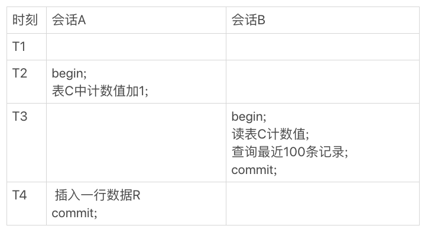

虽然会话 B 的读操作仍然是在 T3 执行的，但是因为这时候更新事务还没有提交，所以计数值加 1 这个操作对会话 B 还不可见。因此，会话 B 看到的结果里， 查计数值和“最近 100 条记录”看到的结果，逻辑上就是一致的。


### 不同的 count 用法

count(*)、count(主键 id)、count(字段) 和 count(1) 等不同用法的性能，有哪些差别

count(*)、count(主键 id) 和 count(1) 都表示返回满足条件的结果集的总行数；而 count(字段），则表示返回满足条件的数据行里面，参数“字段”不为 NULL 的总个数。

结论是：按照效率排序的话，count(字段)<count(主键 id)<count(1)≈count(*)，所以尽量使用 count(*)。


## order by 工作原理

```mysql
CREATE TABLE `t` (
  `id` int(11) NOT NULL,
  `city` varchar(16) NOT NULL,
  `name` varchar(16) NOT NULL,
  `age` int(11) NOT NULL,
  `addr` varchar(128) DEFAULT NULL,
  PRIMARY KEY (`id`),
  KEY `city` (`city`)
) ENGINE=InnoDB;

#假设你要查询城市是“杭州”的所有人名字，并且按照姓名排序返回前 1000 个人的姓名、年龄

select city,name,age from t where city='杭州' order by name limit 1000  ;

```


###全字段排序

我们先来看一下 city 这个索引的示意图


通常情况下，这个语句执行流程如下所示 ：

1.初始化 sort_buffer，确定放入 name、city、age 这三个字段；

2.从索引 city 找到第一个满足 city='杭州’条件的主键 id，也就是图中的 ID_X；

3.到主键 id 索引取出整行，取 name、city、age 三个字段的值，存入 sort_buffer 中；

4.从索引 city 取下一个记录的主键 id；

5.重复步骤 3、4 直到 city 的值不满足查询条件为止，对应的主键 id 也就是图中的 ID_Y；

6.对 sort_buffer 中的数据按照字段 name 做快速排序；

7.按照排序结果取前 1000 行返回给客户端。

我们暂且把这个排序过程，称为全字段排序，执行流程的示意图如下所示


图中“按 name 排序”这个动作，可能在内存中完成，也可能需要使用外部排序，这取决于排序所需的内存和参数 sort_buffer_size。

sort_buffer_size，就是 MySQL 为排序开辟的内存（sort_buffer）的大小。如果要排序的数据量小于 sort_buffer_size，排序就在内存中完成。但如果排序数据量太大，内存放不下，则不得不利用磁盘临时文件辅助排序。


### rowid 排序

如果 MySQL 认为排序的单行长度太大会怎么做呢？ 我来修改一个参数，让 MySQL 采用另外一种算法。

> SET max_length_for_sort_data = 16;

max_length_for_sort_data，是 MySQL 中专门控制用于排序的行数据的长度的一个参数。它的意思是，如果单行的长度超过这个值，MySQL 就认为单行太大，要换一个算法。新的算法放入 sort_buffer 的字段，只有要排序的列（即 name 字段）和主键 id。


分页查询，可以用延迟关联来优化：
select * from t join
(select id from t where city in('杭州','苏州') order by name limit 10000,100) t_id
on t.id=t_id.id;


## 如何正确地显示随机消息？

假设要从一个单词表中随机选出三个单词。这个表的建表语句和初始数据的命令如下：

```mysql

mysql> CREATE TABLE `words` (
  `id` int(11) NOT NULL AUTO_INCREMENT,
  `word` varchar(64) DEFAULT NULL,
  PRIMARY KEY (`id`)
) ENGINE=InnoDB;

delimiter ;;
create procedure idata()
begin
  declare i int;
  set i=0;
  while i<10000 do
    insert into words(word) values(concat(char(97+(i div 1000)), char(97+(i % 1000 div 100)), char(97+(i % 100 div 10)), char(97+(i % 10))));
    set i=i+1;
  end while;
end;;
delimiter ;

call idata();
```


### 内存临时表

首先你会想到

> mysql> select word from words order by rand() limit 3;

用 explain 命令来看看这个语句的执行情况。Extra 字段显示 Using temporary，表示的是需要使用临时表；Using filesort，表示的是需要执行排序操作。

对于 InnoDB 表来说，执行全字段排序会减少磁盘访问，因此会被优先选择。

我强调了“InnoDB 表”，你肯定想到了，**对于内存表，回表过程只是简单地根据数据行的位置，直接访问内存得到数据，根本不会导致多访问磁盘。**优化器没有了这一层顾虑，那么它会优先考虑的，就是用于排序的行越小越好了，所以，MySQL 这时就会选择 rowid 排序。

这条语句的执行流程是这样的：

```
1.创建一个临时表。这个临时表使用的是 memory 引擎，表里有两个字段，第一个字段是 double 类型，为了后面描述方便，记为字段 R，第二个字段是 varchar(64) 类型，记为字段 W。并且，这个表没有建索引。

2.从 words 表中，按主键顺序取出所有的 word 值。对于每一个 word 值，调用 rand() 函数生成一个大于 0 小于 1 的随机小数，并把这个随机小数和 word 分别存入临时表的 R 和 W 字段中，到此，扫描行数是 10000。

3.现在临时表有 10000 行数据了，接下来你要在这个没有索引的内存临时表上，按照字段 R 排序。

4.初始化 sort_buffer。sort_buffer 中有两个字段，一个是 double 类型，另一个是整型。

5.从内存临时表中一行一行地取出 R 值和引擎生成的row_id，分别存入 sort_buffer 中的两个字段里。这个过程要对内存临时表做全表扫描，此时扫描行数增加 10000，变成了 20000。

6.在 sort_buffer 中根据 R 的值进行排序。注意，这个过程没有涉及到表操作，所以不会增加扫描行数。

7.排序完成后，取出前三个结果的位置信息，依次到内存临时表中取出 word 值，返回给客户端。这个过程中，访问了表的三行数据，总扫描行数变成了 20003。
```


小结一下：**order by rand() 使用了内存临时表，内存临时表排序的时候使用了 rowid 排序方法。**


### 磁盘临时表

tmp_table_size 这个配置限制了内存临时表的大小，默认值是 16M。如果临时表大小超过了 tmp_table_size，那么内存临时表就会转成磁盘临时表。

磁盘临时表使用的引擎默认是 InnoDB，是由参数 internal_tmp_disk_storage_engine 控制的。

当使用磁盘临时表的时候，对应的就是一个没有显式索引的 InnoDB 表的排序过程。

为了复现这个过程，如下操作

```mysql
set tmp_table_size=1024;
set sort_buffer_size=32768;
set max_length_for_sort_data=16;
/* 打开 optimizer_trace，只对本线程有效 */
SET optimizer_trace='enabled=on'; 

/* 执行语句 */
select word from words order by rand() limit 3;

/* 查看 OPTIMIZER_TRACE 输出 */
SELECT * FROM `information_schema`.`OPTIMIZER_TRACE`\G
```


这里number_of_tmp_files 的值是 0，原因是limit 3 数量比较少，采用了 优先队列排序算法

### 随机排序方法

1.取得整个表的行数，并记为 C。

2.取得 Y = floor(C * rand())。 floor 函数在这里的作用，就是取整数部分。

3.再用 limit Y,1 取得一行。

```mysql
mysql> select count(*) into @C from t;
set @Y = floor(@C * rand());
set @sql = concat("select * from t limit ", @Y, ",1");
prepare stmt from @sql;
execute stmt;
DEALLOCATE prepare stmt;
```

由于 limit 后面的参数不能直接跟变量，所以我在上面的代码中使用了 prepare+execute 的方法。你也可以把拼接 SQL 语句的方法写在应用程序中，会更简单些。


## 幻读是什么 & GAP锁

**1：什么是幻读？**
幻读是指在同一个事务中，存在前后两次查询同一个范围的数据，但是第二次查询却看到了第一次查询没看到的行。
注意，幻读出现的场景
第一：事务的隔离级别为可重复读，且是"当前读"（current read)
第二：幻读仅专指新插入的行
**2：幻读带来的问题？**
一是，对行锁语义的破坏。(并没锁住想锁的所有行)
二是，破坏了数据一致性。(binlog重跑会与原始不一致)

**3：为啥会出现幻读？**
行锁只能锁定存在的行，针对新插入的操作没有限定

**4：如何解决幻读？**
存储引擎采用加间隙锁(Gap Lock)的方式来避免出现幻读

**5：间隙锁是啥？它怎么避免出现幻读的？它引入了什么新的问题？**
间隙锁和行锁合称 next-key lock，专门用于解决幻读这种问题。它锁的了行与行之间的间隙，能够阻塞新插入的操作。
间隙锁的引入也带来了一些新的问题，可能会导致同样的语句锁住更大的范围，这其实是影响了并发度的，可能导致死锁。
注意，读读不互斥，读写/写读/写写是互斥的，但是**间隙锁之间都不存在冲突关系的，跟间隙锁存在冲突关系的，是“往这个间隙中插入一个记录”这个操作。**间隙锁在可重复读级别下才是有效的


### gap 锁加锁规则

MySQL 后面的版本可能会改变加锁策略，所以这个规则只限于截止到现在的最新版本，即 5.x 系列 <=5.7.24，8.0 系列 <=8.0.13


我总结的加锁规则里面，包含了两个“原则”、两个“优化”和一个“bug”。

> 原则 1：加锁的基本单位是 next-key lock。希望你还记得，next-key lock 是前开后闭区间。
>
> 原则 2：查找过程中访问到的对象才会加锁。
>
> 优化 1：索引上的等值查询，给唯一索引加锁的时候，next-key lock 退化为行锁。
>
> 优化 2：索引上的等值查询，向右遍历时且最后一个值不满足等值条件的时候，next-key lock 退化为间隙锁。
>
> 一个 bug：唯一索引上的范围查询会访问到不满足条件的第一个值为止。


## MySQL是怎么保证数据不丢的？

### binlog 的写入机制

binlog 的写入逻辑比较简单：事务执行过程中，先把日志写到 binlog cache，事务提交的时候，再把 binlog cache 写到 binlog 文件中。

一个事务的 binlog 是不能被拆开的，因此不论这个事务多大，也要确保一次性写入。这就涉及到了 binlog cache 的保存问题。


可以看到，每个线程有自己 binlog cache，参数 binlog_cache_size 用于控制所占内存大小，但是共用同一份 binlog 文件

- 图中的 write，指的就是指把日志写入到文件系统的 page cache，并没有把数据持久化到磁盘，所以速度比较快。

- 图中的 fsync，才是将数据持久化到磁盘的操作。一般情况下，我们认为 fsync 才占磁盘的 IOPS

write 和 fsync 的时机，是由参数 sync_binlog 控制的：

1. sync_binlog=0 的时候，表示每次提交事务都只 write，不 fsync；（默认）
2. sync_binlog=1 的时候，表示每次提交事务都会执行 fsync；
3. sync_binlog=N(N>1) 的时候，表示每次提交事务都 write，但累积 N 个事务后才 fsync。(主机重启，丢失最近N个事务的binlog日志)


### redo log 的写入机制

redo log 可能存在的三种状态

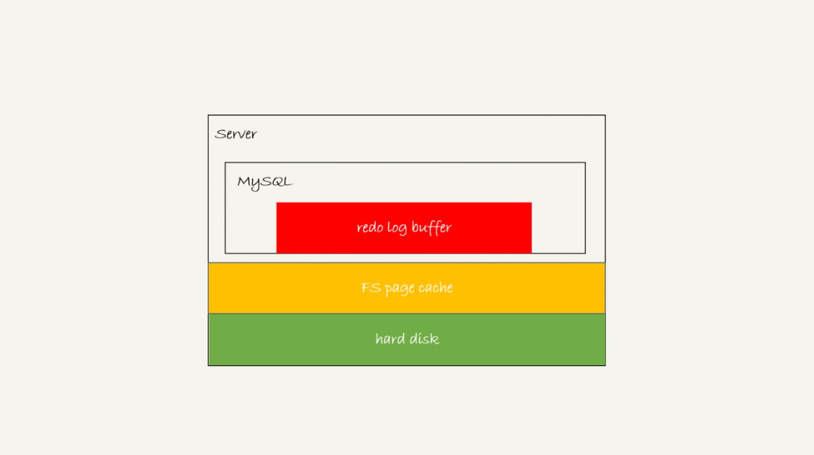


这三种状态分别是：

1. 存在 redo log buffer 中，物理上是在 MySQL 进程内存中，就是图中的红色部分；
2. 写到磁盘 (write)，但是没有持久化（fsync)，物理上是在文件系统的 page cache 里面，也就是图中的黄色部分；
3. 持久化到磁盘，对应的是 hard disk，也就是图中的绿色部分。

为了控制 redo log 的写入策略，InnoDB 提供了 innodb_flush_log_at_trx_commit 参数，

它有三种可能取值：

1. 设置为 0 的时候，表示每次事务提交时都只是把 redo log 留在 redo log buffer 中 ;
2. 设置为 1 的时候，表示每次事务提交时都将 redo log 直接持久化到磁盘；
3. 设置为 2 的时候，表示每次事务提交时都只是把 redo log 写到 page cache。

InnoDB 有一个后台线程，每隔 1 秒，就会把 redo log buffer 中的日志，调用 write 写到文件系统的 page cache，然后调用 fsync 持久化到磁盘。

除了后台线程每秒一次的轮询操作外，还有两种场景会让一个没有提交的事务的 redo log 写入到磁盘中。

1. **一种是，redo log buffer 占用的空间即将达到 innodb_log_buffer_size 一半的时候，后台线程会主动write 到page cache。**
2. **另一种是，并行的事务提交的时候，顺带将这个事务的 redo log buffer 持久化到磁盘。**


### 组提交机制（group commit）

通常我们说 **MySQL 的“双 1”配置**，指的就是 sync_binlog 和 innodb_flush_log_at_trx_commit 都设置成 1。也就是说，一个事务完整提交前，需要等待两次刷盘，一次是 redo log（prepare 阶段），一次是 binlog。

这时候，你可能有一个疑问，这意味着我从 MySQL 看到的 TPS 是每秒两万的话，每秒就会写四万次磁盘。但是，我用工具测试出来，磁盘能力也就两万左右，怎么能实现两万的 TPS？

解释这个问题，就要用到**组提交（group commit）机制**了。


1. trx1 是第一个到达的，会被选为这组的 leader；
2. 等 trx1 要开始写盘的时候，这个组里面已经有了三个事务，这时候 LSN 也变成了 160；
3. trx1 去写盘的时候，带的就是 LSN=160，因此等 trx1 返回时，所有 LSN 小于等于 160 的 redo log，都已经被持久化到磁盘；
4. 这时候 trx2 和 trx3 就可以直接返回了。

在并发更新场景下，第一个事务写完 redo log buffer 以后，接下来这个 fsync 越晚调用，组员可能越多，节约 IOPS 的效果就越好。

为了让一次 fsync 带的组员更多，MySQL 有一个很有趣的优化：拖时间。

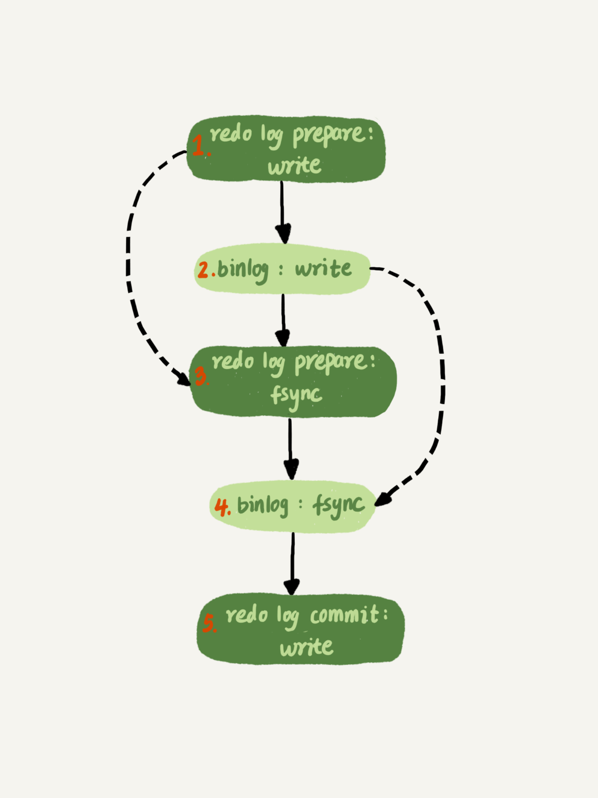

这么一来，binlog 也可以组提交了。不过通常情况下第 3 步执行得会很快，所以 binlog 的 write 和 fsync 间的间隔时间短，导致能集合到一起持久化的 binlog 比较少，因此 binlog 的组提交的效果通常不如 redo log 的效果那么好。

如果你想提升 binlog 组提交的效果，可以通过设置 binlog_group_commit_sync_delay 和 binlog_group_commit_sync_no_delay_count 来实现。

1. binlog_group_commit_sync_delay 参数，表示延迟多少微秒后才调用fsync;
2. binlog_group_commit_sync_no_delay_count 参数，表示累积多少次以后才调用 fsync。

这两个条件是或的关系，也就是说只要有一个满足条件就会调用 fsync。

### IO性能瓶颈

如果你的 MySQL 现在出现了性能瓶颈，而且瓶颈在 IO 上，可以通过哪些方法来提升性能呢？

1. 设置 binlog_group_commit_sync_delay 和 binlog_group_commit_sync_no_delay_count 参数，减少 binlog 的写盘次数。这个方法是基于“额外的故意等待”来实现的，因此可能会增加语句的响应时间，但没有丢失数据的风险。
2. 将 sync_binlog 设置为大于 1 的值（比较常见是 100~1000）。这样做的风险是，主机掉电时会丢 binlog 日志。
3. 将 innodb_flush_log_at_trx_commit 设置为 2。这样做的风险是，主机掉电的时候会丢数据。

一般情况下，把生产库改成“非双 1”配置，是设置 innodb_flush_log_at_trx_commit=2、sync_binlog=1000


## MySQL是怎么保证主备一致的？

### MySQL 主备的基本原理


在状态 1 中，虽然节点 B 没有被直接访问，但是我依然建议你把节点 B（也就是备库）设置成只读（readonly）模式。这样做，有以下几个考虑：

1. 有时候一些运营类的查询语句会被放到备库上去查，设置为只读可以防止误操作；
2. 防止切换逻辑有 bug，比如切换过程中出现双写，造成主备不一致；
3. 可以用 readonly 状态，来判断节点的角色。


接下来，我们再看看**节点 A 到 B 这条线的内部流程是什么样的**。下图画出的就是一个 update 语句在节点 A 执行，然后同步到节点 B 的完整流程图。


主库接收到客户端的更新请求后，执行内部事务的更新逻辑，同时写 binlog。

备库 B 跟主库 A 之间维持了一个长连接。主库 A 内部有一个线程，专门用于服务备库 B 的这个长连接。一个事务日志同步的完整过程是这样的：

1. 在备库 B 上通过 change master 命令，设置主库 A 的 IP、端口、用户名、密码，以及要从哪个位置开始请求 binlog，这个位置包含文件名和日志偏移量。
2. 在备库 B 上执行 start slave 命令，这时候备库会启动两个线程，就是图中的 io_thread 和 sql_thread。其中 io_thread 负责与主库建立连接。
3. 主库 A 校验完用户名、密码后，开始按照备库 B 传过来的位置，从本地读取 binlog，发给 B。
4. 备库 B 拿到 binlog 后，写到本地文件，称为中转日志（relay log）。
5. sql_thread 读取中转日志，解析出日志里的命令，并执行。

后来由于多线程复制方案的引入，sql_thread 演化成为了多个线程。


### binlog 的三种格式对比

#### statement 

当 binlog_format=statement 时，binlog 里面记录的就是 SQL 语句的原文。可以用类似命令看 binlog 中的内容。

```mysql
mysql> show binlog events in 'master.000001';
```


>运行这条 delete 命令产生了一个 warning。这是因为 delete 带 limit，很可能会出现主备数据不一致的情况。
>
>如果主库、备库走的是不同的索引，有可能出现不一致


#### row

先来看看这时候 binog 中的内容吧


与 statement 格式的 binlog 相比，前后的 BEGIN 和 COMMIT 是一样的。但是，row 格式的 binlog 里没有了 SQL 语句的原文，而是替换成了两个 event：Table_map 和 Delete_rows。

1. Table_map event，用于说明接下来要操作的表是 test 库的表 t;
2. Delete_rows event，用于定义删除的行为。

其实，我们通过图 是看不到详细信息的，还需要借助 mysqlbinlog 工具，用下面这个命令解析和查看 binlog 中的内容。因为图 中的信息显示，这个事务的 binlog 是从 8900 这个位置开始的，所以可以用 start-position 参数来指定从这个位置的日志开始解析。

>mysqlbinlog  -vv data/master.000001 --start-position=8900;


- server id 1，表示这个事务是在 server_id=1 的这个库上执行的。
- 每个 event 都有 CRC32 的值，这是因为我把参数 binlog_checksum 设置成了 CRC32。
- Table_map event 跟在图 5 中看到的相同，显示了接下来要打开的表，map 到数字 226。现在我们这条 SQL 语句只操作了一张表，如果要操作多张表呢？每个表都有一个对应的 Table_map event、都会 map 到一个单独的数字，用于区分对不同表的操作。
- 我们在 mysqlbinlog 的命令中，使用了 -vv 参数是为了把内容都解析出来，所以从结果里面可以看到各个字段的值（比如，@1=4、 @2=4 这些值）。
- binlog_row_image 的默认配置是 FULL，因此 Delete_event 里面，包含了删掉的行的所有字段的值。如果把 binlog_row_image 设置为 MINIMAL，则只会记录必要的信息，在这个例子里，就是只会记录 id=4 这个信息。
- 最后的 Xid event，用于表示事务被正确地提交了。

你可以看到，当 binlog_format 使用 row 格式的时候，binlog 里面记录了真实删除行的主键 id，这样 binlog 传到备库去的时候，就肯定会删除 id=4 的行，不会有主备删除不同行的问题。

现在越来越多的场景要求把 MySQL 的 binlog 格式设置成 row。这么做的理由有很多，我来给你举一个可以直接看出来的好处：**恢复数据。**

因为row格式binlog会把执行参数保存起来，恢复时候只要反过来执行即可。


#### mixed

**为什么会有 mixed 这种 binlog 格式的存在场景？**推论过程是这样的：

- 因为有些 statement 格式的 binlog 可能会导致主备不一致，所以要使用 row 格式。
- 但 row 格式的缺点是，很占空间。比如你用一个 delete 语句删掉 10 万行数据，用 statement 的话就是一个 SQL 语句被记录到 binlog 中，占用几十个字节的空间。但如果用 row 格式的 binlog，就要把这 10 万条记录都写到 binlog 中。这样做，不仅会占用更大的空间，同时写 binlog 也要耗费 IO 资源，影响执行速度。
- 所以，MySQL 就取了个折中方案，也就是有了 mixed 格式的 binlog。mixed 格式的意思是，MySQL 自己会判断这条 SQL 语句是否可能引起主备不一致，如果有可能，就用 row 格式，否则就用 statement 格式。

也就是说，mixed 格式可以利用 statment 格式的优点，同时又避免了数据不一致的风险。


### 循环复制问题

生产上使用比较多的是双 M 结构


双 M 结构和 M-S 结构，其实区别只是多了一条线，即：节点 A 和 B 之间总是互为主备关系。**这样在切换的时候就不用再修改主备关系。**

但是，双 M 结构还有一个问题需要解决。如果节点 A 同时是节点 B 的备库，相当于又把节点 B 新生成的 binlog 拿过来执行了一次，然后节点 A 和 B 间，会不断地循环执行这个更新语句，也就是循环复制了。这个要怎么解决呢？


从上面的图中可以看到，MySQL 在 binlog 中记录了这个命令第一次执行时所在实例的 server id。因此，我们可以用下面的逻辑，来解决两个节点间的循环复制的问题：

1. 规定两个库的 server id 必须不同，如果相同，则它们之间不能设定为主备关系；
2. 一个备库接到 binlog 并在重放的过程中，生成与原 binlog 的 server id 相同的新的 binlog；
3. 每个库在收到从自己的主库发过来的日志后，先判断 server id，如果跟自己的相同，表示这个日志是自己生成的，就直接丢弃这个日志。

按照这个逻辑，如果我们设置了双 M 结构，日志的执行流就会变成这样：

1. 从节点 A 更新的事务，binlog 里面记的都是 A 的 server id；
2. 传到节点 B 执行一次以后，节点 B 生成的 binlog 的 server id 也是 A 的 server id；
3. 再传回给节点 A，A 判断到这个 server id 与自己的相同，就不会再处理这个日志。所以，死循环在这里就断掉了。


## 怎么保证高可用


​														图 1 MySQL 主备切换流程 -- 双 M 结构


### 主备延迟

我们先一起看看主动切换的场景。在介绍主动切换流程的详细步骤之前，我要先跟你说明一个概念，即“同步延迟”。与数据同步有关的时间点主要包括以下三个：

1. 主库 A 执行完成一个事务，写入 binlog，我们把这个时刻记为 T1;
2. 之后传给备库 B，我们把备库 B 接收完这个 binlog 的时刻记为 T2;
3. 备库 B 执行完成这个事务，我们把这个时刻记为 T3。

所谓主备延迟，就是同一个事务，在备库执行完成的时间和主库执行完成的时间之间的差值，也就是 T3-T1。

你可以在备库上执行 show slave status 命令，它的返回结果里面会显示 seconds_behind_master，用于表示当前备库延迟了多少秒。seconds_behind_master 的计算方法是这样的：

1. 每个事务的 binlog 里面都有一个时间字段，用于记录主库上写入的时间；
2. 备库取出当前正在执行的事务的时间字段的值，计算它与当前系统时间的差值，得到 seconds_behind_master。

可以看到，其实 seconds_behind_master 这个参数计算的就是 T3-T1。所以，我们可以用 seconds_behind_master 来作为主备延迟的值，这个值的时间精度是秒。

在网络正常的时候，T2-T1 的值是非常小的。所以说，主备延迟最直接的表现是，备库消费中转日志（relay log）的速度，比主库生产 binlog 的速度要慢


### 主备延迟的来源

**首先，有些部署条件下，备库所在机器的性能要比主库所在的机器性能差。**

当然，这种部署现在比较少了。因为主备可能发生切换，备库随时可能变成主库，所以主备库选用相同规格的机器，并且做对称部署，是现在比较常见的情况。

**第二种常见的可能，即备库的压力大。**

一般的想法是，主库既然提供了写能力，那么备库可以提供一些读能力。或者一些运营后台需要的分析语句，不能影响正常业务，所以只能在备库上跑。

这种情况，我们一般可以这么处理：

1. 一主多从。除了备库外，可以多接几个从库，让这些从库来分担读的压力。
2. 通过 binlog 输出到外部系统，比如 Hadoop 这类系统，让外部系统提供统计类查询的能力。

其中，一主多从的方式大都会被采用。因为作为数据库系统，还必须保证有定期全量备份的能力。而从库，就很适合用来做备份。

**第三种可能，大事务。**

大事务这种情况很好理解。因为主库上必须等事务执行完成才会写入 binlog，再传给备库。所以，如果一个主库上的语句执行 10 分钟，那这个事务很可能就会导致从库延迟 10 分钟。

另一种典型的大事务场景，就是大表 DDL。这个场景，我在前面的文章中介绍过。处理方案就是，计划内的 DDL，建议使用 gh-ost 方案

**第四种可能，备库的并行复制能力**

TODO


由于主备延迟的存在，所以在主备切换的时候，就相应的有不同的策略。


###可靠性优先策略

在图 1 的双 M 结构下，从状态 1 到状态 2 切换的详细过程是这样的：

1. 判断备库 B 现在的 seconds_behind_master，如果小于某个值（比如 5 秒）继续下一步，否则持续重试这一步；
2. 把主库 A 改成只读状态，即把 readonly 设置为 true；
3. 判断备库 B 的 seconds_behind_master 的值，直到这个值变成 0 为止；
4. 把备库 B 改成可读写状态，也就是把 readonly 设置为 false；
5. 把业务请求切到备库 B。

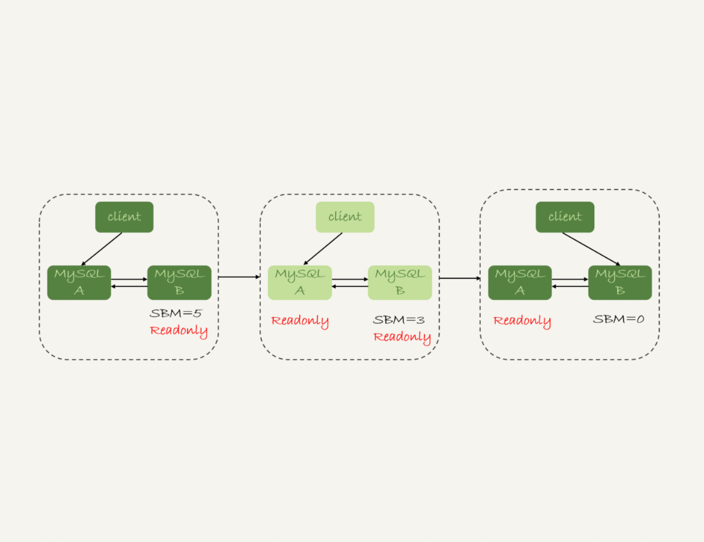

这个切换流程中是有不可用时间的。因为在步骤 2 之后，主库 A 和备库 B 都处于 readonly 状态，也就是说这时系统处于不可写状态，直到步骤 5 完成后才能恢复。

在这个不可用状态中，比较耗费时间的是步骤 3，可能需要耗费好几秒的时间。这也是为什么需要在步骤 1 先做判断，确保 seconds_behind_master 的值足够小。


### 可用性优先策略

如果我强行把步骤 4、5 调整到最开始执行，也就是说不等主备数据同步，直接把连接切到备库 B，并且让备库 B 可以读写，那么系统几乎就没有不可用时间了。

代价，就是可能出现数据不一致的情况。 例子不赘述

**使用 row 格式的 binlog 时，数据不一致的问题更容易被发现。**而使用 mixed 或者 statement 格式的 binlog 时，数据很可能悄悄地就不一致了。


### 异常切换

**在可靠性优先的前提下**，异常切换会是什么效果？

假设，主库 A 和备库 B 间的主备延迟是 30 分钟，这时候主库 A 掉电了，HA 系统要切换 B 作为主库。采用可靠性优先策略的话，你就必须得等到备库 B 的 seconds_behind_master=0 之后，才能切换。但现在的情况比刚刚更严重，并不是系统只读、不可写的问题了，而是系统处于完全不可用的状态。因为，主库 A 掉电后，我们的连接还没有切到备库 B

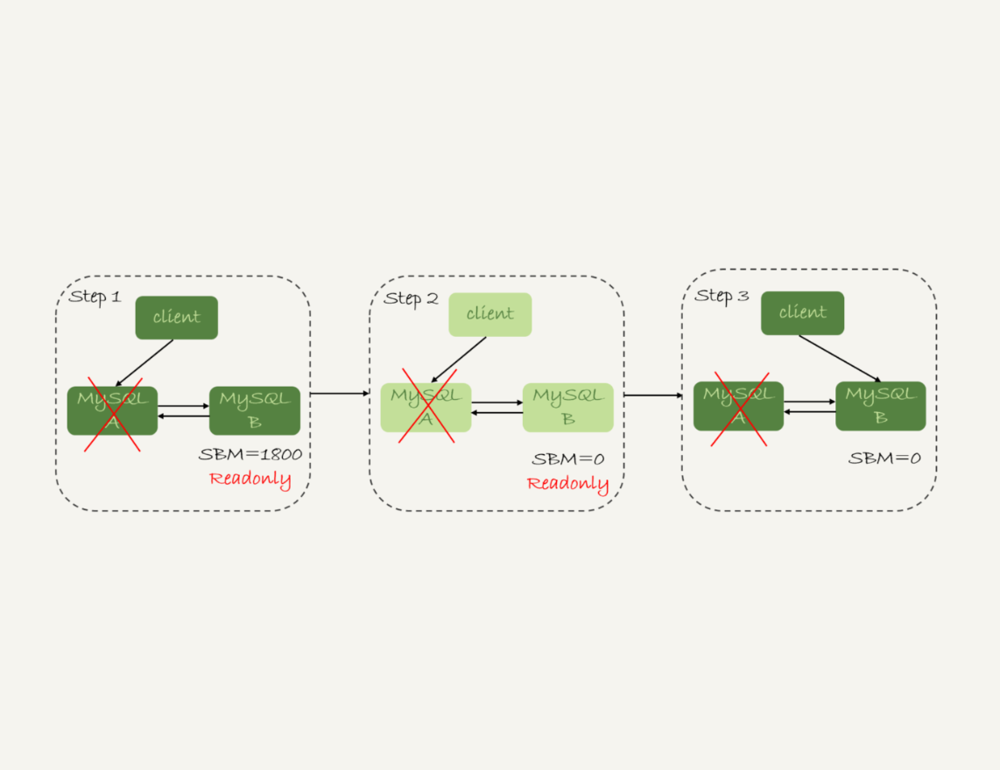

那能不能直接切换到备库 B，但是保持 B 只读呢？这样也不行。因为，这段时间内，中转日志还没有应用完成，如果直接发起主备切换，客户端查询看不到之前执行完成的事务，会认为有“数据丢失”。

虽然随着中转日志的继续应用，这些数据会恢复回来，但是对于一些业务来说，查询到“暂时丢失数据的状态”也是不能被接受的。

因此，**MySQL 高可用系统的可用性，是依赖于主备延迟的。**延迟的时间越小，在主库故障的时候，服务恢复需要的时间就越短，可用性就越高。


## 一主多从下的主备切换


虚线箭头表示的是主备关系，也就是 A 和 A’互为主备， 从库 B、C、D 指向的是主库 A。一主多从的设置，一般用于读写分离，主库负责所有的写入和一部分读，其他的读请求则由从库分担。


接下来，我们再一起看看一个切换系统会怎么完成一主多从的主备切换过程。

### 基于位点的主备切换

当我们把节点 B 设置成节点 A’的从库的时候，需要执行一条 change master 命令：

```shell
CHANGE MASTER TO 
MASTER_HOST=$host_name 
MASTER_PORT=$port 
MASTER_USER=$user_name 
MASTER_PASSWORD=$password 
MASTER_LOG_FILE=$master_log_name 
MASTER_LOG_POS=$master_log_pos  
```

最后两个参数 MASTER_LOG_FILE 和 MASTER_LOG_POS 表示，要从主库的 master_log_name 文件的 master_log_pos 这个位置的日志继续同步。而这个位置就是我们所说的同步位点，也就是主库对应的文件名和日志偏移量。

这个位点很难精确取到，只能取一个大概位置。为什么这么说呢？

考虑到切换过程中不能丢数据，所以我们找位点的时候，总是要找一个“稍微往前”的，然后再通过判断跳过那些在从库 B 上已经执行过的事务。

一种取同步位点的方法是这样的：

1. 等待新主库 A’把中转日志（relay log）全部同步完成；
2. 在 A’上执行 show master status 命令，得到当前 A’上最新的 File 和 Position；
3. 取原主库 A 故障的时刻 T；
4. 用 mysqlbinlog 工具解析 A’的 File，得到 T 时刻的位点。

> mysqlbinlog File --stop-datetime=T --start-datetime=T


图中，end_log_pos 后面的值“123”，表示的就是 A’这个实例，在 T 时刻写入新的 binlog 的位置。然后，我们就可以把 123 这个值作为 $master_log_pos ，用在节点 B 的 change master 命令里。


当然这个值并不精确。你可以设想有这么一种情况，假设在 T 这个时刻，主库 A 已经执行完成了一个 insert 语句插入了一行数据 R，并且已经将 binlog 传给了 A’和 B，然后在传完的瞬间主库 A 的主机就掉电了。那么，这时候系统的状态是这样的：

1. 在从库 B 上，由于同步了 binlog， R 这一行已经存在；
2. 在新主库 A’上， R 这一行也已经存在，日志是写在 123 这个位置之后的；
3. 我们在从库 B 上执行 change master 命令，指向 A’的 File 文件的 123 位置，就会把插入 R 这一行数据的 binlog 又同步到从库 B 去执行。

这时候，从库 B 的同步线程就会报告 Duplicate entry ‘id_of_R’ for key ‘PRIMARY’ 错误，提示出现了主键冲突，然后停止同步。

**通常情况下，我们在切换任务的时候，要先主动跳过这些错误，有两种常用的方法。**

**一种做法是，主动跳过一个事务。**跳过命令的写法是：

```
set global sql_slave_skip_counter=1;
start slave;
```

**另外一种方式是，通过设置 slave_skip_errors 参数，直接设置跳过指定的错误。**

等到主备间的同步关系建立完成，并稳定执行一段时间之后，我们还需要把这个参数设置为空，以免之后真的出现了主从数据不一致，也跳过了。


### GTID

上述两种操作都很复杂，而且容易出错。所以，MySQL 5.6 版本引入了 GTID，彻底解决了这个困难。

GTID 的全称是 Global Transaction Identifier，也就是全局事务 ID，是一个事务在提交的时候生成的，是这个事务的唯一标识。它由两部分组成，格式是：

>GTID=server_uuid:gno

- server_uuid 是一个实例第一次启动时自动生成的，是一个全局唯一的值；
- gno 是一个整数，初始值是 1，每次提交事务的时候分配给这个事务，并加 1

GTID 模式的启动也很简单，我们只需要在启动一个 MySQL 实例的时候，加上参数 gtid_mode=on 和 enforce_gtid_consistency=on 就可以了。

每个 MySQL 实例都维护了一个 GTID 集合，用来对应“这个实例执行过的所有事务”。接下来我就用一个简单的例子，来和你说明 GTID 的基本用法。

```mysql
CREATE TABLE `t` (
  `id` int(11) NOT NULL,
  `c` int(11) DEFAULT NULL,
  PRIMARY KEY (`id`)
) ENGINE=InnoDB;

insert into t values(1,1);
```


可以看到，事务的 BEGIN 之前有一条 SET @@SESSION.GTID_NEXT 命令。这时，如果实例 X 有从库，那么将 CREATE TABLE 和 insert 语句的 binlog 同步过去执行的话，执行事务之前就会先执行这两个 SET 命令， 这样被加入从库的 GTID 集合的，就是图中的这两个 GTID。

假设，现在这个实例 X 是另外一个实例 Y 的从库，并且此时在实例 Y 上执行了下面这条插入语句：

insert into t values(1,1);

并且，这条语句在实例 Y 上的 GTID 是 “aaaaaaaa-cccc-dddd-eeee-ffffffffffff:10”。

那么，实例 X 作为 Y 的从库，就要同步这个事务过来执行，显然会出现主键冲突，导致实例 X 的同步线程停止。这时，我们应该怎么处理呢？

处理方法就是，你可以执行下面的这个语句序列：

```mysql
set gtid_next='aaaaaaaa-cccc-dddd-eeee-ffffffffffff:10';
begin;
commit;
set gtid_next=automatic;
start slave;
```

执行完这个空事务之后的 show master status 的结果


在上面的这个语句序列中，start slave 命令之前还有一句 set gtid_next=automatic。这句话的作用是“恢复 GTID 的默认分配行为”，也就是说如果之后有新的事务再执行，就还是按照原来的分配方式，继续分配 gno=3。


### 基于 GTID 的主备切换

在 GTID 模式下，备库 B 要设置为新主库 A’的从库的语法如下：

```mysql
CHANGE MASTER TO 
MASTER_HOST=$host_name 
MASTER_PORT=$port 
MASTER_USER=$user_name 
MASTER_PASSWORD=$password 
master_auto_position=1 
```

其中，master_auto_position=1 就表示这个主备关系使用的是 GTID 协议。可以看到，前面让我们头疼不已的 MASTER_LOG_FILE 和 MASTER_LOG_POS 参数，已经不需要指定了。

我们把现在这个时刻，实例 A’的 GTID 集合记为 set_a，实例 B 的 GTID 集合记为 set_b。接下来，我们就看看现在的主备切换逻辑。

我们在实例 B 上执行 start slave 命令，取 binlog 的逻辑是这样的：

1. 实例 B 指定主库 A’，基于主备协议建立连接。
2. 实例 B 把 set_b 发给主库 A’。
3. 实例 A’算出 set_a 与 set_b 的差集，也就是所有存在于 set_a，但是不存在于 set_b 的 GTID 的集合，判断 A’本地是否包含了这个差集需要的所有 binlog 事务。a. 如果不包含，表示 A’已经把实例 B 需要的 binlog 给删掉了，直接返回错误；b. 如果确认全部包含，A’从自己的 binlog 文件里面，找出第一个不在 set_b 的事务，发给 B；
4. 之后就从这个事务开始，往后读文件，按顺序取 binlog 发给 B 去执行。

其实，这个逻辑里面包含了一个设计思想：在基于 GTID 的主备关系里，系统认为只要建立主备关系，就必须保证主库发给备库的日志是完整的。因此，如果实例 B 需要的日志已经不存在，A’就拒绝把日志发给 B。


严谨地说，主备切换不是不需要找位点了，而是找位点这个工作，在实例 A’内部就已经自动完成了。但由于这个工作是自动的，所以对 HA 系统的开发人员来说，非常友好。

之后这个系统就由新主库 A’写入，主库 A’的自己生成的 binlog 中的 GTID 集合格式是：server_uuid_of_A’:1-M。

如果之前从库 B 的 GTID 集合格式是 server_uuid_of_A:1-N， 那么切换之后 GTID 集合的格式就变成了 server_uuid_of_A:1-N, server_uuid_of_A’:1-M。

当然，主库 A’之前也是 A 的备库，因此主库 A’和从库 B 的 GTID 集合是一样的。这就达到了我们预期。


### GTID 在在线DDL中应用

假设，这两个互为主备关系的库还是实例 X 和实例 Y，且当前主库是 X，并且都打开了 GTID 模式。这时的主备切换流程可以变成下面这样：

- 在实例 X 上执行 stop slave。
- 在实例 Y 上执行 DDL 语句。注意，这里并不需要关闭 binlog。
- 执行完成后，查出这个 DDL 语句对应的 GTID，并记为 server_uuid_of_Y:gno。
- 到实例 X 上执行以下语句序列：

```mysql
set GTID_NEXT="server_uuid_of_Y:gno";
begin;
commit;
set gtid_next=automatic;
start slave;
```

这样做的目的在于，既可以让实例 Y 的更新有 binlog 记录，同时也可以确保不会在实例 X 上执行这条更新。

- 接下来，执行完主备切换，然后照着上述流程再执行一遍即可。


## 读写分离 

读写分离的主要目标就是分摊主库的压力。一般有两种架构。

一种是客户端（client）主动做负载均衡，这种模式下一般会把数据库的连接信息放在客户端的连接层。也就是说，由客户端来选择后端数据库进行查询。

还有一种架构是，在 MySQL 和客户端之间有一个中间代理层 proxy，客户端只连接 proxy， 由 proxy 根据请求类型和上下文决定请求的分发路由。

我们就看一下客户端直连和带 proxy 的读写分离架构，各有哪些特点。

1. 客户端直连方案，因为少了一层 proxy 转发，所以查询性能稍微好一点儿，并且整体架构简单，排查问题更方便。但是这种方案，由于要了解后端部署细节，所以在出现主备切换、库迁移等操作的时候，客户端都会感知到，并且需要调整数据库连接信息。你可能会觉得这样客户端也太麻烦了，信息大量冗余，架构很丑。其实也未必，一般采用这样的架构，一定会伴随一个负责管理后端的组件，比如 Zookeeper，尽量让业务端只专注于业务逻辑开发。
2. 带 proxy 的架构，对客户端比较友好。客户端不需要关注后端细节，连接维护、后端信息维护等工作，都是由 proxy 完成的。但这样的话，对后端维护团队的要求会更高。而且，proxy 也需要有高可用架构。因此，带 proxy 架构的整体就相对比较复杂。

具体选择哪个方案就取决于数据库团队提供的能力了。但目前看，趋势是往带 proxy 的架构方向发展的。

但是，不论使用哪种架构，你都会碰到我们今天要讨论的问题：由于主从可能存在延迟，**这种“在从库上会读到系统的一个过期状态”的现象，在这篇文章里，我们暂且称之为“过期读”。**

主要处理方案有：

- 强制走主库方案；
- sleep 方案；
- 判断主备无延迟方案；
- 配合 semi-sync 方案；
- 等主库位点方案；
- 等 GTID 方案。


### 强制走主库方案

其实就是，将查询请求做分类。必须要拿到最新结果的请求，强制将其发到主库上；可以读到旧数据的请求，才将其发到从库上。

这个方案最大的问题在于，有时候你会碰到“所有查询都不能是过期读”的需求，比如一些金融类的业务。这样的话，你就要放弃读写分离，

因此接下来，我们来讨论的话题是：可以支持读写分离的场景下，有哪些解决过期读的方案，并分析各个方案的优缺点。


### Sleep 方案

主库更新后，读从库之前先 sleep 一下。具体的方案就是，类似于执行一条 select sleep(1) 命令。

这个方案存在的问题就是不精确。这个不精确包含了两层意思：

如果这个查询请求本来 0.5 秒就可以在从库上拿到正确结果，也会等 1 秒；

如果延迟超过 1 秒，还是会出现过期读。


### 判断主备无延迟方案

​														show slave status 结果的部分截图

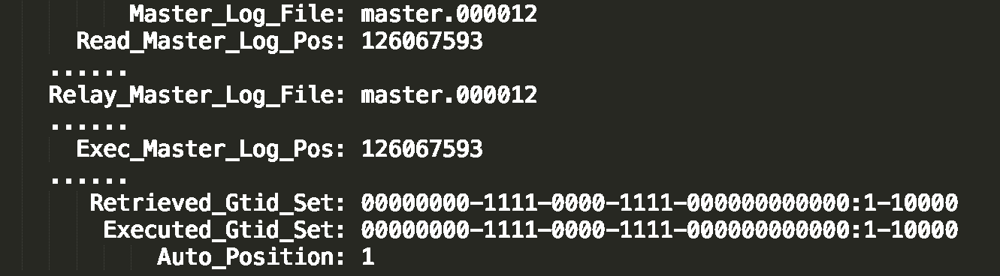


**第一种方法**，对比位点确保主备无延迟：

- Master_Log_File 和 Read_Master_Log_Pos，表示的是读到的主库的最新位点；
- Relay_Master_Log_File 和 Exec_Master_Log_Pos，表示的是备库执行的最新位点。

如果 Master_Log_File 和 Relay_Master_Log_File、Read_Master_Log_Pos 和 Exec_Master_Log_Pos 这两组值完全相同，就表示接收到的日志已经同步完成。


**第二种方法**，对比 GTID 集合确保主备无延迟：

- Auto_Position=1 ，表示这对主备关系使用了 GTID 协议。
- Retrieved_Gtid_Set，是备库收到的所有日志的 GTID 集合；
- Executed_Gtid_Set，是备库所有已经执行完成的 GTID 集合。

如果这两个集合相同，也表示备库接收到的日志都已经同步完成。

相比于 sleep 方案，准确度确实提升了不少，但还是没有达到“精确”的程度。为什么这么说呢？

在主备之间状态的分析中，不难看出还有一部分日志，处于客户端已经收到提交确认，而备库还没收到日志的状态。


主库上执行完成了三个事务 trx1、trx2 和 trx3，其中：

1. trx1 和 trx2 已经传到从库，并且已经执行完成了；
2. trx3 在主库执行完成，并且已经回复给客户端，但是还没有传到从库中。

如果这时候你在从库 B 上执行查询请求，按照我们上面的逻辑，从库认为已经没有同步延迟，但还是查不到 trx3 的。严格地说，就是出现了过期读。那么，这个问题有没有办法解决呢？


### 配合 semi-sync

要解决这个问题，就要引入半同步复制，也就是 semi-sync replication。

semi-sync 做了这样的设计：

1. 事务提交的时候，主库把 binlog 发给从库；
2. 从库收到 binlog 以后，发回给主库一个 ack，表示收到了；
3. 主库收到这个 ack 以后，才能给客户端返回“事务完成”的确认。

也就是说，如果启用了 semi-sync，就表示所有给客户端发送过确认的事务，都确保了备库已经收到了这个日志。

但是，**semi-sync+ 位点判断的方案，只对一主一备的场景是成立的。**在一主多从场景中，主库只要等到一个从库的 ack，就开始给客户端返回确认。

其实，**判断同步位点的方案还有另外一个潜在的问题，**即：如果在业务更新的高峰期，主库的位点或者 GTID 集合更新很快，那么上面的两个位点等值判断就会一直不成立，很可能出现从库上迟迟无法响应查询请求的情况。


实际上，回到我们最初的目的，当发起一个查询请求以后，我们要得到准确的结果，其实并不需要等到“主备完全同步”。


​																							图 5 主备持续延迟一个事务

我们小结一下，semi-sync 配合判断主备无延迟的方案，存在两个问题：

1. 一主多从的时候，在某些从库执行查询请求会存在过期读的现象；
2. 在持续延迟的情况下，可能出现过度等待的问题。

接下来，我要和你介绍的等主库位点方案，就可以解决这两个问题。


### 等主库位点方案

要理解等主库位点方案，我需要先和你介绍一条命令：

>select master_pos_wait(file, pos[, timeout]);

这条命令的逻辑如下：

1. 它是在从库执行的；
2. 参数 file 和 pos 指的是主库上的文件名和位置；
3. timeout 可选，设置为正整数 N 表示这个函数最多等待 N 秒。

这个命令正常返回的结果是一个正整数 M，表示从命令开始执行，到应用完 file 和 pos 表示的 binlog 位置，执行了多少事务。

当然，除了正常返回一个正整数 M 外，这条命令还会返回一些其他结果，包括：

1. 如果执行期间，备库同步线程发生异常，则返回 NULL；
2. 如果等待超过 N 秒，就返回 -1；
3. 如果刚开始执行的时候，就发现已经执行过这个位置了，则返回 0。


对于图 5 中先执行 trx1，再执行一个查询请求的逻辑，要保证能够查到正确的数据，我们可以使用这个逻辑：

1. trx1 事务更新完成后，马上执行 show master status 得到当前主库执行到的 File 和 Position；
2. 选定一个从库, 执行 select master_pos_wait(File, Position, 1)；
3. 如果返回值是 >=0 的正整数，则在这个从库执行查询语句；
4. 否则，到主库执行查询语句。

我把上面这个流程画出来。

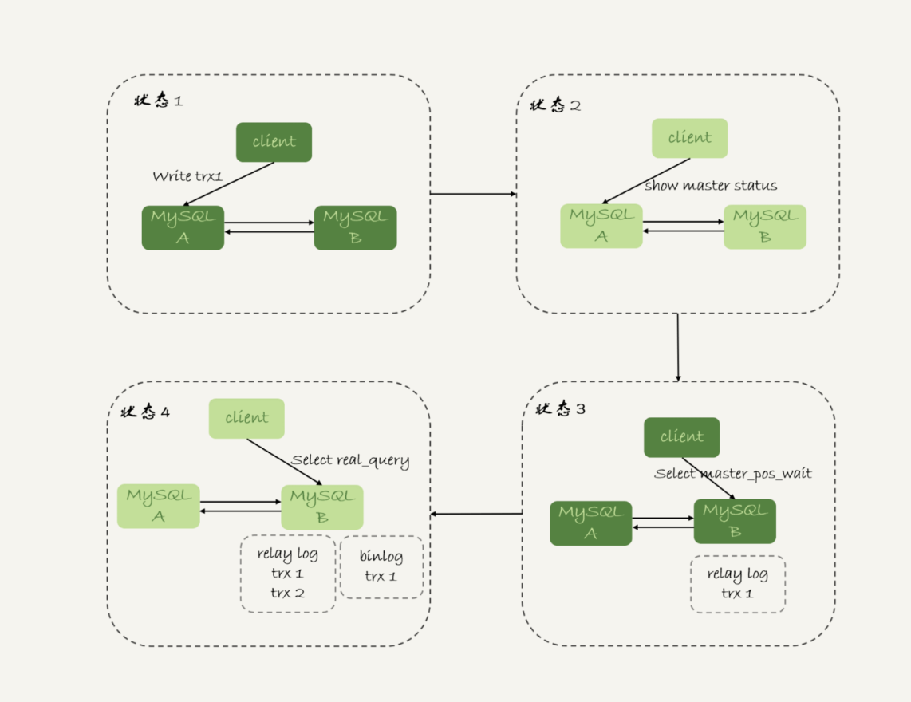


### GTID 方案

如果你的数据库开启了 GTID 模式，MySQL 中同样提供了一个类似的命令：

```mysql
select wait_for_executed_gtid_set(gtid_set, 1);
```

这条命令的逻辑是：

1. 等待，直到这个库执行的事务中包含传入的 gtid_set，返回 0；
2. 超时返回 1。

在前面等位点的方案中，我们执行完事务后，还要主动去主库执行 show master status。而 MySQL 5.7.6 版本开始，允许在执行完更新类事务后，把这个事务的 GTID 返回给客户端，这样等 GTID 的方案就可以减少一次查询。

这时，等 GTID 的执行流程就变成了：

1. trx1 事务更新完成后，从返回包直接获取这个事务的 GTID，记为 gtid1；
2. 选定一个从库,执行 select wait_for_executed_gtid_set(gtid1, 1)；
3. 如果返回值是 0，则在这个从库执行查询语句；
4. 否则，到主库执行查询语句。


在上面的第一步中，trx1 事务更新完成后，从返回包直接获取这个事务的 GTID。问题是，怎么能够让 MySQL 在执行事务后，返回包中带上 GTID 呢？你只需要将参数 session_track_gtids 设置为 OWN_GTID，然后通过 API 接口 mysql_session_track_get_first 从返回包解析出 GTID 的值即可。


## 如何判断一个数据库是不是出问题了

### select 1 判断

select 1 成功返回，只能说明这个库的进程还在，并不能说明主库没问题。

介绍两个概念 并发连接和并发查询。你在 show processlist 的结果里，看到的几千个连接，指的就是并发连接。而“当前正在执行”的语句，才是我们所说的并发查询。

并发连接数达到几千个影响并不大，就是多占一些内存而已。我们应该关注的是并发查询，因为并发查询太高才是 CPU 杀手。这也是为什么我们需要设置 **innodb_thread_concurrency** 参数的原因。

实际上，**在线程进入锁等待以后，并发线程的计数会减一**，也就是说等行锁（也包括间隙锁）的线程是不算在里面的。MySQL 这样设计是非常有意义的。因为，进入锁等待的线程已经不吃 CPU 了；更重要的是，必须这么设计，才能避免整个系统锁死。


### 查表判断

为了能够检测 InnoDB 并发线程数过多导致的系统不可用情况，我们需要找一个访问 InnoDB 的场景。一般的做法是，在系统库（mysql 库）里创建一个表，比如命名为 health_check，里面只放一行数据，然后定期执行：

```mysql
mysql> select * from mysql.health_check; 
```

使用这个方法，我们可以检测出由于并发线程过多导致的数据库不可用的情况。

但是，我们马上还会碰到下一个问题，即：空间满了以后，这种方法又会变得不好使。

更新事务要写 binlog，而一旦 binlog 所在磁盘的空间占用率达到 100%，那么所有的更新语句和事务提交的 commit 语句就都会被堵住。但是，系统这时候还是可以正常读数据的。

因此，我们还是把这条监控语句再改进一下


### 更新判断

既然要更新，就要放个有意义的字段，常见做法是放一个 timestamp 字段，用来表示最后一次执行检测的时间。这条更新语句类似于：

```mysql
mysql> update mysql.health_check set t_modified=now();
```

节点可用性的检测都应该包含主库和备库。如果用更新来检测主库的话，那么备库也要进行更新检测。

为了让主备之间的更新不产生冲突，我们可以在 mysql.health_check 表上存入多行数据，并用 A、B 的 server_id 做主键。

```mysql
mysql> CREATE TABLE `health_check` (
  `id` int(11) NOT NULL,
  `t_modified` timestamp NOT NULL DEFAULT CURRENT_TIMESTAMP,
  PRIMARY KEY (`id`)
) ENGINE=InnoDB;

/* 检测命令 */
insert into mysql.health_check(id, t_modified) values (@@server_id, now()) on duplicate key update t_modified=now();
```


但是仍然有问题，设想一个日志盘的 IO 利用率已经是 100% 的场景。这时候，整个系统响应非常慢，已经需要做主备切换了。但是你要知道，IO 利用率 100% 表示系统的 IO 是在工作的，每个请求都有机会获得 IO 资源，执行自己的任务。而我们的检测使用的 update 命令，需要的资源很少，所以可能在拿到 IO 资源的时候就可以提交成功，并且在超时时间 N 秒未到达之前就返回给了检测系统。

也就是说，这时候在业务系统上正常的 SQL 语句已经执行得很慢了，但是 DBA 上去一看，HA 系统还在正常工作，并且认为主库现在处于可用状态。

之所以会出现这个现象，根本原因是我们上面说的所有方法，都是基于外部检测的。外部检测天然有一个问题，就是随机性。

所以，接下来我要再和你介绍一种在 MySQL 内部发现数据库问题的方法。


### 内部统计

针对磁盘利用率这个问题，如果 MySQL 可以告诉我们，内部每一次 IO 请求的时间，那我们判断数据库是否出问题的方法就可靠得多了。

其实，MySQL 5.6 版本以后提供的 performance_schema 库，就在 file_summary_by_event_name 表里统计了每次 IO 请求的时间。file_summary_by_event_name 表里有很多行数据，我们先来看看 event_name='wait/io/file/innodb/innodb_log_file’这一行。


图中这一行表示统计的是 redo log 的写入时间，第一列 EVENT_NAME 表示统计的类型。

接下来的三组数据，显示的是 redo log 操作的时间统计。

第一组五列，是所有 IO 类型的统计。其中，COUNT_STAR 是所有 IO 的总次数，接下来四列是具体的统计项， 单位是皮秒；前缀 SUM、MIN、AVG、MAX，顾名思义指的就是总和、最小值、平均值和最大值。

第二组六列，是读操作的统计。最后一列 SUM_NUMBER_OF_BYTES_READ 统计的是，总共从 redo log 里读了多少个字节。

第三组六列，统计的是写操作。

最后的第四组数据，是对其他类型数据的统计。在 redo log 里，你可以认为它们就是对 fsync 的统计。

在 performance_schema 库的 file_summary_by_event_name 表里，binlog 对应的是 event_name = "wait/io/file/sql/binlog"这一行。各个字段的统计逻辑，与 redo log 的各个字段完全相同。这里，我就不再赘述了。

因为我们每一次操作数据库，performance_schema 都需要额外地统计这些信息，所以我们打开这个统计功能是有性能损耗的。

我的测试结果是，如果打开所有的 performance_schema 项，性能大概会下降 10% 左右。所以，我建议你只打开自己需要的项进行统计。你可以通过下面的方法打开或者关闭某个具体项的统计。

如果要打开 redo log 的时间监控，你可以执行这个语句：

```mysql
mysql> update setup_instruments set ENABLED='YES', Timed='YES' where name like '%wait/io/file/innodb/innodb_log_file%';
```

假设，现在你已经开启了 redo log 和 binlog 这两个统计信息，那要怎么把这个信息用在实例状态诊断上呢？

很简单，你可以通过 MAX_TIMER 的值来判断数据库是否出问题了。比如，你可以设定阈值，单次 IO 请求时间超过 200 毫秒属于异常，然后使用类似下面这条语句作为检测逻辑。

```mysql
mysql> select event_name,MAX_TIMER_WAIT  FROM performance_schema.file_summary_by_event_name where event_name in ('wait/io/file/innodb/innodb_log_file','wait/io/file/sql/binlog') and MAX_TIMER_WAIT>200*1000000000;
```

发现异常后，取到你需要的信息，再通过下面这条语句：

>mysql> truncate table performance_schema.file_summary_by_event_name;

把之前的统计信息清空。这样如果后面的监控中，再次出现这个异常，就可以加入监控累积值了。


## 关于kill 命令

在 MySQL 中有两个 kill 命令：一个是 kill query + 线程 id，表示终止这个线程中正在执行的语句；一个是 kill connection + 线程 id，这里 connection 可缺省，表示断开这个线程的连接，

大多数情况下，kill query/connection 命令是有效的。比如，执行一个查询的过程中，发现执行时间太久，要放弃继续查询，这时我们就可以用 kill query 命令，终止这条查询语句。

还有一种情况是，语句处于锁等待的时候，直接使用 kill 命令也是有效的。我们一起来看下这个例子：


可以看到，session C 执行 kill query 以后，session B 几乎同时就提示了语句被中断。这，就是我们预期的结果。


### 收到 kill 以后，线程做什么？

前面讲过，当对一个表做增删改查操作时，会在表上加 MDL 读锁。所以，session B 虽然处于 blocked 状态，但还是拿着一个 MDL 读锁的。如果线程被 kill 的时候，就直接终止，那之后这个 MDL 读锁就没机会被释放了。

这样看来，kill 并不是马上停止的意思，而是告诉执行线程说，这条语句已经不需要继续执行了，可以开始“执行停止的逻辑了”。

**实现上，当用户执行 kill query thread_id_B 时，MySQL 里处理 kill 命令的线程做了两件事：**

1. **把 session B 的运行状态改成 THD::KILL_QUERY(将变量 killed 赋值为 THD::KILL_QUERY)；**
2. **给 session B 的执行线程发一个信号。**

因为像图 1 的我们例子里面，session B 处于锁等待状态，如果只是把 session B 的线程状态设置 THD::KILL_QUERY，线程 B 并不知道这个状态变化，还是会继续等待。发一个信号的目的，就是让 session B 退出等待，来处理这个 THD::KILL_QUERY 状态。

上面的分析中，隐含了这么三层意思：

1. **一个语句执行过程中有多处“埋点”，在这些“埋点”的地方判断线程状态，如果发现线程状态是 THD::KILL_QUERY，才开始进入语句终止逻辑；**
2. **如果处于等待状态，必须是一个可以被唤醒的等待，否则根本不会执行到“埋点”处；**
3. **语句从开始进入终止逻辑，到终止逻辑完全完成，是有一个过程的。**


## 查全表会不会把数据库内存打爆

### 全表扫描对 server 层的影响

我们现在要对一个 200G 的 InnoDB 表 db1. t，执行一个全表扫描。当然，你要把扫描结果保存在客户端，会使用类似这样的命令：

>mysql -h$host -P$port -u$user -p$pwd -e "select * from db1.t" > $target_file

整个过程大概如下:

1. 获取一行，写到 net_buffer 中。这块内存的大小是由参数 net_buffer_length 定义的，默认是 16k。
2. 重复获取行，直到 net_buffer 写满，调用网络接口发出去。
3. 如果发送成功，就清空 net_buffer，然后继续取下一行，并写入 net_buffer。
4. 如果发送函数返回 EAGAIN 或 WSAEWOULDBLOCK，就表示本地网络栈（socket send buffer）写满了，进入等待。直到网络栈重新可写，再继续发送。

这个过程对应的流程图如下所示。

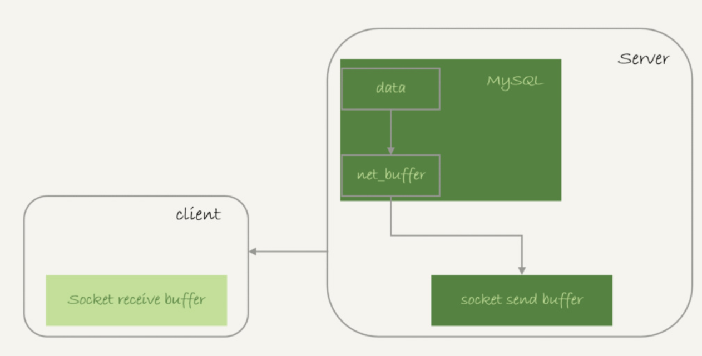


也就是说，**MySQL 是“边读边发的”**，这个概念很重要。这就意味着，**如果客户端接收得慢，会导致 MySQL 服务端由于结果发不出去，这个事务的执行时间变长。**


#### Sending to client  & Sending data

比如下面这个状态，就是我故意让客户端不去读 socket receive buffer 中的内容，然后在服务端 show processlist 看到的结果。

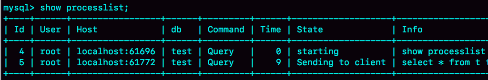

如果你看到 State 的值一直处于**“Sending to client”**，就表示服务器端的网络栈写满了。

与“Sending to client”长相很类似的一个状态是**“Sending data”**，这是一个经常被误会的问题。

实际上，一个查询语句的状态变化是这样的（注意：这里，我略去了其他无关的状态）：

- MySQL 查询语句进入执行阶段后，首先把状态设置成“Sending data”；
- 然后，发送执行结果的列相关的信息（meta data) 给客户端；
- 再继续执行语句的流程；
- 执行完成后，把状态设置成空字符串。

也就是说，“Sending data”并不一定是指“正在发送数据”，而**可能是处于执行器过程中的任意阶段。**意思只是“正在执行”。


### 全表扫描对 InnoDB 的影响

内存的数据页是在 Buffer Pool (BP) 中管理的，在 WAL 里 Buffer Pool 起到了加速更新的作用。而实际上，Buffer Pool 还有一个更重要的作用，就是加速查询。

如果一个 Buffer Pool 满了，而又要从磁盘读入一个数据页，那肯定是要淘汰一个旧数据页的。InnoDB 内存管理用的是最近最少使用 (Least Recently Used, LRU) 算法，这个算法的核心就是淘汰最久未使用的数据。


但是如果考虑到要做一个全表扫描，会不会有问题呢？

假设我们要扫描一个 200G 的表，而这个表是一个历史数据表，平时没有业务访问它。那么，按照这个算法扫描的话，就会把当前的 Buffer Pool 里的数据全部淘汰掉，存入扫描过程中访问到的数据页的内容。也就是说 Buffer Pool 里面主要放的是这个历史数据表的数据。业务系统 Buffer Pool 的内存命中率急剧下降，磁盘压力增加，SQL 语句响应变慢。

实际上，InnoDB 对 LRU 算法做了改进。


在 InnoDB 实现上，按照 5:3 的比例把整个 LRU 链表分成了 young 区域和 old 区域。图中 LRU_old 指向的就是 old 区域的第一个位置，是整个链表的 5/8 处。也就是说，靠近链表头部的 5/8 是 young 区域，靠近链表尾部的 3/8 是 old 区域。

改进后的 LRU 算法执行流程变成了下面这样。

1. 图 7 中状态 1，要访问数据页 P3，由于 P3 在 young 区域，因此和优化前的 LRU 算法一样，将其移到链表头部，变成状态 2。
2. 之后要访问一个新的不存在于当前链表的数据页，这时候依然是淘汰掉数据页 Pm，但是新插入的数据页 Px，是放在 LRU_old 处。
3. 处于 old 区域的数据页，每次被访问的时候都要做下面这个判断：

- 若这个数据页在 LRU 链表中存在的时间超过了 1 秒，就把它移动到链表头部；
- 如果这个数据页在 LRU 链表中存在的时间短于 1 秒，位置保持不变。1 秒这个时间，是由参数 innodb_old_blocks_time 控制的。其默认值是 1000，单位毫秒。


这个策略，就是为了处理类似全表扫描的操作量身定制的。还是以刚刚的扫描 200G 的历史数据表为例，我们看看改进后的 LRU 算法的操作逻辑：

1. 扫描过程中，需要新插入的数据页，都被放到 old 区域 ;
2. 一个数据页里面有多条记录，这个数据页会被多次访问到，但由于是顺序扫描，这个数据页第一次被访问和最后一次被访问的时间间隔不会超过 1 秒，因此还是会被保留在 old 区域；
3. 再继续扫描后续的数据，之前的这个数据页之后也不会再被访问到，于是始终没有机会移到链表头部（也就是 young 区域），很快就会被淘汰出去。

可以看到，这个策略最大的收益，就是在扫描这个大表的过程中，虽然也用到了 Buffer Pool，但是对 young 区域完全没有影响，从而保证了 Buffer Pool 响应正常业务的查询命中率。


## join 语句的执行过程

```mysql
CREATE TABLE `t2` (
  `id` int(11) NOT NULL,
  `a` int(11) DEFAULT NULL,
  `b` int(11) DEFAULT NULL,
  PRIMARY KEY (`id`),
  KEY `a` (`a`)
) ENGINE=InnoDB;

drop procedure idata;
delimiter ;;
create procedure idata()
begin
  declare i int;
  set i=1;
  while(i<=1000)do
    insert into t2 values(i, i, i);
    set i=i+1;
  end while;
end;;
delimiter ;
call idata();

create table t1 like t2;
insert into t1 (select * from t2 where id<=100)
```

存储过程 idata() 往表 t2 里插入了 1000 行数据，在表 t1 里插入的是 100 行数据。


### Index Nested-Loop Join

我们来看一下这个语句：

> select * from t1 straight_join t2 on (t1.a=t2.a);


这个过程是先遍历表 t1，然后根据从表 t1 中取出的每行数据中的 a 值，去表 t2 中查找满足条件的记录。在形式上，这个过程就跟我们写程序时的嵌套查询类似，并且可以用上被驱动表的索引，所以我们称之为“Index Nested-Loop Join”，简称 NLJ。


假设被驱动表的行数是 M。每次在被驱动表查一行数据，要先搜索索引 a，再搜索主键索引。每次搜索一棵树近似复杂度是以 2 为底的 M 的对数，记为 log2M，所以在被驱动表上查一行的时间复杂度是 2*log2M。

假设驱动表的行数是 N，整个执行过程，近似复杂度是 N + N * 2 * log2M。


### Simple Nested-Loop Join

现在，我们把 SQL 语句改成不走索引：

```mysql
select * from t1 straight_join t2 on (t1.a=t2.b);
```

由于表 t2 的字段 b 上没有索引，因此再用图 2 的执行流程时，每次到 t2 去匹配的时候，就要做一次全表扫描。

这个算法也有一个名字，叫做“Simple Nested-Loop Join”，但是这算法太“笨重”了，MySQL也没有使用SNLJ。


### Block Nested-Loop Join

join_buffer 的大小是由参数 join_buffer_size 设定的，默认值是 256k。如果放不下表 t1 的所有数据话，策略很简单，就是分段放。我把 join_buffer_size 改成 1200，再执行：

1. 扫描表 t1，顺序读取数据行放入线程内存 join_buffer 中，放完第 88 行 join_buffer 满了，继续第 2 步；

2. 扫描表 t2，把 t2 中的每一行取出来，跟 join_buffer 中的数据做对比，满足 join 条件的，作为结果集的一部分返回；

   因为对比是在内存中操作，速度会比Simple Nested-Loop Join 快很多

3. 清空 join_buffer；

4. 继续扫描表 t1，顺序读取最后的 12 行数据放入 join_buffer 中，继续执行第 2 步。

执行流程图也就变成这样：


这个流程才体现出了这个算法名字中“Block”的由来，表示“分块去 join”。

假设，驱动表的数据行数是 N，需要分 λ*N段才能完成算法流程，显然λ的取值范围是 (0,1)。被驱动表的数据行数是 M。

在这个算法的执行过程中：

1. 扫描行数是 N+λ * N * M；
2. 内存判断 N*M 次

N数越大，分段数越大。N固定的时候，join_buffer_size 越大，λ 越小，对被驱动表的全表扫描次数就越少。这就是为什么，**你可能会看到一些建议告诉你，如果你的 join 语句很慢，就把 join_buffer_size 改大。**


第一个问题：能不能使用 join 语句？

1. 如果可以使用 Index Nested-Loop Join 算法，也就是说可以用上被驱动表上的索引，其实是没问题的；
2. 如果使用 Block Nested-Loop Join 算法，扫描行数就会过多。尤其是在大表上的 join 操作，这样可能要扫描被驱动表很多次，会占用大量的系统资源。所以这种 join 尽量不要用。

所以你在判断要不要使用 join 语句时，就是看 explain 结果里面，Extra 字段里面有没有出现“Block Nested Loop”字样。


第二个问题是：如果要使用 join，应该选择大表做驱动表还是选择小表做驱动表？

1. 如果是 Index Nested-Loop Join 算法，应该选择小表做驱动表；
2. 如果是 Block Nested-Loop Join 算法：

- 在 join_buffer_size 足够大的时候，是一样的，即λ * N = 1；
- 在 join_buffer_size 不够大的时候（这种情况更常见），应该选择小表做驱动表。

结论就是，总是应该使用小表做驱动表。


## join 语句优化

```mysql
create table t1(id int primary key, a int, b int, index(a));
create table t2 like t1;
drop procedure idata;
delimiter ;;
create procedure idata()
begin
  declare i int;
  set i=1;
  while(i<=1000)do
    insert into t1 values(i, 1001-i, i);
    set i=i+1;
  end while;
  
  set i=1;
  while(i<=1000000)do
    insert into t2 values(i, i, i);
    set i=i+1;
  end while;

end;;
delimiter ;
call idata();
```

为了便于后面量化说明，我在表 t1 里，插入了 1000 行数据，每一行的 a=1001-id 的值。也就是说，表 t1 中字段 a 是逆序的。同时，我在表 t2 中插入了 100 万行数据。


### 概念：Multi-Range Read (MRR) 优化

MRR 这个优化的主要目的是尽量使用顺序读盘

之前提到了“回表”的概念。回表是指，InnoDB 在普通索引 a 上查到主键 id 的值后，再根据一个个主键 id 的值**一行一行地**到主键索引上去查整行数据的过程。如果随着 a 的值递增顺序查询的话，id 的值就变成随机的，那么就会出现随机访问，性能相对较差

**因为大多数的数据都是按照主键递增顺序插入得到的，所以我们可以认为，如果按照主键的递增顺序查询的话，对磁盘的读比较接近顺序读，能够提升读性能。**

这，就是 MRR 优化的设计思路。此时，语句的执行流程变成了这样：

1. 根据索引 a，定位到满足条件的记录，将 id 值放入 read_rnd_buffer 中 ;
2. 将 read_rnd_buffer 中的 id 进行递增排序；
3. 排序后的 id 数组，依次到主键 id 索引中查记录，并作为结果返回。

另外需要说明的是，如果你想要稳定地使用 MRR 优化的话，需要设置set optimizer_switch="mrr_cost_based=off"。（官方文档的说法，是现在的优化器策略，判断消耗的时候，会更倾向于不使用 MRR，把 mrr_cost_based 设置为 off，就是固定使用 MRR 了。）

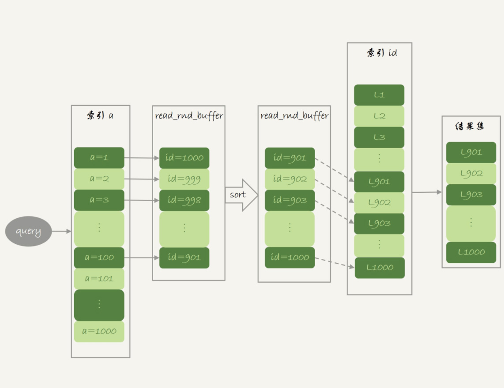

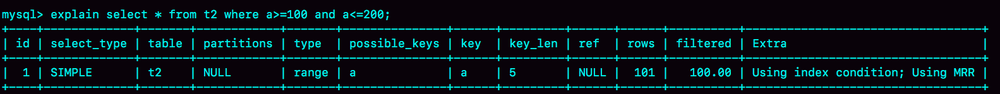

explain 结果中，我们可以看到 Extra 字段多了 Using MRR，表示的是用上了 MRR 优化。而且，由于我们在 read_rnd_buffer 中按照 id 做了排序，所以最后得到的结果集也是按照主键 id 递增顺序的


### NLJ的优化：Batched Key Access

理解了 MRR 性能提升的原理，我们就能理解 MySQL 在 5.6 版本后开始引入的 Batched Key Access(BKA) 算法了。这个 BKA 算法，其实就是对 NLJ 算法的优化。

NLJ算法每次从驱动表t1取一条数据去t2 join，我们把取数批量化， 复用下 BNL算法里的 join_buffer，如图

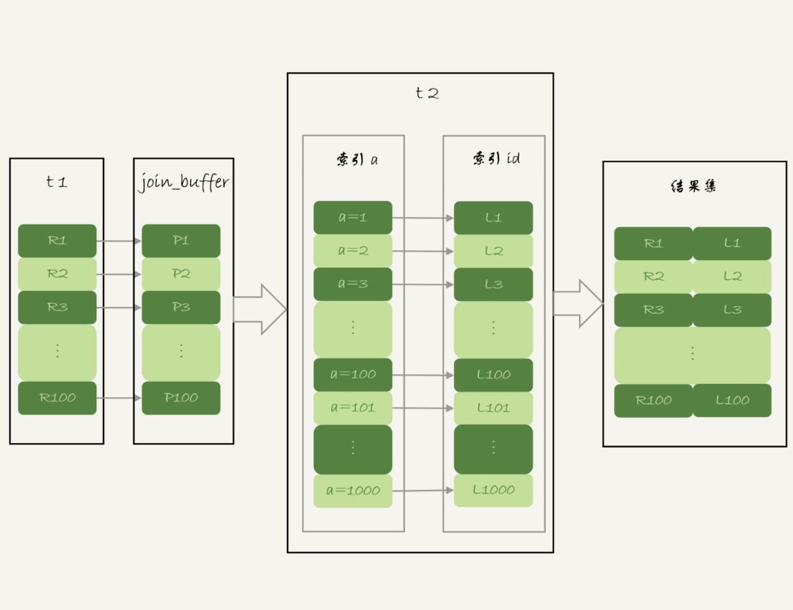

如果 join buffer 放不下 P1~P100 的所有数据，就会把这 100 行数据分成多段执行上图的流程。

如果要使用 BKA 优化算法的话，你需要在执行 SQL 语句之前，先设置

> set optimizer_switch='mrr=on,mrr_cost_based=off,batched_key_access=on';

**当多表join时，使用 BKA 算法的时候，并不是“先计算两个表 join 的结果，再跟第三个表 join”，而是直接嵌套查询的。**


### BNL的优化

#### BNL产生的影响

我们说到 InnoDB 的 LRU 算法的时候提到，由于 InnoDB 对 Bufffer Pool 的 LRU 算法做了优化，即：第一次从磁盘读入内存的数据页，会先放在 old 区域。如果 1 秒之后这个数据页不再被访问了，就不会被移动到 LRU 链表头部，这样对 Buffer Pool 的命中率影响就不大。

但是，如果一个使用 BNL 算法的 join 语句，多次扫描一个冷表，而且这个语句执行时间超过 1 秒，就会在再次扫描冷表的时候，把冷表的数据页移到 LRU 链表头部。

这种情况对应的，是冷表的数据量小于整个 Buffer Pool 的 3/8，能够完全放入 old 区域的情况。

如果这个冷表很大，就会出现另外一种情况：业务正常访问的数据页，没有机会进入 young 区域。

由于优化机制的存在，一个正常访问的数据页，要进入 young 区域，需要隔 1 秒后再次被访问到。但是，由于我们的 join 语句在循环读磁盘和淘汰内存页，进入 old 区域的数据页，很可能在 1 秒之内就被淘汰了。这样，就会导致这个 MySQL 实例的 Buffer Pool 在这段时间内，young 区域的数据页没有被合理地淘汰。

**这两种情况都会影响 Buffer Pool 的正常运作。大表 join 操作虽然对 IO 有影响，但是在语句执行结束后，对 IO 的影响也就结束了。但是，对 Buffer Pool 的影响就是持续性的，需要依靠后续的查询请求慢慢恢复内存命中率。**


总结，BNL 算法对系统的影响主要包括三个方面：

1. 可能会多次扫描被驱动表，占用磁盘 IO 资源；
2. 判断 join 条件需要执行 N * M 次对比（N、M 分别是两张表的行数），如果是大表就会占用非常多的 CPU 资源；
3. 可能会导致 Buffer Pool 的热数据被淘汰，影响内存命中率。


#### BNL 转 BKA

一些情况下，我们可以直接在被驱动表上建索引，这时就可以直接转成 BKA 算法了。

但是，有时候你确实会碰到一些不适合在被驱动表上建索引的情况。比如下面这个语句：

```mysql
select * from t1 join t2 on (t1.b=t2.b) where t2.b>=1 and t2.b<=2000;
```

我们在文章开始的时候，在表 t2 中插入了 100 万行数据，但是经过 where 条件过滤后，需要参与 join 的只有 2000 行数据。如果这条语句同时是一个低频的 SQL 语句，那么再为这个语句在表 t2 的字段 b 上创建一个索引就很浪费了。

我们可以考虑使用临时表。使用临时表的大致思路是：

1. 把表 t2 中满足条件的数据放在临时表 tmp_t 中；
2. 为了让 join 使用 BKA 算法，给临时表 tmp_t 的字段 b 加上索引；
3. 让表 t1 和 tmp_t 做 join 操作。

```mysql
create temporary table temp_t(id int primary key, a int, b int, index(b))engine=innodb;
insert into temp_t select * from t2 where b>=1 and b<=2000;
select * from t1 join temp_t on (t1.b=temp_t.b);
```

总体来看，不论是在原表上加索引，还是用有索引的临时表，我们的思路都是让 join 语句能够用上被驱动表上的索引，来触发 BKA 算法，提升查询性能。


------


## 为什么用户临时表可以重名？

在上一篇文章中，我们在优化 join 查询的时候使用到了临时表。

这里，我需要先帮你厘清一个容易误解的问题：有的人可能会认为，临时表就是内存表。但是，这两个概念可是完全不同的。

- 内存表，指的是使用 Memory 引擎的表，建表语法是 create table … engine=memory。这种表的数据都保存在内存里，系统重启的时候会被清空，但是表结构还在。除了这两个特性看上去比较“奇怪”外，从其他的特征上看，它就是一个正常的表。
- 而临时表，可以使用各种引擎类型 。如果是使用 InnoDB 引擎或者 MyISAM 引擎的临时表，写数据的时候是写到磁盘上的。当然，临时表也可以使用 Memory 引擎。弄清楚了内存表和临时表的区别以后，我们再来看看临时表有哪些特征。


### 临时表的特性

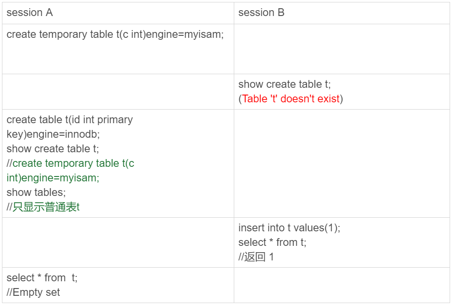

可以看到，临时表在使用上有以下几个特点：

1. 建表语法是 create temporary table …。
2. 一个临时表只能被创建它的 session 访问，对其他线程不可见。在这个 session 结束的时候，会自动删除临时表。
3. 临时表可以与普通表同名。
4. session A 内有同名的临时表和普通表的时候，show create 语句，以及增删改查语句访问的是临时表。
5. show tables 命令不显示临时表。


### 分库分表中临时表的应用

一般分库分表的场景，就是要把一个逻辑上的大表分散到不同的数据库实例上。比如。将一个大表 ht，按照字段 f，拆分成 1024 个分表，然后分布到 32 个数据库实例上。如下图所示：


一般情况下，这种分库分表系统都有一个中间层 proxy。不过，也有一些方案会让客户端直接连接数据库，也就是没有 proxy 这一层。

在这个架构中，分区 key 的选择是以“减少跨库和跨表查询”为依据的。如果大部分的语句都会包含 f 的等值条件，那么就要用 f 做分区键。这样，在 proxy 这一层解析完 SQL 语句以后，就能确定将这条语句路由到哪个分表做查询。比如：

```mysql
select v from ht where f=N;
```

我们就可以通过分表规则（比如，N%1024) 来确认需要的数据被放在了哪个分表上。这种语句只需要访问一个分表，是分库分表方案最欢迎的语句形式了。

但是，如果这个表上还有另外一个索引 k，并且查询语句是这样的：

```mysql
select v from ht where k >= M order by t_modified desc limit 100;
```

这时候，由于查询条件里面没有用到分区字段 f，只能到所有的分区中去查找满足条件的所有行，然后统一做 order by 的操作。这种情况下，有两种比较常用的思路。

**第一种思路是，在 proxy 层的进程代码中实现排序。**

这种方式的优势是处理速度快，拿到分库的数据以后，直接在内存中参与计算。不过，这个方案的缺点也比较明显：

1. 需要的开发工作量比较大。我们举例的这条语句还算是比较简单的，如果涉及到复杂的操作，比如 group by，甚至 join 这样的操作，对中间层的开发能力要求比较高；
2. 对 proxy 端的压力比较大，尤其是很容易出现内存不够用和 CPU 瓶颈的问题。

**另一种思路就是，把各个分库拿到的数据，汇总到一个 MySQL 实例的一个表中，然后在这个汇总实例上做逻辑操作。**

- 在汇总库上创建一个临时表 temp_ht，表里包含三个字段 v、k、t_modified；
- 在各个分库上执行

> select v,k,t_modified from ht_x where k >= M order by t_modified desc limit 100;

- 把分库执行的结果插入到 temp_ht 表中；
- 执行

> select v from temp_ht order by t_modified desc limit 100;


### 为什么临时表可以重名？

####表结构、表数据

创建临时表的时候，MySQL 要给这个 InnoDB 表创建一个 frm 文件保存表结构定义，还要有地方保存表数据。

这个 frm 文件放在临时文件目录下，可以使用 select @@tmpdir 命令，来显示实例的临时文件目录。

**文件名 = #sql{进程 id}_ {线程 id}_ 序列号.frm**


而关于表中数据的存放方式，在不同的 MySQL 版本中有着不同的处理方式：

- 在 5.6 以及之前的版本里，MySQL 会在临时文件目录下创建一个相同前缀、以.ibd 为后缀的文件，用来存放数据文件；
- 而从 5.7 版本开始，MySQL 引入了一个临时文件表空间，专门用来存放临时文件的数据。因此，我们就不需要再创建 ibd 文件了。


####内存中

MySQL 维护数据表，除了物理上要有文件外，内存里面也有一套机制区别不同的表，每个表都对应一个 table_def_key。

- 一个普通表的 table_def_key 的值是由“库名 + 表名”得到的，所以如果你要在同一个库下创建两个同名的普通表，创建第二个表的过程中就会发现 table_def_key 已经存在了。
- 而对于临时表，table_def_key 在“库名 + 表名”基础上，又加入了“server_id+thread_id”。


也就是说，session A 和 sessionB 创建的两个临时表 t1，它们的 table_def_key 不同，磁盘文件名也不同，因此可以并存。

在实现上，每个线程都维护了自己的临时表链表。这样每次 session 内操作表的时候，先遍历链表，检查是否有这个名字的临时表，如果有就优先操作临时表，如果没有再操作普通表；在 session 结束的时候，对链表里的每个临时表，执行 “DROP TEMPORARY TABLE + 表名”操作。

这时候你会发现，binlog 中也记录了 DROP TEMPORARY TABLE 这条命令。你一定会觉得奇怪，临时表只在线程内自己可以访问，为什么需要写到 binlog 里面？

### 临时表和主备复制

你可以设想一下，在主库上执行下面这个语句序列：

```mysql
create table t_normal(id int primary key, c int)engine=innodb;/*Q1*/
create temporary table temp_t like t_normal;/*Q2*/
insert into temp_t values(1,1);/*Q3*/
insert into t_normal select * from temp_t;/*Q4*/
```

如果关于临时表的操作都不记录，备库在执行到Q4 的时候，就会报错“表 temp_t 不存在”。

如果当前的 binlog_format=row，那么跟临时表有关的语句，就不会记录到 binlog 里。也就是说，**只在 binlog_format=statment/mixed 的时候，binlog 中才会记录临时表的操作。**

------


## 什么时候会使用内部临时表？

介绍了 sort buffer、内存临时表和 join buffer。这三个数据结构都是用来存放语句执行过程中的中间数据，以辅助 SQL 语句的执行的。其中，我们在排序的时候用到了 sort buffer，在使用 join 语句的时候用到了 join buffer。

那什么时候会使用内部临时表呢？


### union 执行流程

```mysql

create table t1(id int primary key, a int, b int, index(a));
delimiter ;;
create procedure idata()
begin
  declare i int;

  set i=1;
  while(i<=1000)do
    insert into t1 values(i, i, i);
    set i=i+1;
  end while;
end;;
delimiter ;
call idata();
```

然后，我们执行下面这条语句：

```mysql
(select 1000 as f) union (select id from t1 order by id desc limit 2);
```


可以看到：

- 第二行的 key=PRIMARY，说明第二个子句用到了索引 id。
- 第三行的 Extra 字段，表示在对子查询的结果集做 union 的时候，使用了临时表 (Using temporary)。

这个语句的执行流程是这样的：

1. 创建一个内存临时表，这个临时表只有一个整型字段 f，并且 f 是主键字段。
2. 执行第一个子查询，得到 1000 这个值，并存入临时表中。
3. 执行第二个子查询：
4. - 拿到第一行 id=1000，试图插入临时表中。但由于 1000 这个值已经存在于临时表了，违反了唯一性约束，所以插入失败，然后继续执行；
   - 取到第二行 id=999，插入临时表成功。
5. 从临时表中按行取出数据，返回结果，并删除临时表，结果中包含两行数据分别是 1000 和 999。


如果把上面这个语句中的 union 改成 union all 的话，就没有了“去重”的语义。这样执行的时候，就依次执行子查询，得到的结果直接作为结果集的一部分，发给客户端。因此也就不需要临时表了。

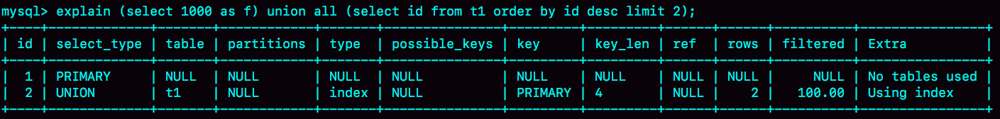


### group by 执行流程

我们来看一下这个语句：

```mysql
select id%10 as m, count(*) as c from t1 group by m;
```


这个语句的执行流程是这样的：

1. 创建内存临时表，表里有两个字段 m 和 c，主键是 m；
2. 扫描表 t1 的索引 a，依次取出叶子节点上的 id 值，计算 id%10 的结果，记为 x；
3. - 如果临时表中没有主键为 x 的行，就插入一个记录 (x,1);
   - 如果表中有主键为 x 的行，就将 x 这一行的 c 值加 1；
4. 遍历完成后，再根据字段 m 做排序，得到结果集返回给客户端。


如果你的需求并不需要对结果进行排序，那你可以在 SQL 语句末尾增加 order by null，也就是改成：

> select id%10 as m, count(*) as c from t1 group by m order by null;

这个例子里由于临时表只有 10 行，内存可以放得下，因此全程只使用了内存临时表。但是，内存临时表的大小是有限制的，参数 tmp_table_size 就是控制这个内存大小的，默认是 16M。如果执行：

```mysql
set tmp_table_size=1024;
select id%100 as m, count(*) as c from t1 group by m order by null limit 10;
```

那么，这时候就会把内存临时表转成磁盘临时表，磁盘临时表默认使用的引擎是 InnoDB。


### group by 优化方法 

#### 索引

要解决 group by 语句的优化问题，你可以先想一下这个问题：执行 group by 语句为什么需要临时表？

group by 的语义逻辑，是统计不同的值出现的个数。但是，由于每一行的 id%100 的结果是无序的，所以我们就需要有一个临时表，来记录并统计结果。

假设，现在有一个类似图 10 的这么一个数据结构，我们来看看 group by 可以怎么做。


- 当碰到第一个 1 的时候，已经知道累积了 X 个 0，结果集里的第一行就是 (0,X);
- 当碰到第一个 2 的时候，已经知道累积了 Y 个 1，结果集里的第二行就是 (1,Y);

按照这个逻辑执行的话，扫描到整个输入的数据结束，就可以拿到 group by 的结果，不需要临时表，也不需要再额外排序。

InnoDB 的索引，就可以满足这个输入有序的条件。

在 MySQL 5.7 版本支持了 generated column 机制，用来实现列数据的关联更新。你可以用下面的方法创建一个列 z，然后在 z 列上创建一个索引

```mysql
alter table t1 add column z int generated always as(id % 100), add index(z);
```

这样，索引 z 上的数据就是类似图 10 这样有序的了。上面的 group by 语句就可以改成：

```mysql
select z, count(*) as c from t1 group by z;
```

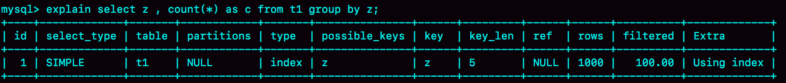

从 Extra 字段可以看到，这个语句的执行不再需要临时表，也不需要排序了。


#### 直接排序

如果可以通过加索引来完成 group by 逻辑就再好不过了。但是，如果碰上不适合创建索引的场景，我们还是要老老实实做排序的。

假如一个 group by 语句中需要放到临时表上的数据量特别大，却还是要“先放到内存临时表，插入一部分数据后，发现内存临时表不够用了再转成磁盘临时表”，看上去就有点儿傻。

可以在 group by 语句中加入 SQL_BIG_RESULT 这个提示（hint），就可以告诉优化器：这个语句涉及的数据量很大，请直接用磁盘临时表。

优化器一看，磁盘临时表是 B+ 树存储，存储效率不如数组来得高。所以，既然你告诉我数据量很大，那从磁盘空间考虑，还是直接用数组来存吧。

```mysql
select SQL_BIG_RESULT id%100 as m, count(*) as c from t1 group by m;
```

执行流程就是这样的：

1. 初始化 sort_buffer，确定放入一个整型字段，记为 m；
2. 扫描表 t1 的索引 a，依次取出里面的 id 值, 将 id%100 的值存入 sort_buffer 中；
3. 扫描完成后，对 sort_buffer 的字段 m 做排序（如果 sort_buffer 内存不够用，就会利用磁盘临时文件辅助排序）；
4. 排序完成后，就得到了一个有序数组。

根据有序数组，得到数组里面的不同值，以及每个值的出现次数。这一步的逻辑，你已经从前面的group-索引优化中了解过了。


从 Extra 字段可以看到，这个语句的执行没有再使用临时表，而是直接用了排序算法。

------


## Memory引擎

### 内存表的数据组织结构

为了便于分析，我来把这个问题简化一下，假设有以下的两张表 t1 和 t2，其中表 t1 使用 Memory 引擎， 表 t2 使用 InnoDB 引擎。

```mysql
create table t1(id int primary key, c int) engine=Memory;
create table t2(id int primary key, c int) engine=innodb;
insert into t1 values(1,1),(2,2),(3,3),(4,4),(5,5),(6,6),(7,7),(8,8),(9,9),(0,0);
insert into t2 values(1,1),(2,2),(3,3),(4,4),(5,5),(6,6),(7,7),(8,8),(9,9),(0,0);
```


表 t2 用的是 InnoDB 引擎，它的主键索引 id 的组织方式，你已经很熟悉了：InnoDB 表的数据就放在主键索引树上，主键索引是 B+ 树。主键索引上的值是有序存储的。在执行 select * 的时候，就会按照叶子节点从左到右扫描，所以得到的结果里，0 就出现在第一行。

与 InnoDB 引擎不同，Memory 引擎的数据和索引是分开的。我们来看一下表 t1 中的数据内容。


可以看到，内存表的数据部分以数组的方式单独存放，而主键 id 索引里，存的是每个数据的位置。主键 id 是 hash 索引，可以看到索引上的 key 并不是有序的。

从中我们可以看出，这两个引擎的一些典型不同：

1. **InnoDB 表的数据总是有序存放的，而内存表的数据就是按照写入顺序存放的；**
2. **当数据文件有空洞的时候，InnoDB 表在插入新数据的时候，为了保证数据有序性，只能在固定的位置写入新值，而内存表找到空位就可以插入新值；**
3. **数据位置发生变化的时候，InnoDB 表只需要修改主键索引，而内存表需要修改所有索引；**
4. **InnoDB 表用主键索引查询时需要走一次索引查找，用普通索引查询的时候，需要走两次索引查找。而内存表没有这个区别，所有索引的“地位”都是相同的。**
5. **InnoDB 支持变长数据类型，不同记录的长度可能不同；内存表不支持 Blob 和 Text 字段，并且即使定义了 varchar(N)，实际也当作 char(N)，也就是固定长度字符串来存储，因此内存表的每行数据长度相同。**


需要指出的是，表 t1 的这个主键索引是哈希索引，因此如果执行范围查询，比如

> select * from t1 where id<5;

是用不上主键索引的，需要走全表扫描。那如果要让内存表支持范围扫描，应该怎么办呢 ？


### hash 索引和 B-Tree 索引

实际上，内存表也是支 B-Tree 索引的。在 id 列上创建一个 B-Tree 索引，

```mysql
alter table t1 add index a_btree_index using btree (id);
```

这时，表 t1 的数据组织形式就变成了这样：


可以看到，执行 select * from t1 where id<5 的时候，优化器会选择 B-Tree 索引，所以返回结果是 0 到 4。 使用 force index 强行使用主键 id 这个索引，id=0 这一行就在结果集的最末尾了。

但是，接下来我要跟你说明，为什么我不建议你在生产环境上使用内存表。这里的原因主要包括两个方面：

1. 锁粒度问题；
2. 数据持久化问题。


### 内存表的问题

#### 内存表的锁

内存表不支持行锁，只支持表锁。因此，一张表只要有更新，就会堵住其他所有在这个表上的读写操作。

需要注意的是，这里的表锁跟之前我们介绍过的 MDL 锁不同，但都是表级的锁。


#### 数据持久性问题

数据放在内存中，是内存表的优势，但也是一个劣势。因为，数据库重启的时候，所有的内存表都会被清空。

**我们先看看 M-S 架构下，使用内存表存在的问题。**


如果备库重启，主库同步的语句都会报错。

但是，接下来内存表的这个特性就会让使用现象显得更“诡异”了。由于 MySQL 知道重启之后，内存表的数据会丢失。所以，担心主库重启之后，出现主备不一致，MySQL 在实现上做了这样一件事儿：在数据库重启之后，往 binlog 里面写入一行 DELETE FROM t1。

**如果使用是下图所示的双 M 结构的话：**


在备库重启的时候，备库 binlog 里的 delete 语句就会传到主库，然后把主库内存表的内容删除。这样你在使用的时候就会发现，主库的内存表数据突然被清空了。

所以，**建议你把普通内存表都用 InnoDB 表来代替**。但是，有一个场景却是例外的。这个场景就是，我们在第 35 和 36 篇说到的用户临时表。在数据量可控，不会耗费过多内存的情况下，你可以考虑使用内存表。


## 自增主键为何不连续？

```mysql
CREATE TABLE `t` (
  `id` int(11) NOT NULL AUTO_INCREMENT,
  `c` int(11) DEFAULT NULL,
  `d` int(11) DEFAULT NULL,
  PRIMARY KEY (`id`),
  UNIQUE KEY `c` (`c`)
) ENGINE=InnoDB;
```


### 自增值保存在哪儿？

不同的引擎对于自增值的保存策略不同。

1. MyISAM 引擎的自增值保存在数据文件中。
2. InnoDB 引擎的自增值，其实是保存在了内存里，并且到了 MySQL 8.0 版本后，才有了“自增值持久化”的能力，也就是才实现了“如果发生重启，表的自增值可以恢复为 MySQL 重启前的值”，具体情况是：

- ​	在 MySQL 5.7 及之前的版本，自增值保存在内存里，并没有持久化。每次重启后，第一次打开表的时候，都会去找自增值的最大值 max(id)，然后将 max(id)+1 作为这个表当前的自增值。举例来说，如果一个表当前数据行里最大的 id 是 10，AUTO_INCREMENT=11。这时候，我们删除 id=10 的行，AUTO_INCREMENT 还是 11。但如果马上重启实例，重启后这个表的 AUTO_INCREMENT 就会变成 10。也就是说，MySQL 重启可能会修改一个表的 AUTO_INCREMENT 的值。
- ​	在 MySQL 8.0 版本，将自增值的变更记录在了 redo log 中，重启的时候依靠 redo log 恢复重启之前的值。


### 自增值修改机制

假设，某次要插入的值是 X，当前的自增值是 Y。

1. 如果 X<Y，那么这个表的自增值不变；
2. 如果 X≥Y，就需要把当前自增值修改为新的自增值。

新的自增值生成算法是：从 auto_increment_offset 开始，以 auto_increment_increment 为步长，持续叠加，直到找到第一个大于 X 的值，作为新的自增值。(auto_increment_offset 和 auto_increment_increment 是两个系统参数，分别用来表示自增的初始值和步长，默认值都是 1)


### 主键id不连续的3种情况

**唯一键冲突是导致自增主键 id 不连续的第一种原因。**

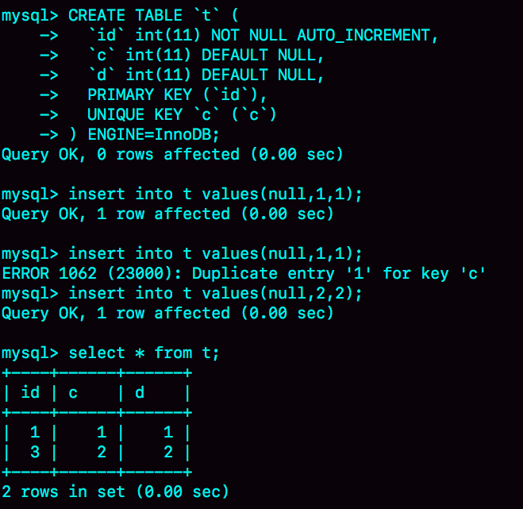


**事务回滚也会产生类似的现象，这就是第二种原因。**

```mysql
insert into t values(null,1,1);
begin;
insert into t values(null,2,2);
rollback;
insert into t values(null,2,2);
//插入的行是(3,2,2)
```


**自增值为什么不能回退?**  MySQL 这么设计是为了提升性能。


**第三种原因**

如果一个 select … insert 语句要插入 10 万行数据，按照这个逻辑的话就要申请 10 万次。显然，这种申请自增 id 的策略，在大批量插入数据的情况下，不但速度慢，还会影响并发插入的性能。

因此，对于批量插入数据的语句，MySQL 有一个批量申请自增 id 的策略：

1. 语句执行过程中，第一次申请自增 id，会分配 1 个；
2. 1 个用完以后，这个语句第二次申请自增 id，会分配 2 个；
3. 依此类推，同一个语句去申请自增 id，每次申请到的自增 id 个数都是上一次的两倍。

```mysql
insert into t values(null, 1,1);
insert into t values(null, 2,2);
insert into t values(null, 3,3);
insert into t values(null, 4,4);
create table t2 like t;
insert into t2(c,d) select c,d from t;
insert into t2 values(null, 5,5);
```

insert…select，实际上往表 t2 中插入了 4 行数据。但是，这四行数据是分三次申请的自增 id，第一次申请到了 id=1，第二次被分配了 id=2 和 id=3， 第三次被分配到 id=4 到 id=7。

由于这条语句实际只用上了 4 个 id，所以 id=5 到 id=7 就被浪费掉了。之后，再执行 insert into t2 values(null, 5,5)，实际上插入的数据就是（8,5,5)。


### 自增锁的优化史

自增 id 锁并不是一个事务锁，而是每次申请完就马上释放，以便允许别的事务再申请。其实，在 MySQL 5.1 版本之前，并不是这样的。

在 MySQL 5.0 版本的时候，自增锁的范围是语句级别。也就是说，如果一个语句申请了一个表自增锁，这个锁会等语句执行结束以后才释放。显然，这样设计会影响并发度。

MySQL 5.1.22 版本引入了一个新策略，新增参数 innodb_autoinc_lock_mode，默认值是 1。

1. 这个参数的值被设置为 0 时，表示采用之前 MySQL 5.0 版本的策略，即语句执行结束后才释放锁；
2. 这个参数的值被设置为 1 时：
3. - 普通 insert 语句，自增锁在申请之后就马上释放；
   - 类似 insert … select 这样的批量插入数据的语句，自增锁还是要等语句结束后才被释放；
4. 这个参数的值被设置为 2 时，所有的申请自增主键的动作都是申请后就释放锁。

你一定有两个疑问：**为什么默认设置下，insert … select 要使用语句级的锁？为什么这个参数的默认值不是 2？**

比如


如果 session B 是申请了自增值以后马上就释放自增锁，如果我们现在的 binlog_format=statement，主从id可能就不一致

而要解决这个问题，有两种思路：

1. 一种思路是，让原库的批量插入数据语句，固定生成连续的 id 值。所以，自增锁直到语句执行结束才释放，就是为了达到这个目的。
2. 另一种思路是，在 binlog 里面把插入数据的操作都如实记录进来，到备库执行的时候，不再依赖于自增主键去生成。这种情况，其实就是 innodb_autoinc_lock_mode 设置为 2，同时 binlog_format 设置为 row。

我这里说的**批量插入数据，包含的语句类型是 insert … select、replace … select 和 load data 语句。**


------

## insert 语句的锁为什么这么多


### insert … select 语句

接上一节最后一个例子。现在，我们一起来看看为什么在可重复读隔离级别下，binlog_format=statement 时执行：

> insert into t2(c,d) select c,d from t;

这个语句时，需要对表 t 的所有行和间隙加锁呢？

如果没有锁的话，就可能出现 session B 的 insert 语句先执行，但是后写入 binlog 的情况。binlog 里面就记录了这样的语句序列：

```mysql
insert into t values(null,5,5);
insert into t2(c,d) select c,d from t;
```

这个语句到了备库执行，就会把 c=5 这一行也写到表 t2 中，出现主备不一致。


### insert 循环写入

当然了，执行 insert … select 的时候，对目标表也不是锁全表，而是只锁住需要访问的资源。比如：

```mysql
insert into t2(c,d)  (select c+1, d from t force index(c) order by c desc limit 1);
```

这个语句的加锁范围，就是表 t 索引 c 上的 (3,4]和 (4,supremum]这两个 next-key lock，以及主键索引上 id=4 这一行。

它的执行流程也比较简单，从表 t 中按照索引 c 倒序，扫描第一行，拿到结果写入到表 t2 中。

因此整条语句的扫描行数是 1。


那么，如果我们是要把这样的一行数据插入到原表 t 中的话：

```mysql
insert into t(c,d)  (select c+1, d from t force index(c) order by c desc limit 1);
```


整个执行过程应该是这样：

1. 创建临时表，表里有两个字段 c 和 d。
2. 按照索引 c 扫描表 t，依次取 c=4、3、2、1，然后回表，读到 c 和 d 的值写入临时表。这时，Rows_examined=4。
3. 由于语义里面有 limit 1，所以只取了临时表的第一行，再插入到表 t 中。这时，Rows_examined 的值加 1，变成了 5。

也就是说，这个语句会导致在表 t 上做全表扫描，并且会给索引 c 上的所有间隙都加上共享的 next-key lock。所以，这个语句执行期间，其他事务不能在这个表上插入数据。

由于实现上这个语句没有在子查询中就直接使用 limit 1，从而导致了这个语句的执行需要遍历整个表 t。它的优化方法也比较简单，就是用前面介绍的方法，先 insert into 到临时表 temp_t，这样就只需要扫描一行；然后再从表 temp_t 里面取出这行数据插入表 t1。

```mysql
create temporary table temp_t(c int,d int) engine=memory;
insert into temp_t  (select c+1, d from t force index(c) order by c desc limit 1);
insert into t select * from temp_t;
drop table temp_t;
```


### insert 唯一键冲突

分享一个经典的死锁场景


在 session A 执行 rollback 语句回滚的时候，session C 几乎同时发现死锁并返回。这个死锁产生的逻辑是这样的：

1. 在 T1 时刻，启动 session A，并执行 insert 语句，此时在索引 c 的 c=5 上加了记录锁。注意，这个索引是唯一索引，因此退化为记录锁
2. 在 T2 时刻，session B 要执行相同的 insert 语句，发现了唯一键冲突，加上读锁；同样地，session C 也在索引 c 上，c=5 这一个记录上，加了读锁。
3. T3 时刻，session A 回滚。这时候，session B 和 session C 都试图继续执行插入操作，都要加上写锁。两个 session 都要等待对方的行锁，所以就出现了死锁。这个流程的状态变化图如下所示。

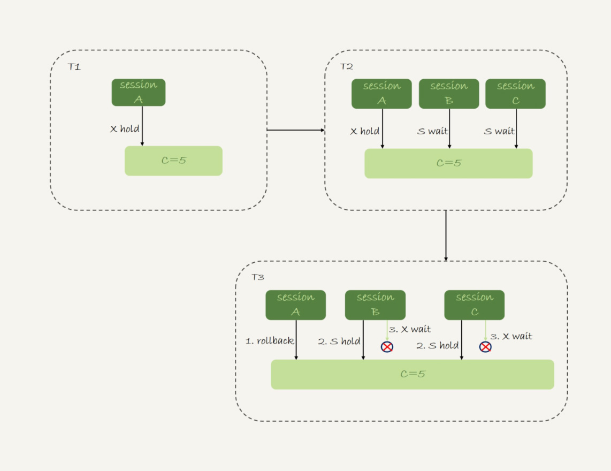


### insert into … on duplicate key update

insert into … on duplicate key update 这个语义的逻辑是，插入一行数据，如果碰到唯一键约束，就执行后面的更新语句。

**注意，如果有多个列违反了唯一性约束，就会按照索引的顺序，修改跟第一个索引冲突的行。**

现在表 t 里面已经有了 (1,1,1) 和 (2,2,2) 这两行，我们再来看看下面这个语句执行的效果：


需要注意的是，执行这条语句的 affected rows 返回的是 2，很容易造成误解。实际上，真正更新的只有一行，只是在代码实现上，insert 和 update 都认为自己成功了，update 计数加了 1， insert 计数也加了 1。


### 小结

insert … select 是很常见的在两个表之间拷贝数据的方法。你需要注意，在可重复读隔离级别下，这个语句会给 select 的表里扫描到的记录和间隙加读锁。

而如果 insert 和 select 的对象是同一个表，则有可能会造成循环写入。这种情况下，我们需要引入用户临时表来做优化。insert 语句如果出现唯一键冲突，会在冲突的唯一值上加共享的 next-key lock(S 锁)。

因此，碰到由于唯一键约束导致报错后，要尽快提交或回滚事务，避免加锁时间过长。

------


## grant之后要跟着flush privileges吗？

### 全局权限

全局权限，作用于整个 MySQL 实例，这些权限信息保存在 mysql 库的 user 表里。如果我要给用户 ua 赋一个最高权限的话，语句是这么写的：

```mysql
grant all privileges on *.* to 'ua'@'%' with grant option;
```

这个 grant 命令做了两个动作：

1. 磁盘上，将 mysql.user 表里，用户’ua’@’%'这一行的所有表示权限的字段的值都修改为‘Y’；
2. 内存里，从数组 acl_users 中找到这个用户对应的对象，将 access 值（权限位）修改为二进制的“全 1”。

在这个 grant 命令执行完成后，如果有新的客户端使用用户名 ua 登录成功，MySQL 会为新连接维护一个线程对象，然后从 acl_users 数组里查到这个用户的权限，并将权限值拷贝到这个线程对象中。之后在这个连接中执行的语句，所有关于全局权限的判断，都直接使用线程对象内部保存的权限位。


如果要回收上面的 grant 语句赋予的权限，你可以使用下面这条命令：

```mysql
revoke all privileges on *.* from 'ua'@'%';
```


### db 权限

如果要让用户 ua 拥有库 db1 的所有权限，可以执行下面这条命令：

```mysql
grant all privileges on db1.* to 'ua'@'%' with grant option;
```

基于库的权限记录保存在 mysql.db 表中，在内存里则保存在数组 acl_dbs 中。这条 grant 命令做了如下两个动作：

1. 磁盘上，往 mysql.db 表中插入了一行记录，所有权限位字段设置为“Y”；
2. 内存里，增加一个对象到数组 acl_dbs 中，这个对象的权限位为“全 1”。

每次需要判断一个用户对一个数据库读写权限的时候，都需要遍历一次 acl_dbs 数组，根据 user、host 和 db 找到匹配的对象，然后根据对象的权限位来判断。


**注意点**


这里在代码实现上有一个特别的逻辑，如果当前会话已经处于某一个 db 里面，之前 use 这个库的时候拿到的库权限会保存在会话变量中。

你可以看到在 T6 时刻，session C 和 session B 对表 t 的操作逻辑是一样的。但是 session B 报错，而 session C 可以执行成功。这是因为 session C 在 T2 时刻执行的 use db1，拿到了这个库的权限，在切换出 db1 库之前，session C 对这个库就一直有权限。


### 表权限和列权限

其中，表权限定义存放在表 mysql.tables_priv 中，列权限定义存放在表 mysql.columns_priv 中。这两类权限，组合起来存放在内存的 hash 结构 column_priv_hash 中。这两类权限的赋权命令如下：

```mysql
create table db1.t1(id int, a int);

grant all privileges on db1.t1 to 'ua'@'%' with grant option;
GRANT SELECT(id), INSERT (id,a) ON mydb.mytbl TO 'ua'@'%' with grant option;
```

跟 db 权限类似，这两个权限每次 grant 的时候都会修改数据表，也会同步修改内存中的 hash 结构。因此，对这两类权限的操作，也会马上影响到已经存在的连接。


###  flush privileges

看到这里，你一定会问，看来 grant 语句都是即时生效的，那这么看应该就不需要执行 flush privileges 语句了呀。答案也确实是这样的。

**正常情况下，grant 命令之后，没有必要跟着执行 flush privileges 命令。**

那么，flush privileges 是在什么时候使用呢？显然，当数据表中的权限数据跟内存中的权限数据不一致的时候，flush privileges 语句可以用来重建内存数据，达到一致状态。

这种不一致往往是由不规范的操作导致的，比如直接用 DML 语句操作系统权限表。我们来看一下下面这个场景：

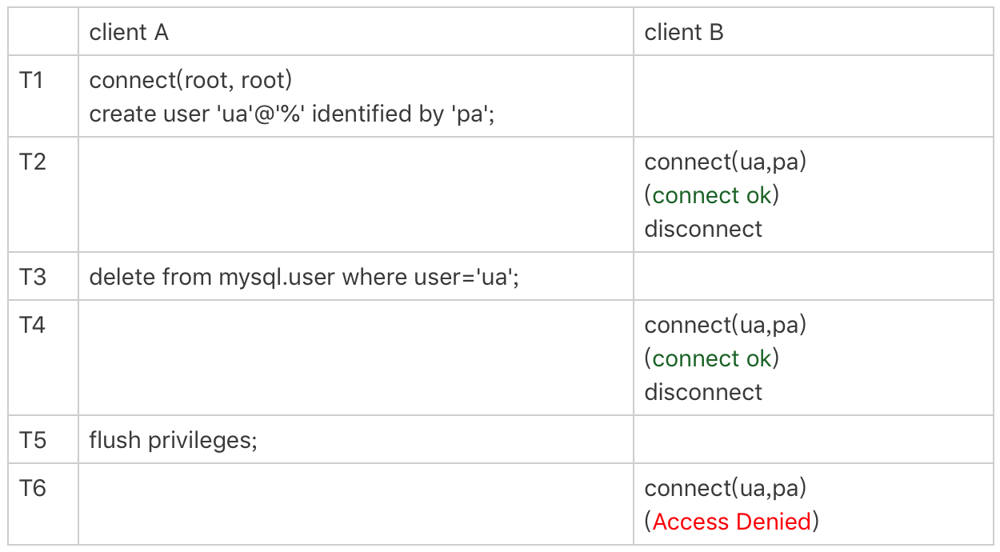


------


## 要不要使用分区表？

1：啥是分区表？
创建表的时候，使用了数据分区相关的语法，存储数据的时候，存储引擎会根据分区规则将不同的数据存入不同的分区文件。
2：使用分区表的劣势？
2-1：MySQL 在第一次打开分区表的时候，需要访问所有的分区——打开的表较多，性能糟糕也可能报打开的表超过设置的问题。
2-2：在 server 层，认为这是同一张表，因此所有分区共用同一个 MDL 锁——锁粒度大，影响并发度，站在Server看也是合理的，不过站在存储引擎的角度看就不合理了。
2-3：在引擎层，认为这是不同的表，因此 MDL 锁之后的执行过程，会根据分区表规则，只访问必要的分区——被访问到的分区。
3：使用分区表的优势？
分区表的一个显而易见的优势是对业务透明，相对于用户分表来说，使用分区表的业务代码更简洁。还有，分区表可以很方便的清理历史数据。
4：啥时候适合使用分区表？
单表过大时，使用时注意以下两点
4-1：分区并不是越细越好。实际上，单表或者单分区的数据一千万行，只要没有特别大的索引，对于现在的硬件能力来说都已经是小表了。
4-2：分区也不要提前预留太多，在使用之前预先创建即可。比如，如果是按月分区，每年年底时再把下一年度的 12 个新分区创建上即可。对于没有数据的历史分区，要及时的 drop 掉。
5：使用分区表，有其特点的根本原因？
对于Server层，分区表还是一个表
对于存储引擎层，分区表会是多张表