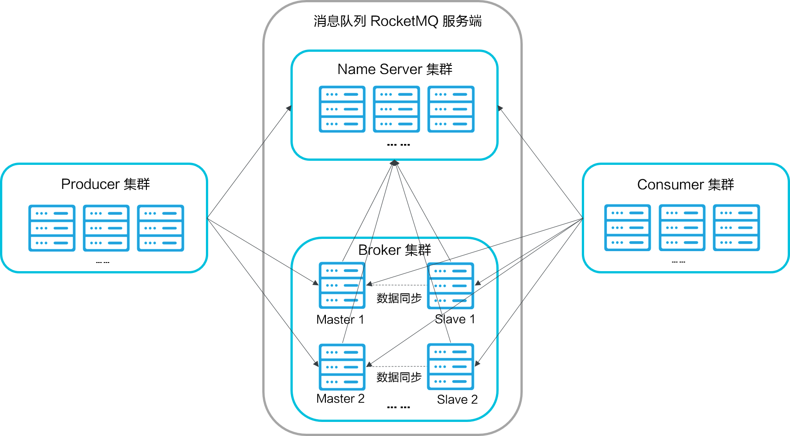
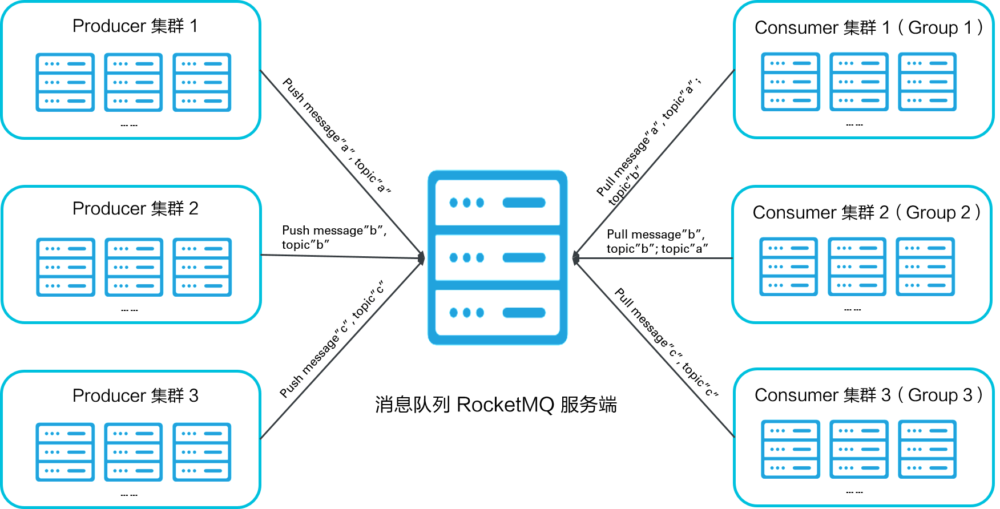

# RocketMQ


## 产品架构



图中所涉及到的概念如下所述：

- Name Server: 是一个几乎无状态节点，可集群部署，在消息队列 RocketMQ 中提供命名服务，更新和发现 Broker 服务。
- Broker：分为 Master Broker 和 Slave Broker，一个 Master Broker 可以对应多个 Slave Broker，但是一个 Slave Broker 只能对应一个 Master Broker。Broker 启动后需要完成一次将自己注册至 Name Server 的操作；随后每隔 30s 定期向 Name Server 上报 Topic 路由信息。
- Producer：与 Name Server 集群中的其中一个节点（随机）建立长链接（Keep-alive），定期从 Name Server 读取 Topic 路由信息，并向提供 Topic 服务的 Master Broker 建立长链接，且定时向 Master Broker 发送心跳。
- Consumer： 与 Name Server 集群中的其中一个节点（随机）建立长连接，定期从 Name Server 拉取 Topic 路由信息，并向提供 Topic 服务的 Master Broker、Slave Broker 建立长连接，且定时向 Master Broker、Slave Broker 发送心跳。Consumer 既可以从 Master Broker 订阅消息，也可以从 Slave Broker 订阅消息，订阅规则由 Broker 配置决定。

### 订阅模式

消息队列 RocketMQ 的订阅模式采用的是发布/订阅模式（Pub/Sub 模式），如下图所示。

[](http://docs-aliyun.cn-hangzhou.oss.aliyun-inc.com/assets/pic/112008/cn_zh/1554883226316/订阅模式.png)

- Producer 集群: 用来表示一个发送消息应用，一个 Producer 集群下包含多个 Producer 实例，可以是多台机器，也可以是一台机器的多个进程，或者一个进程的多个 Producer 对象。一个 Producer 集群可以发送多个 Topic 消息。可以想象一下，发送分布式事物消息时，如果 Producer 中途意外宕机，Broker 会主动回调 Producer 集群的任意一台机器来确认事务状态。

- Consumer 集群：用来表示一个消费消息应用，一个 Consumer 集群下包含多个 Consumer 实例，可以是多台机器，也可以是多个进程，或者是一个进程的多个 Consumer 对象。一个 Consumer 集群下的多个 Consumer 以均摊方式消费消息。如果设置的是广播方式，那么这个 Consumer 集群下的每个实例都消费全量数据。

  一个 Consumer 对应一个 Group ID，一个 Group ID 可以订阅多个 Topic，如图中的 Group 1 所示。Group 和 Topic 的订阅关系可以通过直接在程序中设置即可，具体设置方法可参见[产品更新日志](https://help.aliyun.com/document_detail/102895.html?spm=a2c4g.11186623.2.14.12925301fADkdN)中的**资源申请流程优化**部分。


## 消息重试

### 顺序消息的重试

对于顺序消息，当消费者消费消息失败后，消息队列 RocketMQ 会自动不断进行消息重试（每次间隔时间为 1 秒），这时，应用会出现消息消费被阻塞的情况。因此，建议您使用顺序消息时，务必保证应用能够及时监控并处理消费失败的情况，避免阻塞现象的发生。

### 无序消息的重试

对于无序消息（普通、定时、延时、事务消息），当消费者消费消息失败时，您可以通过设置返回状态达到消息重试的结果。

无序消息的重试只针对集群消费方式生效；广播方式不提供失败重试特性，即消费失败后，失败消息不再重试，继续消费新的消息。

**注意：以下内容都只针对无序消息生效。**

#### 重试次数

消息队列 RocketMQ 默认允许每条消息最多重试 16 次，每次重试的间隔时间如下：

| 第几次重试 | 与上次重试的间隔时间 | 第几次重试 | 与上次重试的间隔时间 |
| :--------: | :------------------: | :--------: | :------------------: |
|     1      |        10 秒         |     9      |        7 分钟        |
|     2      |        30 秒         |     10     |        8 分钟        |
|     3      |        1 分钟        |     11     |        9 分钟        |
|     4      |        2 分钟        |     12     |       10 分钟        |
|     5      |        3 分钟        |     13     |       20 分钟        |
|     6      |        4 分钟        |     14     |       30 分钟        |
|     7      |        5 分钟        |     15     |        1 小时        |
|     8      |        6 分钟        |     16     |        2 小时        |

如果消息重试 16 次后仍然失败，消息将不再投递。如果严格按照上述重试时间间隔计算，某条消息在一直消费失败的前提下，将会在接下来的 4 小时 46 分钟之内进行 16 次重试，超过这个时间范围消息将不再重试投递。

**注意：** 一条消息无论重试多少次，这些重试消息的 Message ID 不会改变。

#### 配置方式

#### 消费失败后，重试配置方式

集群消费方式下，消息消费失败后期望消息重试，需要在消息监听器接口的实现中明确进行配置（三种方式任选一种）：

- 返回 Action.ReconsumeLater （推荐）
- 返回 Null
- 抛出异常

**示例代码**


```java
public class MessageListenerImpl implements MessageListener {
    @Override
    public Action consume(Message message, ConsumeContext context) {
        //方法3：消息处理逻辑抛出异常，消息将重试
        doConsumeMessage(message);
        //方式1：返回 Action.ReconsumeLater，消息将重试
        return Action.ReconsumeLater;
        //方式2：返回 null，消息将重试
        return null;
        //方式3：直接抛出异常， 消息将重试
        throw new RuntimeException("Consumer Message exceotion");
    }
}
```

#### 消费失败后，不重试配置方式

集群消费方式下，消息失败后期望消息不重试，需要捕获消费逻辑中可能抛出的异常，最终返回 Action.CommitMessage，此后这条消息将不会再重试。

**示例代码**


```java
public class MessageListenerImpl implements MessageListener {
    @Override
    public Action consume(Message message, ConsumeContext context) {
        try {
            doConsumeMessage(message);
        } catch (Throwable e) {
            //捕获消费逻辑中的所有异常，并返回 Action.CommitMessage;
            return Action.CommitMessage;
        }
        //消息处理正常，直接返回 Action.CommitMessage;
        return Action.CommitMessage;
    }
}
```

#### 自定义消息最大重试次数

**自定义消息队列 RocketMQ 的客户端日志配置，请升级 TCP Java SDK 版本到1.2.2及以上。**

消息队列 RocketMQ 允许 Consumer 启动的时候设置最大重试次数，重试时间间隔将按照如下策略：

- 最大重试次数小于等于 16 次，则重试时间间隔同上表描述。
- 最大重试次数大于 16 次，超过 16 次的重试时间间隔均为每次 2 小时。

配置方式如下：


```
Properties properties = new Properties();
//配置对应 Group ID 的最大消息重试次数为 20 次
properties.put(PropertyKeyConst.MaxReconsumeTimes,"20");
Consumer consumer =ONSFactory.createConsumer(properties);
```

**注意：**

- 消息最大重试次数的设置对相同 Group ID 下的所有 Consumer 实例有效。
- 如果只对相同 Group ID 下两个 Consumer 实例中的其中一个设置了 MaxReconsumeTimes，那么该配置对两个 Consumer 实例均生效。
- 配置采用覆盖的方式生效，即最后启动的 Consumer 实例会覆盖之前的启动实例的配置。

#### 获取消息重试次数

消费者收到消息后，可按照如下方式获取消息的重试次数：


```java
public class MessageListenerImpl implements MessageListener {
    @Override
    public Action consume(Message message, ConsumeContext context) {
        //获取消息的重试次数
        System.out.println(message.getReconsumeTimes());
        return Action.CommitMessage;
    }
}
```


## 消费幂等

消息队列 RocketMQ 消费者在接收到消息以后，有必要根据业务上的唯一 Key 对消息做幂等处理的必要性。

### 消费幂等的必要性

在互联网应用中，尤其在网络不稳定的情况下，消息队列 RocketMQ 的消息有可能会出现重复，这个重复简单可以概括为以下两种情况：

- 发送时消息重复

  当一条消息已被成功发送到服务端并完成持久化，此时出现了网络闪断或者客户端宕机，导致服务端对客户端应答失败。 如果此时生产者意识到消息发送失败并尝试再次发送消息，消费者后续会收到两条内容相同并且 Message ID 也相同的消息。

- 投递时消息重复

  消息消费的场景下，消息已投递到消费者并完成业务处理，当客户端给服务端反馈应答的时候网络闪断。 为了保证消息至少被消费一次，消息队列 RocketMQ 的服务端将在网络恢复后再次尝试投递之前已被处理过的消息，消费者后续会收到两条内容相同并且 Message ID 也相同的消息。

- 负载均衡时消息重复

  当消息队列 RocketMQ 的 Broker 或客户端重启、扩容或缩容时，会触发 Rebalance，此时消费者可能会收到重复消息。

### 处理建议

因为 Message ID 有可能出现冲突（重复）的情况，所以真正安全的幂等处理，不建议以 Message ID 作为处理依据。 最好的方式是以业务唯一标识作为幂等处理的关键依据，而业务的唯一标识可以通过消息 Key 进行设置


## 消息队列 RocketMQ 消息 Body 的长度限制是多少？   

消息大小根据消息类型来限制。具体限制如下所述：

- 普通消息和顺序消息：4 MB
- 事务消息和定时/延时消息：64 KB


## 消息负载均衡策略

消息队列 RocketMQ 的消息负载策略针对发布方和订阅方有所差异。对订阅方而言，消息负载策略在一定程度上影响消息堆积。

### 发布方消息负载均衡策略

消息队列 RocketMQ 针对发布方采取的是轮询制，即 Producer 的消息以轮询的方式发送至 Queue，如下图所示。

[](http://docs-aliyun.cn-hangzhou.oss.aliyun-inc.com/assets/pic/117459/cn_zh/1557060781329/负载策略0-7.PNG)

图中箭头线条上的标号代表顺序，发布方会把第一条消息发送至 Queue 0，然后第二条消息发送至 Queue 1，以此类推，第八条消息发送至 Queue 7，第九条消息又发送至 Queue 0，循环往复。

### 订阅方消息负载均衡策略

消息队列 RokcetMQ 包含 Broker 和 Name Server 等节点，其中 Broker 节点负责将 Topic 的路由信息上报至 Name Server 节点。

假设目前消息队列 RocketMQ 只有一个 Broker 节点，消息从 Producer 发送至消息队列 RocketMQ 的 Topic，默认会将这些 Topic 下的消息均衡负载至 8 个 Queue（逻辑概念）。RocketMQ Broker 会将这些 Queue 再平均分配至属于同一个 Group ID 的订阅方集群。

因此，每台订阅方机器处理的 Queue 的数量有以下几种可能：

- 若订阅方机器数量大于 Queue 的数量，则超出 Queue 数量的机器会处理 0 个 Queue 上的消息，如下图所示。

  [](http://docs-aliyun.cn-hangzhou.oss.aliyun-inc.com/assets/pic/117459/cn_zh/1557060862975/订阅方策略0-7.PNG)

- 若订阅方机器数量等于 Queue 的数量，则每台机器会处理 1 个 Queue 上的消息，如下图所示。

  [](http://docs-aliyun.cn-hangzhou.oss.aliyun-inc.com/assets/pic/117459/cn_zh/1557060880565/负载策略%3D0-7.PNG)

- 若订阅方机器数量小于 Queue 的数量，则每台机器会处理多个 Queue 上的消息，如下图所示。

  [](http://docs-aliyun.cn-hangzhou.oss.aliyun-inc.com/assets/pic/117459/cn_zh/1557060899125/订阅方策略是0-7.PNG)

如果其中一台机器处理变慢，可能是机器硬件、系统、远程 RPC 调用或 Java GC 等原因导致分配至此机器上的 Queue 的消息不能及时处理；此外，消息队列 RocketMQ 的消息负载是按 Queue 为粒度维护，所以，整个 Queue上的消息都会堆积。


> 参考
>
> <https://help.aliyun.com/document_detail/49319.html?spm=a2c4g.11186623.6.552.5a2a38a4nNm8XO>


## Consumer 

- PullConsumer拉取消息

  https://blog.csdn.net/gwd1154978352/article/details/80884741


- 广播消费模式与集群消费模式

  https://blog.csdn.net/gwd1154978352/article/details/80802674

