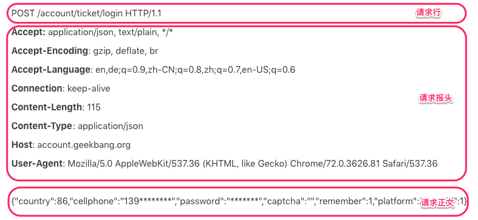
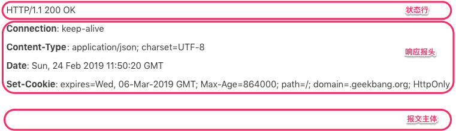
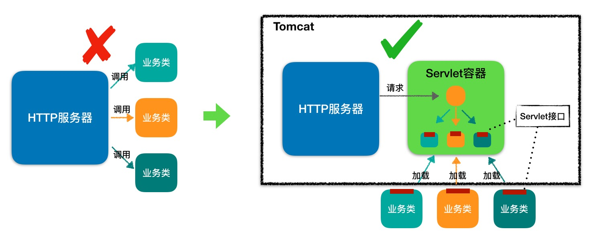
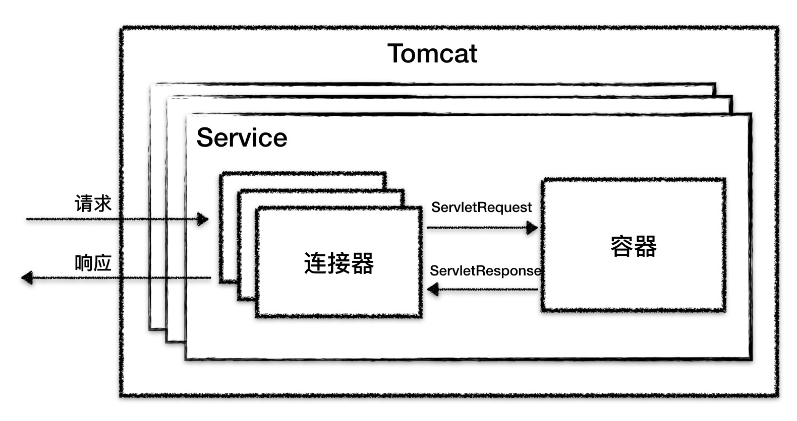
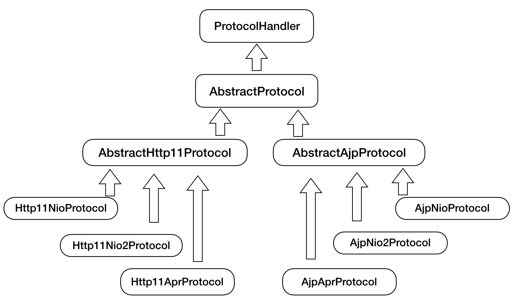

# Tomcat & Jetty

而 Tomcat 和 Jetty 就是一个 Servlet 容器。为了方便使用，它们也具有 HTTP 服务器的功能，因此 **Tomcat 或者 Jetty 就是一个“HTTP 服务器 + Servlet 容器”，我们也叫它们 Web 容器。**


## HTTP协议

### HTTP 请求响应实例

你可以看到，HTTP 请求数据由三部分组成，分别是**请求行、请求报头、请求正文**。当这个 HTTP 请求数据到达 Tomcat 后，Tomcat 会把 HTTP 请求数据字节流解析成一个 Request 对象，这个 Request 对象封装了 HTTP 所有的请求信息。接着 Tomcat 把这个 Request 对象交给 Web 应用去处理，处理完后得到一个 Response 对象，Tomcat 会把这个 Response 对象转成 HTTP 格式的响应数据并发送给浏览器。

我们再来看看 HTTP 响应的格式，HTTP 的响应也是由三部分组成，分别是**状态行、响应报头、报文主体**。同样，我还以极客时间登陆请求的响应为例。



### Cookie 和 Session

HTTP 协议有个特点是无状态，请求与请求之间是没有关系的。这样会出现一个很尴尬的问题：Web 应用不知道你是谁。因此 HTTP 协议需要一种技术让请求与请求之间建立起联系，并且服务器需要知道这个请求来自哪个用户，于是 Cookie 技术出现了。


#### Cookie 技术

**Cookie 是 HTTP 报文的一个请求头**，Web 应用可以将用户的标识信息或者其他一些信息（用户名等）存储在 Cookie 中。用户经过验证之后，每次 HTTP 请求报文中都包含 Cookie，这样服务器读取这个 Cookie 请求头就知道用户是谁了。**Cookie 本质上就是一份存储在用户本地的文件，里面包含了每次请求中都需要传递的信息。** 由于是以明文的方式存储，这样就造成了非常大的安全隐患

cookie有两个重要属性：

`Domain` 和 `Path` 标识定义了Cookie的*作用域：*即Cookie应该发送给哪些URL。

`Domain` 标识指定了哪些主机可以接受Cookie。如果不指定，默认为[当前文档的主机]（**不包含子域名**）。如果指定了`Domain`，则一般包含子域名。

- 如果设置 `Domain=mozilla.org`，则Cookie也包含在子域名中（如`developer.mozilla.org`）。

`Path` 标识指定了主机下的哪些路径可以接受Cookie（该URL路径必须存在于请求URL中）。以字符 `%x2F` ("/") 作为路径分隔符，子路径也会被匹配。

例如，设置 `Path=/docs`，则以下地址都会匹配：

- `/docs`
- `/docs/Web/`
- `/docs/Web/HTTP`

跨域说的是，我们访问两个不同的域名或路径时，希望带上同一个cookie，跨域的具体实现方式有很多..


#### Session 技术

**Session 可以理解为服务器端开辟的存储空间，里面保存了用户的状态**，用户信息以 Session 的形式存储在服务端。

当用户请求到来时，服务端可以把用户的请求和用户的 Session 对应起来。那么 Session 是怎么和请求对应起来的呢？答案是通过 Cookie，浏览器在 Cookie 中填充了一个 Session ID 之类的字段用来标识请求。

具体工作过程是这样的：服务器在创建 Session 的同时，会为该 Session 生成唯一的 Session ID，服务端通过set-cookie放在http的响应头里 ,然后浏览器写到cookie里，后续每次请求就会自动带上来了。发到客户端的只有 Session ID，这样相对安全，也节省了网络流量，因为不需要在 Cookie 中存储大量用户信息。


## Servlet规范和Servlet容器

Servlet 接口其实是 Servlet 容器跟具体业务类之间的接口。Servlet 接口和 Servlet 容器的出现，达到了 HTTP 服务器与业务类解耦的目的。

而 Servlet 接口和 Servlet 容器这一整套规范叫作 Servlet 规范。Tomcat 和 Jetty 都按照 Servlet 规范的要求实现了 Servlet 容器，同时它们也具有 HTTP 服务器的功能。


### Servlet 接口

 定义了下面五个方法：

```java
public interface Servlet {
    //在web.xml给 Servlet 配置参数
    void init(ServletConfig config) throws ServletException;
    
    ServletConfig getServletConfig();
    
    void service(ServletRequest req, ServletResponse res）throws ServletException, IOException;
    
    String getServletInfo();
    
    void destroy();
}
```

其中最重要是的 service 方法，具体业务类在这个方法里实现处理逻辑。这个方法有两个参数：ServletRequest 和 ServletResponse。ServletRequest 用来封装请求信息，ServletResponse 用来封装响应信息，**因此本质上这两个类是对通信协议的封装。**

有接口一般就有抽象类，抽象类用来实现接口和封装通用的逻辑，因此 Servlet 规范提供了 GenericServlet 抽象类，我们可以通过扩展它来实现 Servlet。虽然 Servlet 规范并不在乎通信协议是什么，但是大多数的 Servlet 都是在 HTTP 环境中处理的，因此 Servet 规范还提供了 HttpServlet 来继承 GenericServlet，并且加入了 HTTP 特性。这样我们通过继承 HttpServlet 类来实现自己的 Servlet，只需要重写两个方法：doGet 和 doPost。


### Servlet 容器


#### web应用

servlet规范下的web目录

> | -  MyWebApp
>       | -  WEB-INF/web.xml        -- 配置文件，用来配置Servlet等
>       | -  WEB-INF/lib/           -- 存放Web应用所需各种JAR包
>       | -  WEB-INF/classes/       -- 存放你的应用类，比如Servlet类
>       | -  META-INF/              -- 目录存放工程的一些信息

Servlet 容器通过读取配置文件，就能找到并加载 Servlet。

Servlet 规范里定义了 **ServletContext** 这个接口来对应一个 Web 应用。Web 应用部署好后，Servlet 容器在启动时会加载 Web 应用，并为每个 Web 应用创建唯一的 ServletContext 对象。你可以把 ServletContext 看成是一个全局对象，一个 Web 应用可能有多个 Servlet，这些 Servlet 可以通过全局的 ServletContext 来共享数据，这些数据包括 Web 应用的初始化参数、Web 应用目录下的文件资源等。由于 ServletContext 持有所有 Servlet 实例，你还可以通过它来实现 Servlet 请求的转发。


#### 扩展机制

引入了 Servlet 规范后，你不需要关心 Socket 网络通信、不需要关心 HTTP 协议，也不需要关心你的业务类是如何被实例化和调用的，但是如果有个性化需求，怎么办呢？

- Filter -> FilterChain。Filter 是干预过程的，它是过程的一部分，是基于过程行为的。
- Listener ->监听事件。 Listener 是基于状态的，任何行为改变同一个状态，触发的事件是一致的。


servlet、spring、springMVC启动时关系

> Tomcat&Jetty在启动时给每个Web应用创建一个全局的上下文环境，这个上下文就是ServletContext，其为后面的Spring容器提供宿主环境。
>
> Tomcat&Jetty在启动过程中触发容器初始化事件，Spring的ContextLoaderListener会监听到这个事件，它的contextInitialized方法会被调用，在这个方法中，Spring会初始化全局的Spring根容器，这个就是Spring的IoC容器，IoC容器初始化完毕后，Spring将其存储到ServletContext中，便于以后来获取。
>
> Tomcat&Jetty在启动过程中还会扫描Servlet，一个Web应用中的Servlet可以有多个，以SpringMVC中的DispatcherServlet为例，这个Servlet实际上是一个标准的前端控制器，用以转发、匹配、处理每个Servlet请求。
>
> Servlet一般会延迟加载，当第一个请求达到时，Tomcat&Jetty发现DispatcherServlet还没有被实例化，就调用DispatcherServlet的init方法，DispatcherServlet在初始化的时候会建立自己的容器，叫做SpringMVC 容器，用来持有Spring MVC相关的Bean。同时，Spring MVC还会通过ServletContext拿到Spring根容器，并将Spring根容器设为SpringMVC容器的父容器，请注意，Spring MVC容器可以访问父容器中的Bean，但是父容器不能访问子容器的Bean， 也就是说Spring根容器不能访问SpringMVC容器里的Bean。说的通俗点就是，在Controller里可以访问Service对象，但是在Service里不可以访问Controller对象。


## 连接器是如何设计的？


### Tomcat 总体架构

Tomcat 要实现 2 个核心功能：

- 处理 Socket 连接，负责网络字节流与 Request 和 Response 对象的转化。
- 加载和管理 Servlet，以及具体处理 Request 请求。

**因此 Tomcat 设计了两个核心组件连接器（Connector）和容器（Container）来分别做这两件事情。连接器负责对外交流，容器负责内部处理。**


Tomcat 支持的 I/O 模型有：

- NIO：非阻塞 I/O，采用 Java NIO 类库实现。
- NIO.2：异步 I/O，采用 JDK 7 最新的 NIO.2 类库实现。
- APR：采用 Apache 可移植运行库实现，是 C/C++ 编写的本地库。

Tomcat 支持的应用层协议有：

- HTTP/1.1：这是大部分 Web 应用采用的访问协议。
- AJP：用于和 Web 服务器集成（如 Apache）。
- HTTP/2：HTTP 2.0 大幅度的提升了 Web 性能。


Tomcat 为了实现支持多种 I/O 模型和应用层协议，一个容器可能对接多个连接器。但是单独的连接器或者容器都不能对外提供服务，需要把它们组装起来才能工作，组装后这个整体叫作 Service 组件。这里请你注意，Service 本身没有做什么重要的事情，只是在连接器和容器外面多包了一层，把它们组装在一起。




### 连接器

连接器对 Servlet 容器屏蔽了协议及 I/O 模型等的区别，无论是 HTTP 还是 AJP，在容器中获取到的都是一个标准的 ServletRequest 对象。

连接器需要完成 3 个高内聚的功能，分别对应3个组件：

- 网络通信。对应**Endpoint**
- 应用层协议解析，生成统一的Tomcat Request/Response 对象。对应**Processor**
- Tomcat Request/Response 与 ServletRequest/ServletResponse 的转化。对应**Adapter**

Endpoint 负责提供字节流给 Processor，Processor 负责提供 Tomcat Request 对象给 Adapter，Adapter 负责提供 ServletRequest 对象给容器。


#### ProtocolHandler 组件

由于 I/O 模型和应用层协议可以自由组合，比如 NIO + HTTP 或者 NIO.2 + AJP。Tomcat 的设计者将网络通信和应用层协议解析放在一起考虑，设计了一个叫 ProtocolHandler 的接口来封装这两种变化点。





- Endpoint

Endpoint 是对传输层的抽象，因此 Endpoint 是用来实现 TCP/IP 协议的。

Endpoint 是一个接口，对应的抽象实现类是 AbstractEndpoint，而 AbstractEndpoint 的具体子类，比如在 NioEndpoint 和 Nio2Endpoint 中，有两个重要的子组件：Acceptor 和 SocketProcessor。

其中 Acceptor 用于监听 Socket 连接请求。SocketProcessor 用于处理接收到的 Socket 请求，它实现 Runnable 接口，在 run 方法里调用协议处理组件 Processor 进行处理。为了提高处理能力，SocketProcessor 被提交到线程池来执行。而这个线程池叫作执行器（Executor)，我在后面的专栏会详细介绍 Tomcat 如何扩展原生的 Java 线程池。


- Processor

  如果说 Endpoint 是用来实现 TCP/IP 协议的，那么 Processor 用来实现 HTTP 协议。

  Processor 是一个接口，定义了请求的处理等方法。它的抽象实现类 AbstractProcessor 对一些协议共有的属性进行封装，没有对方法进行实现。具体的实现有 AjpProcessor、Http11Processor 等，这些具体实现类实现了特定协议的解析方法和请求处理方式。


再来看看连接器的组件图：


从图中我们看到，Endpoint 接收到 Socket 连接后，生成一个 SocketProcessor 任务提交到线程池去处理，SocketProcessor 的 run 方法会调用 Processor 组件去解析应用层协议，Processor 通过解析生成 Request 对象后，会调用 Adapter 的 Service 方法。


#### Adapter 组件

ProtocolHandler 接口负责解析请求并生成 Tomcat Request 类。但是这个 Request 对象不是标准的 ServletRequest，也就意味着，不能用 Tomcat Request 作为参数来调用容器。Tomcat 设计者的解决方案是引入 CoyoteAdapter，这是适配器模式的经典运用，连接器调用 CoyoteAdapter 的 sevice 方法，传入的是 Tomcat Request 对象，CoyoteAdapter 负责将 Tomcat Request 转成 ServletRequest，再调用容器的 service 方法。


