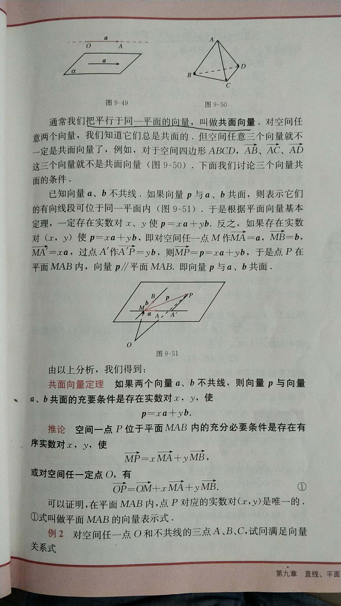

## 高中公式

[TOC]

### 不等式

####算术平均数/几何平均数

$$
\frac{a+b}{2} \geq \sqrt{ab} ， (a,b\in R,且a>0,b>0)
\\我们称\frac{a+b}{2}为a,b的算术平均数， 称\sqrt{ab} 为a,b的几何平均数。
$$

即 两个正数的算术平均数不小于几何平均数，推广   
$$
对于n个正数，
\frac{a_{1}+a_{2}+\cdots+a_{n}}{n} \geq \sqrt[n]{a_{1}a_{2}\cdots a_{n}},\quad
当且仅当a_{1}=a_{2}=\cdots=a_{n}时，等号成立
$$

###直线与方程

***斜率：*** 

经过两点P1(x1,y1), P2(x2,y2)的斜率k

$$
k=\frac{y_{2}-y_{1}}{x_{2}-x_{1}}
$$

***点斜式：***
$$
y-y_{1} = k(x-x_{1})
$$

***斜截式:***  

已知直线l 斜率k，与y轴交点P(0,b)带入点斜式， b为l在y轴的截距
$$
y = kx +b
$$
***两点式：***

已知直线l经过不同两点P1(x1,y1), P2(x2,y2)，写全点斜式，得
$$
\frac{y-y_{1}}{y_{2}-y_{1}}= \frac{x-x_{1}}{x_{2}-x_{1}}
$$
***截距式：***

因为直线经过A(a,0),B(0,b)，代入两点式得
$$
\frac{x}{a} + \frac{y}{b} = 1
$$
***直线垂直***

设直线L1，L2斜率分别为k1,k2,且分别有方向向量a=(1,k1), b=(1,k2)
$$
l_{1}\perp l_{2}\Leftrightarrow a \perp b \Leftrightarrow a\cdot b=0 \Leftrightarrow k_{1} k_{2}=-1
$$

***夹角***
$$
直线l_{1},l_{2}倾斜角分别为\alpha_{1},\alpha_{2}，则\tan \alpha_{1}=k_1,\tan\alpha_2=k_2
\\ 把相交的其中的锐角叫做两条直线的夹角，记作\theta
\\ \tan\theta= \left | \frac{k_2-k_1}{1+k_2k_1} \right |
$$
***点到直线的距离***

$$
Ax+By+C=0 (A,B不同时为0) 为直线方程的一般式。任意点(x_0,y_0)到直线的距离d\\

d=\frac{\left | Ax_0+By_0+C \right |}{\sqrt{A^2+B^2}}
$$

------

### 圆的方程

***圆的标准方程***

圆心是C(a,b)，半径是r的圆 表示为
$$
（x-a)^2 +(y-b)^2 = r^2
$$
其中过圆上一点M(x0,y0)的切线方程为
$$
(x_0-a)(x-a)+(y_0-b)(y-b) = r^2
$$

***圆的一般方程***

展开标准方程，得到圆的一般表达方式
$$
x^2+y^2+Dx+Ey+F = 0 \quad①\\ 
配方得 (x+\frac{D}{2})^2 + (y+\frac{E}{2})^2 = \frac{D^2+E^2-4F}{4}\\
当{D^2+E^2-4F}>0，方程①表示以 (-\frac{D}{2},-\frac{E}{2})为圆心，
\frac{\sqrt{D^2+E^2-4F}}{2}为半径的圆 \\
当{D^2+E^2-4F}=0，方程只有一个实数解(-\frac{D}{2},-\frac{E}{2}),表示一个点\\
当{D^2+E^2-4F}<0，没有实数解 不表示任何图形
$$

***圆的参数方程***
$$
\begin{cases} 
x=a+r\cos\theta，\theta为参数 \\ 
y=b+r\sin\theta
\end{cases}
$$

------

###圆锥曲线方程

#### 椭圆及其标准方程

> 我们把平面内与两定点F1、F2的距离和等于常数(大于|F1F2|)的点的轨迹叫做椭圆。这两个定点叫做椭圆的焦点，两焦点的距离叫做椭圆的焦距。

设焦距为2c(c>0)，建立直角坐标系使F1、F2为(-c,0)、(c,0)，又设距离和等于2a，椭圆截y轴距离为2b，则有

a^2+b^2=c^2，椭圆标准方程为
$$
\frac{x^2}{a^2}+\frac{y^2}{b^2}=1 ,(a>b>0)
\\ 假设将焦点设在y轴上，则
\\\frac{y^2}{a^2}+\frac{x^2}{b^2}=1 ,(a>b>0)
$$

#### 椭圆的简单几何性质

1、范围。椭圆位于x=±a，y=±b的矩形里

2、关于原点对称

3、标准方程与x、y轴四个顶点分别为(-a,0),(a,0),(0,b),(0,-b)，2a为长轴，2b为短轴

其中 a^2-c^2=b^2
$$
\\4、椭圆的焦距与长轴长的比 e=\frac{c}{a}，叫做椭圆的离心率 ， 0<e<1 。
\\e越接近1，椭圆越扁；e越接近0，椭圆近似于圆。当c=0,a=b时，焦点重合，图形变成圆
$$

**另一种定义**

当点M与一个定点的距离和它到一条定直线的距离比是常数e=c/a (0<e<1)时，这个点的轨迹是椭圆，定点是椭圆的焦点，定直线是准线，e是离心率。
$$
相对于(c,0)的准线方程式x=\frac{a^2}{c} ，另一条是x=- \frac{a^2}{c}
$$

####双曲线及其标准方程

> 我们把平面内到两定点F1、F2的距离的差的绝对值等于常数(小于|F1F2|)的点的轨迹叫做双曲线。这两定点叫做双曲线的焦点，两焦点的距离叫做双曲线的焦距

设焦距为2c(c>0)，建立直角坐标系使F1、F2为(-c,0)、(c,0)，又设距离差等于2a，令c^2-a^2=b^2，双曲线标准方程为
$$
\frac{x^2}{a^2} - \frac{y^2}{b^2} =1 (a>0 ,b>0)
\\ 假设将焦点设在y轴上，则
\\\frac{y^2}{a^2}-\frac{x^2}{b^2}=1 ,(a>0 ,b>0)
$$

#### 双曲线的简单几何性质

1、双曲线的x>= a 与 x <= -a表示的区域内

2、原点是双曲线的对称中心

3、与x轴的两个焦点A1(-a,0) ，A2(a,0)叫做双曲线顶点。 A1A2叫做实轴

画上B1(0,b)，B2(0,-b) 叫做虚轴

4、渐近线。x=±a，y=±b围成的矩形的两条对角线方程 y=±b/a *x ,当双曲线往外延伸时，无限接近渐近线。
$$
5、双曲线的焦距与实轴长的比e=c/a,叫做双曲线的离心率。 e>1 。\frac{b}{a}=\sqrt{e^2-1}
\\e越大，渐近线斜率越大，双曲线开口越阔
$$

**另一种定义**

当点M到一个定点的距离和它到一条定直线的距离的比是常数e=c/a (e>1)时，这个点的的轨迹是双曲线。
定点是椭圆的焦点，定直线是准线，e是离心率。
$$
相对于焦点(c,0)的准线方程是x=\frac{a^2}{c}，另一条是x=-\frac{a^2}{c}
$$

#### 抛物线及其标准方程

> 平面内与一个定点F和一条定直线l 的距离相等的点的轨迹叫做抛物线。点F为抛物线焦点，l叫做抛物线的准线

建立直角坐标系xOy，使x轴经过点F且垂直于l，垂足为K，并使原点与KF的中点重合。
$$
设|KF|=p，则F(\frac{p}{2},0)，l = -\frac{p}{2},抛物线标准方程为y^2=2px(p>0)
\\其它不同象限的形式为
\\y^2=-2px(p>0),
\\x^2=2py(p>0),
\\x^2=-2py(p>0)
$$

#### 抛物线的简单几何性质

以y^2=2px为例

1、范围。随x增大|y|也增大，说明向右上和右下方无限延伸

2、关于x轴对称

3、顶点为坐标原点

4、离心率e=1

5、通过焦点而垂直于x轴的直线与抛物线两交点分别为(p/2,p),(p/2,-p)，连接这两点的线段叫做抛物线的**通径**，长为2p。

### 空间几何

#### 空间直线与平面

***异面直线与其夹角***

我们把不在任何一个平面内的直线叫异面直线。或者连接平面内一点与平面外一点的直线，和这个平面内不经过此点的直线是异面直线。

- 如果一条直线和一个平面平行，经过这条直线的平面和这个平面相交，那么这条直线和交线平行

- 过平面内一点的直线平行于与此平面平行的一条直线，那么这条直线在此平面内。

***三垂线定理***

#### 空间向量

***共线向量与共面向量***

***空间向量基本定理***

如果三个向量a、b、c不共面，那么对空间任一向量p，存在唯一的有序实数组x,y,z，使p=xa+yb+zc

{a,b,c}叫做空间的一个基底，a、b、c都叫基向量

推论：
$$
设O、A、B、C是不共面的四点，则对空间任一点P，都存在唯一的有序实数组x,y,z，使\\
\vec{OP}=x\vec{OA}+y\vec{OB}+z\vec{OC}
$$

***两个向量的数量积***

***空间向量坐标的运算***

夹角和距离公式，设a=(a1,a2,a3)，b=(b1,b2,b3)，则
$$
|a|=\sqrt{a·a}=\sqrt{a_1^2+a_2^2+a_3^2} , |b|=\sqrt{b·b}=\sqrt{b_1^2+b_2^2+b_3^2} \\
a·b=a_1b_1+a_2b_2+a_3b_3 \\
cos<a,b>=\frac{a_1b_1+a_2b_2+a_3b_3}{\sqrt{a_1^2+a_2^2+a_3^2}\sqrt{b_1^2+b_2^2+b_3^2}}\\

已知A(x_1,y_1,z_1)，B(x_2,y_2,z_2),\\
d_{A,B}=\left | \vec{AB} \right |=\sqrt{(x_2-x_1)^2+(y_2-y_1)^2+(z_2-z_1)^2}
$$

***法*向量**

如果向量a⊥α，那么向量a叫做平面α的**法向量**

#### 夹角与距离

***点到直线的距离***

一点到它在一个平面内的正摄影的距离叫点到这个平面的距离

***直线到与它平行平面的距离***

一条直线上的任一点到与它平行的平面的距离，叫做这条直线到平面的距离

***两个平行平面的距离***

两个平行平面的公垂线段的长度，叫做两个平行平面的距离

***异面直线的距离***

任意两条异面直线有且只有一条公垂线。两条异面直线的公垂线段长是分别连接两条异面直线上两点中最短的一条，叫做两条异面直线的距离。

#### 简单多面体

***棱柱与它的性质***

> 平行六面体的对角线交于一点，并且在交点处互相平分

> 长方体的一条对角线长的平方=一个顶点上三条棱长的平方和

***棱锥与它的性质***

> 棱锥被平行于底面的平面所截，那么慢所得的截面与底面相似，截面面积与底面面积的比等于顶点到截面距离与棱锥高的平方比

***正多面体***

> 每个面都是相同边数的正多边形，每个顶点为端点都有相同棱数的凸多面体，叫做正多面体。
>
> 正多面体只有正四面体、正六面体、正八面体、正十二面体、正二十面体 5种

***多面体欧拉定理***

| 正多面体 | 顶点数V | 面数F | 棱数E |
| -------- | ------- | ----- | ----- |
| 正四面   | 4       | 4     | 6     |
| 正六面   | 8       | 6     | 12    |
| 正八面   | 6       | 8     | 12    |
| 正十二面 | 20      | 12    | 30    |
| 正二十面 | 12      | 20    | 30    |

> 表面经过连续变形可变为球面的多面体，叫做简单多面体。简单多面体的顶点、面数、棱数间有关系
>
> V + F -2 = E

#### 球

> 与定点的距离等于或小于订场的点的几何，叫做球体

> 球面上两点之间的最短连线的长度，就是经过这两点的大圆在这两点间的一段劣弧的长度，这个弧长叫做两点的球面距离

***体积***

半径是R的球  
$$
体积是  V=\frac{4}{3}πR^3 \\
表面积  S=4πR^2
$$

### 排列、组合和二项式定理

####排列数公式

$$
规定0! = 1 ,A_n^m = n(n-1)(n-2)...(n-m+1)\\
亦A_n^m = \frac{n!}{(n-m)!} ， A是Arrangement\\
$$

####组合数公式

$$
求从n个不同元素中取出m个元素的排列数，可以分为2步\\

1、先从n个元素中取出m个元素的组合数C_n^m \\
2、求每一个组合中m个元素的全排列数A_m^m \\
根据分步计数原理 A_n^m = C_n^m · A_m^m \\
推出 C_n^m=\frac{A_n^m}{A_m^m}= \frac{n!}{m·(n-m)!} ，C是Combination
$$

***组合数的性质***
$$
C_n^m = C_n^{n-m}   （规定C_n^0 = 1 )
$$

$$
C_{n+1}^m = C_n^m + C_n^{m-1}
$$

#### 二项式定理

