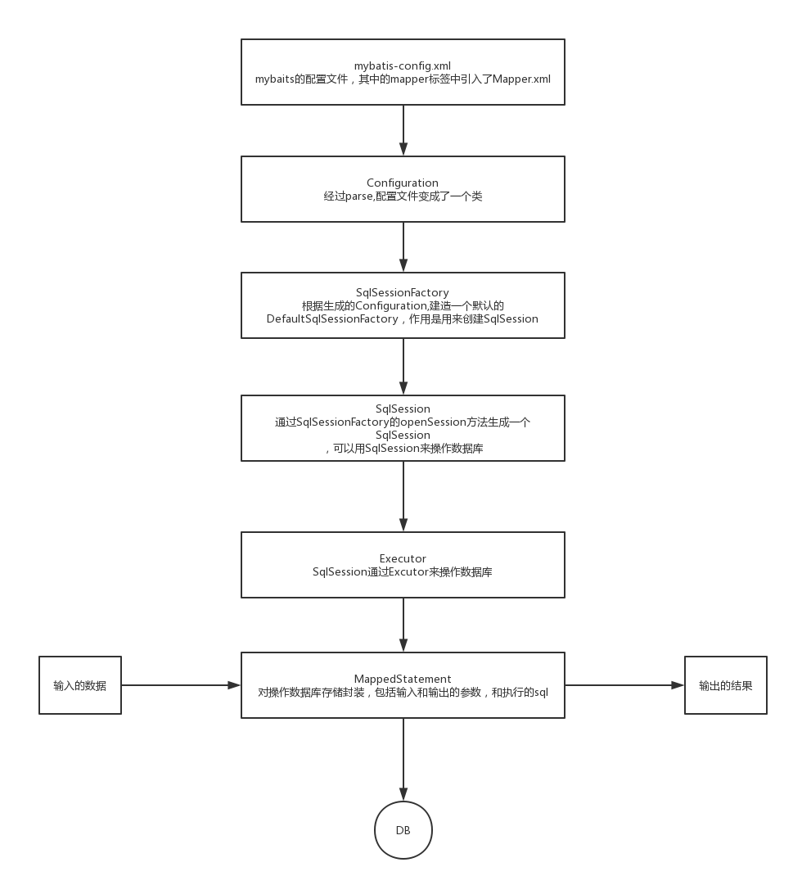
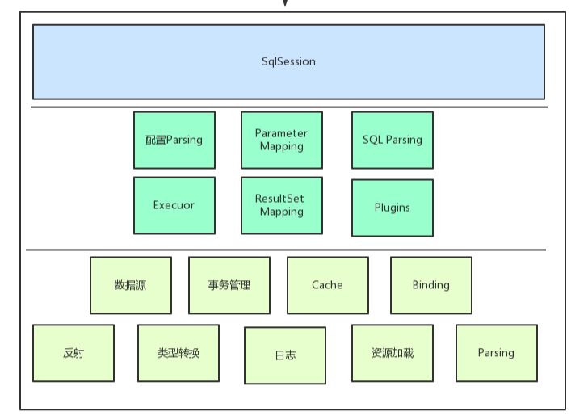
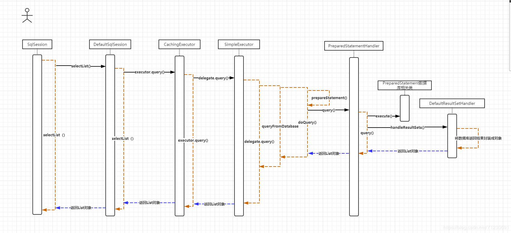

#mybatis 

## What is MyBatis? 

http://www.mybatis.org/mybatis-3/
*MyBatis is a first class persistence framework with support for custom SQL, storedprocedures and advanced mappings.*是什么
*MyBatis eliminates almost all of the JDBC code and manual setting of parameters andretrieval of results.*优势
*MyBatis can use simple XML or Annotations for configuration and map primitives, Mapinterfaces and Java POJOs (Plain Old Java Objects) to database records.* 怎么做到的 

1. mybatis-config.xml就是mybatis的全局配置文件，其中DAO层的Mapper文件已经在Mapper标签中引入了
2. configuration就是根据mybatis-config.xml解析出来的一个对象
3. SqlSessionFactory根据configuration创建一个生产SqlSession的类
4. SqlSession是用来操作数据库的类
5. Excutor是执行sql的类
6. MappedStatement是对操作数据库存储的封装，包括了输入和输出的参数和执行的sql

- 一级缓存(默认开启)

1.  一级缓存的范围有SESSION和STATEMENT两种，默认是SESSION，如果我们不需要使用一级缓存，那么我们可以把一级缓存的范围指定为STATEMENT
2. 怎么验证有一级缓存

二级缓存

mapper级别的缓存

存在的问题

1. 连表时候，副mapper更新不会联动更新主mapper的被关联表缓存。即脏数据
2. 全部失效，缓存id 1、2、3数据，update id=1，全清空，不细致。

