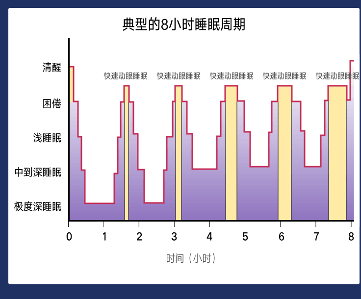
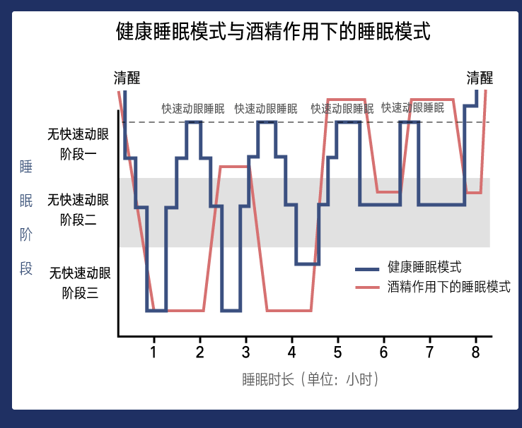

# 怎样获得高质量睡眠

[TOC]

##增大动力

首先，晚上的睡眠不是一个整觉，而是由多个小觉组成的。 每晚有四到六个，每个大概有九十到一百二十分钟。我们所说的睡了一觉，其实是经历了大约四到六个这样的小觉，也叫做睡眠单位。每个单位主要又分为三部分：

> 浅睡眠；
>
> 深睡眠；
>
> 快速动眼睡眠。

我们躺下睡觉，会先进入浅睡眠，然后由浅入深，逐渐进入深睡眠。深睡眠的时候，人就不再有任何的意识，很难被叫醒。在这之后会进入快速动眼睡眠，这时大脑接近清醒状态，眼球会快速地运动，所以才叫做快速动眼睡眠。

在快速动眼睡眠期，大脑活动是非常快的，所以我们很容易从睡眠中醒来，大多数梦也是在这个阶段发生的。

要睡眠好，就需要同时具备这两点，一是增加睡眠的动力，二是减小睡眠的阻力。

那怎样才能增大睡眠的动力呢？有四个方法，我逐个给你讲。

**1、第一件事，也是最重要的，是要找到并尊重自己的睡眠时长和睡眠节律。**

什么叫“自己的睡眠时长”？就像我在发刊词里提到的那个误解，健康的人生每天要睡八小时。这个说法其实不全面。

睡八小时这件事，并不是我们每个人都需要的，这是一个人的基因和生理决定的。 我见过很多每天甚至只睡五六个小时的人，精神非常好，而有些人要睡到十小时，精力才能恢复。

所以，你要了解你自己大概需要睡几个小时。

了解了时长和节律是因人而异的，那你怎么找自己的时长和节律呢？

我讲一个方法，其实非常简单。

>  你可以找休闲的一天，比如周末。你可以按照喜欢的方式，安排一天的生活，比如出去走一走，逛逛公园、爬爬山，看个电影，做个按摩，让自己放松下来，不要做特别刺激或者挑战的事。然后有意识地注意一下你在晚上什么时间会开始觉得困，然后在那个时点上床睡觉。不要给自己任何的压力，睡到自然醒。然后记录下整个的时长和节律。*

找到以后，你要做的，就是尽可能地按照这个节律作息。 最重要的一点是早上一定要在同一时间起床。醒来后就立即起床，绝不赖床，并且晚上一定要感觉困了再上床，不困就不要上床。

**2、第二点是晒太阳。**

晒太阳，特别是早上晒太阳，对于我们的睡眠动力是非常有用的。 为什么呢？因为阳光可以通过眼睛进入到我们的视网膜，然后通过视神经传递到下丘脑，刺激下丘脑合成更多的褪黑激素，并且还能够刺激分泌血清素。血清素和褪黑激素都是睡眠的重要动力。

**3、增加睡眠动力的第三个方法就是运动，尤其是有氧运动。**

运动为什么会增加晚上的睡眠驱动呢？这里有多重原因：

> 运动时体温会升高，并且会维持好几个小时，等我们身体凉下来，体温下降就会增加睡眠驱动。
>
> 另外，运动时身体会分泌很多的激素，帮助舒张血管、降低焦虑感，有助于放松。
>
> 最后，运动时细胞会产生更多腺苷。腺苷是细胞代谢的一个副产品，它有一个大作用，那就是它积累起来能诱发大脑困倦。

**4、最后一个增加睡眠驱动力的方式，就是避免白天睡觉。**

这是为了将睡眠驱动力积累起来，到晚上一起释放。很多人有午睡的习惯，关于对午觉的正确认知，我会在第四讲给你详细解释。

------

##减少阻力

###***创造合适的心理环境***

####找到睡前仪式感

你可以想象，人的身体能够之所以能够按照白天黑夜的规律精妙地运行，日出而作日落而息，一定有它内在的原因。 在医学上叫做昼夜节律和内生平衡节律，简单地说就是人体内某些化学物质会按照昼夜的变化和人觉醒的时间有规律地分泌，引起人困倦和觉醒。

这不是个体几十年的习惯决定的，而是几十万年人类祖先的生存状态自然选择出来的。举例来说，褪黑激素就会在夜晚来临后分泌增多，天亮醒来后分泌减少；而腺苷，只要醒着的时候，都会持续分泌，逐渐积累。

这些机制被自然选择筛选出来，通过遗传基因固化到身体里，对身体的影响力超乎我们想象。 你只有去了解和适应它，才能真正掌控它。

所以，如果你要减少睡眠的阻力，第一件要做的事情，是要创造一个平静、不焦虑、不担心、不兴奋的心理环境。

在这里，我从认知行为疗法的角度，给你三个可行的方法：

**第一个， 在工作娱乐和晚上睡觉之间，要人为地做一个隔离，设定一个防火墙，通过一些有仪式感的事儿，让自己安静下来。**

我给你推荐几个选择：

> 第一个是散步。我一般会在晚上九、十点钟的时候，出门去散散步，有时候和太太一起，有时候自己一个人。和太太一起的话，我们会聊聊白天发生的事。如果我一个人，我会做一些呼吸的练习，就是边散步边调整自己的呼吸，让呼吸变得顺畅，让整个人安静下来。
>
> *除了散步之外，你还可以试试冥想或者太极，或者就是简单准备一下上床睡觉的事情，比如泡泡脚、泡泡澡，做个面膜。*
>
> *另外，读书或者听书也是不错的方法。好多给我留言的学员，都说自己晚上是一边听得到一边睡着的。*

**第二， 你可以试着诱发 “放松反射（Relaxation Response）” 。**

这个反射可以让人快速地放松，心率下降、呼吸变长、血压下降。

启动放松反射的方法，最关键的是两点：

一是借助一个“思想工具”，可以是一个词，也可以是一句话，或者就是呼吸本身；

第二是“被动的态度”，不要去担心做得好不好，别人怎么看，就聚焦在你选择的思想工具上就好。

具体怎么做呢？

> 你可以找一个安静的地方坐下来，慢慢地闭上眼睛，随便找一个词，比如“放松”，或者“安静”“幸福”，甚至是“世界和平”，这个词无所谓，只要你喜欢。然后在脑子里默念这个词，不要停，一直持续大约10分钟的时间。
>
> *注意，这里面的关键是，在这个过程中你的脑子一定会走神，想到其他什么东西。但不要紧，一旦你发现走神了，就说一句，“哦，走神了”，再回到原来的词上面。一直持续10到15分钟。*
>
> *你可能会问，这么简单，能有效果吗？答案是肯定的。*

**第三，降低“睡不着”的紧张感**

睡眠还有一个很常见的阻力源，就是对睡眠过分的强迫或者过高的要求。

要解开这个死结，需要降低自己对睡眠的预期。 给自己一个暗示，我睡几个小时都行，困了就去睡，不困就好好呆着。

###***创造合适的卧室环境***

我会从视觉、触觉、听觉、嗅觉和味觉等五个方面来介绍。

我们现代人的卧室，也应该是像山洞一样的环境，符合简单、黑暗、安静、凉爽的特点。

**第一，视觉。卧室里要尽可能的黑暗，尤其是要避免蓝色的光。**

因为蓝光会影响褪黑激素的分泌。研究发现，在所有光谱里，蓝光对褪黑激素分泌影响最大。

很多家用电器，像空气净化器、电脑、手机屏幕和充电器，它们都会发出蓝光。晚上睡觉前，要把它们都关掉，让屋子尽可能的黑暗。如果非要打开一个小灯的话，最好是橘黄色的，像火焰颜色的灯。

如果你确实需要在晚上工作，盯着电脑或者手机屏幕，我给你推荐一个叫做f.lux的软件。它能根据你的地理位置和时区，自动地调节电脑和手机屏幕的颜色。比如到了晚上，电脑屏幕的颜色就不再是白天看到的白色，而是橘黄色，这样可以避免蓝色光谱。

**第二，触觉。**

*触觉分两个方面——室内温度和身体接触。*

先来说室温。你觉得是偏热的室温适合入睡，还是偏凉的室温适合入睡呢？答案是， 温度要凉爽不要潮热。

美国睡眠学会推荐的最适宜睡眠的温度是十八到二十二摄氏度。我自己试过，这个温度对于大多数中国人来说感觉太凉了，我自己在二十二到二十五摄氏度，会觉得比较舒服。

为什么温度低有助于睡眠呢？ 因为环境温度的下降，会导致我们核心体温的下降，就会触发睡眠驱动。

你可能有经验，晚上泡澡或者泡脚更容易入睡，你知道是为什么吗？你可能以为是血液循环加快，其实不是。如果是血液循环加快，那为什么在浴缸里你不会睡着呢？其实真正的原因是体温的下降。因为泡澡泡脚的时候，我们的体温是上升的，泡完了出来，环境温度低，所以体温下降，触发了我们的睡眠驱动。

*触觉的另一个方面是身体的接触。* 

有一个有助于睡眠的元素是“镁”。我们知道，镁离子在医学上有镇静的作用。咱们古人很早就记载，用某一种矿物盐泡澡可以助眠，其实就是硫酸镁。因为泡澡的时候镁离子可以通过皮肤毛孔进入人体。

以后你要泡澡的时候，可以放一些硫酸镁或者含硫酸镁的浴盐。你可以在淘宝上搜“矿物质浴盐”，就可以找到很多。

**第三个是听觉**。

对于一些人来说，屋子没办法完全的安静，难以避免一些噪音，比如汽车的喇叭，翻身时候床的咯吱声响，伴侣的呼噜声，都会影响睡眠。这种情况下，该怎么办呢？你可以试一试“白噪音”。

自然界这个大师早就合成了很多白噪音，比如水声、风声，或者下雨和大海潮汐的声音。 你可能会有感觉，下雨天特别好睡觉。这跟雨声是白噪音和环境温度降低都有关系。

那你可能会追问，为什么白噪音能够让人更容易入睡呢？这里面可能有两个原因。

第一， 这种声音会让你觉得处在一个自然和安全的环境，心情相对放松。 

第二， 白噪音因为混合了各频率的声音，能够屏蔽掉一些不规律的噪音。

所以，如果你的睡眠环境比较吵，经常被吵醒，你可以试试白噪音。你去App商店搜“白噪音”就会有很多这样的软件。

**第四个是嗅觉**。

如果有可能的话，让屋子里面有一些自然和清新的气味，能让你的大脑感到放松。这个相当于我们祖先在野外睡觉的时候，能闻到花香，能闻到青草的味道，他可能会觉得特别放松、有安全感。

所以，一些适当的自然的味道是可以放在卧室里的。 医学上有一些研究，发现薰衣草的香味，就是Lavender，对人有安眠、安神的作用。所以你可以去买一些薰衣草的香盒，或者是挂饰，放到屋子里面，让房间有薰衣草的味道。

**最后，吃什么会帮助睡眠？**

食物跟睡眠的关系很强，那有没有哪一类特定的食物能帮助睡眠呢？有一类，就是色氨酸含量相对高的食物。

色氨酸是氨基酸的一种，能在体内通过一系列化学反应合成褪黑激素。前面我们讲了，褪黑激素是调节昼夜节律的最重要力量。色氨酸含量高的食物包括豆类、小米、酸奶、海产品等。

------

##四排除干扰：酒、咖啡、安眠药和午觉

###喝酒确实能够帮助入睡，但会降低睡眠质量。

因为酒精会打断深度睡眠，尤其是快速动眼睡眠。所以，它会让人的睡眠质量下降。

酒精有很强的镇静效果。喝酒以后入睡很快，可以从睡眠滑梯上加速冲下来，但没有办法进入深睡眠和快速动眼睡眠，结果大脑和身体也就没有办法得到很好的恢复。好比滑梯的中下段突然变平了，没法达到滑梯底部。我在下方放了一张图，对比了喝酒和没喝酒状态下睡眠周期的不同。

###喝咖啡不等于能少睡会儿

这里我给你讲讲咖啡让人清醒的原因，这要从一个化学物质腺苷讲起。腺苷，我们在第一讲中已经认识到了，它是我们细胞代谢的一个副产品，堆积起来人体就会觉得困倦。

咖啡因有什么作用呢？它能阻止腺苷发挥作用。

咖啡因的半衰期是四到六个小时。所以，如果晚上喝咖啡或者喝茶，就有可能会影响夜晚的睡眠。因为到入睡的时候，咖啡因还没有代谢完。

医学上推荐每个人每天咖啡因的摄入量，大概是四百毫克。当然，这跟体重有关。四百毫克，大致相当于星巴克咖啡，两杯grande的美式咖啡的量，或者是十听可乐的量。只要我们一天不喝超过四百毫克的咖啡因，基本上都是安全的。

###服用安眠药的三个原则

**第一个原则是， 对于失眠来说，安眠药并不是治疗的首选。**

一般来说，安眠药最适用于一些短期的，因为外界环境变化造成的睡眠障碍，比如上夜班倒休、坐飞机倒时差等等。 慢性睡眠问题，不建议长期服药。

中国睡眠医学指南建议，对于失眠和严重的睡眠障碍的患者，首选的治疗方法是认知行为疗法。也就是在这个课里，我给你讲的这些方法。要去增加睡眠的驱动力，降低睡眠的阻力，以及通过环境的改善和心理的放松，来达到改善睡眠的目的。和其他疾病的治疗不一样，吃药并不是治疗失眠的首选，这一点非常非常重要，你要记住。

**第二个原则是， 如果要吃药，一定要去咨询专科医生，不要自己随便在药店买安眠药。**

因为，在药店买的安眠药叫otc（over the counter），就是非处方药。一般的非处方药类的安眠药，是抗组胺类的，就是抗过敏的这一类药。

你可能会觉得好奇，为什么抗过敏的药物，可以拿来当安眠药呢？因为抗组胺类的药物，它有一个副作用，是会让你觉得困。 吃这个药来帮助睡眠，并不是因为它的治疗作用，而是利用它的副作用。

但是，这一类药物并没有足够多、足够强的证据，证明它在治疗失眠问题上的安全性和有效性。所以，吃抗组胺类的药物来帮助睡眠，到底有没有什么潜在风险和危害，现在并不能说得很清楚。

所以，如果是短期的睡眠问题，你可以试一试安眠药。但如果是长期慢性的问题，一定要去医院看专科医生，不要随便在药店买药吃。

**第三个原则是， 如果你已经在服用医生处方的安眠药，则需要按需、间断和足量地服药。**

> 按需 的意思就是说，如果今天晚上，你估计自己入睡有困难，或者躺在床上已经超过二十分钟睡不着，才服用。
> *间断 是指不要天天都吃安眠药，不要一周吃七天。一周选择三到五天吃安眠药就可以了。因为每天都吃的话，药的效果也会下降。你更需要的是通过一些行为的改变，来提高自己睡眠的质量，不要完全依赖安眠药。*
> *足量 是你要吃到足够的剂量，让自己能够睡得着。别因为药劲不够，吃了药又没达到效果。所以，如果你正在吃安眠药，一定要按需、间断、足量地服用。*

###最后，我给你讲讲睡午觉。

如果要提高晚上的睡眠质量，午睡需要掌握两点原则：
**第一，午睡是用来弥补睡得不够，不是用来弥补睡得不好的。**
什么叫睡得不够，睡得不好？这里我给你介绍一个概念叫做 “睡眠效率” ，用来评价你睡得好不好。

> 睡眠效率是用晚上睡着的时间除以在床上躺着的总时间得到的百分数。

比如你11点上床，12点睡着，早上6点半醒过来，赖了会儿床7点起来。那你晚上的睡眠效率就是6.5除以8，大约是81%。好的睡眠效率应该达到90%以上。 如果你晚上睡得不好，睡眠效率本来就不高，第二天困，就尽量不要午睡。因为午睡会减少睡眠动力，第二天晚上可能还是睡得不好。

**第二，午睡不要太长，一般20到30分钟就可以。**
午睡超过30分钟容易进入深睡眠状态，这个时候人被叫醒，反而会觉得更加困乏。午睡之后，如果你还是觉得困，我给你一个小诀窍，可以快速缓解困乏。你用肉眼盯着蓝天看1-2分钟，尽可能睁大眼睛，让蓝光尽可能多地进入。

##加餐 特殊人群应对昼夜紊乱的三个原则

最后，我给你讲讲特殊人群的睡眠障碍怎么办。特殊人群包括上夜班的人、出差倒时差的人和晚上照顾孩子的妈妈们等等。
应对昼夜紊乱导致的睡眠障碍，有三个原则：

**第一，要尽可能维持工作需要的节律不变。**

这是什么意思呢？因为身体其实适应性非常强，对身体影响最大的，不是改时差，而是没有规律。所以，如果你上夜班，那就要尽可能让身体感受到晚上就是白天，白天就是黑夜。比如，在晚上工作的时候让灯光亮一些，第二天白天出门时候要戴墨镜，要让休息的屋子完全黑暗和 凉爽。

此外，你要尽可能维持这个节律一段时间，不要频繁地变。

同样的道理，倒时差的时候，你要让身体提前按照到达地的时间来运行，通过调整睡觉和吃饭的时间，人为地制造黑暗来适应当地的时间。

**第二个原则，可以适量使用一些助眠药品，帮助你倒时差。**

我在课程里说，并不建议长期服用安眠药。但对于倒时差和上夜班的人，助眠药品是可以短期使用的。比如，你坐飞机到美国，中间有12到13个小时的时差，很多人第一个晚上半夜两三点就醒了，这个时候你如果吃一点助眠药品，比如含有苯海拉明的，可以睡到天明，这样时差可以更快倒过来。

**第三个原则是，你需要更加重视食物和运动的作用。**

比如，你需要争取更有效的睡眠，就可以多吃一些高蛋白+碳水化合物的食物，并且多做有氧运动，积累体内的腺苷。如果需要保持清醒，就尽可能吃清淡的食物，比如沙拉，然后做一些身体的拉伸。

对于晚上看宝宝的母亲，因为宝宝哭闹而导致的睡眠问题，情况会更挑战一些。因为妈妈白天还必须清醒，给孩子哺乳，而晚上的睡眠又被频繁地打断。如果你晚上因为某种情况无法睡整觉，还有一个可以尝试的方法，叫做 **R90睡眠法** 。这是一个英国的睡眠专家，曼联的睡眠教练尼克·里特尔黑尔斯提出的。

> 什么意思呢？ 就是以90分钟为周期来睡，算好到90分钟的整数位起来。我们在课程里讲了，晚上的睡眠是若干个NREM+REM的周期组成，一般一个周期平均是90分钟，人晚上睡4到6个周期，总共是6小时到9小时。

如果在90分钟中间被叫醒，人会觉得很难受，很晕。如果是90分钟结束时叫醒，相对就会好很多。所以，如果有可能，可以按照90分钟（1个半小时）或者180分钟（3小时）来睡。

 	

